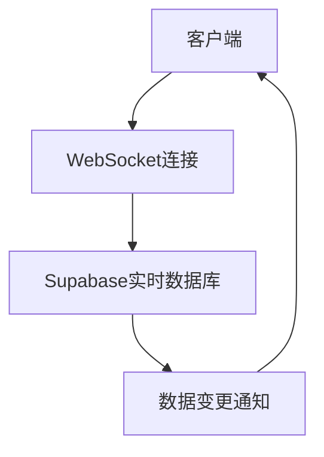
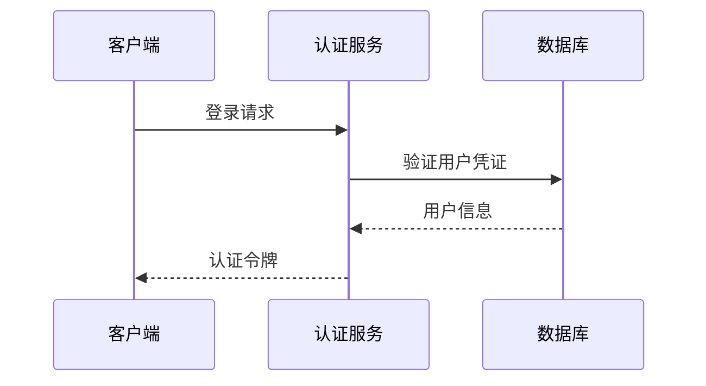
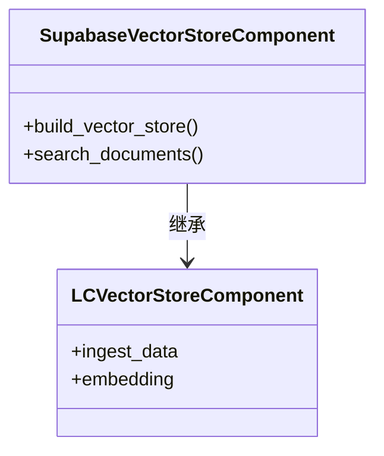

# Supabase集成

<cite>
**本文档中引用的文件**  
- [supabase.py](file://vibe_surf/langflow/components/supabase/supabase.py)
- [supabase_composio.py](file://vibe_surf/langflow/components/composio/supabase_composio.py)
- [supabase_composio.py](file://vibe_surf/workflows/Integrations/supabase_composio.py)
- [manager.py](file://vibe_surf/backend/database/manager.py)
- [authContext.tsx](file://vibe_surf/frontend/src/contexts/authContext.tsx)
- [auth_store.ts](file://vibe_surf/frontend/src/stores/authStore.ts)
</cite>

## 目录
1. [介绍](#介绍)
2. [Supabase功能特性](#supabase功能特性)
3. [配置指南](#配置指南)
4. [常见用例代码示例](#常见用例代码示例)
5. [API调用模式与实时订阅](#api调用模式与实时订阅)
6. [错误处理与连接管理](#错误处理与连接管理)
7. [结论](#结论)

## 介绍

VibeSurf项目集成了Supabase作为其核心后端服务，提供实时数据库操作、身份验证、存储管理和函数调用等功能。Supabase作为一个开源的Firebase替代方案，为VibeSurf提供了强大的后端支持，使得开发者能够快速构建实时应用。

**Section sources**
- [supabase.py](file://vibe_surf/langflow/components/supabase/supabase.py#L1-L77)
- [supabase_composio.py](file://vibe_surf/langflow/components/composio/supabase_composio.py#L1-L12)

## Supabase功能特性

### 实时数据库操作

VibeSurf通过Supabase实现了实时数据库操作，允许客户端在数据发生变化时立即收到更新。这种实时性是通过WebSocket连接实现的，确保了数据的一致性和及时性。

### 身份验证

Supabase的身份验证功能被用于管理用户登录和权限控制。VibeSurf利用Supabase的认证服务来处理用户的注册、登录和会话管理，确保了用户数据的安全性。

### 存储管理

Supabase的存储管理功能允许VibeSurf上传、下载和管理文件。这包括用户生成的内容和其他资源文件，所有这些都可以通过API进行访问和操作。

### 函数调用

Supabase还支持自定义函数的调用，这使得VibeSurf能够在服务器端执行复杂的业务逻辑，而无需将这些逻辑暴露给客户端。

**Section sources**
- [supabase.py](file://vibe_surf/langflow/components/supabase/supabase.py#L1-L77)
- [supabase_composio.py](file://vibe_surf/langflow/components/composio/supabase_composio.py#L1-L12)

## 配置指南

### 项目URL设置

要配置Supabase集成，首先需要设置项目的URL。这通常是在环境变量中完成的，例如`VIBESURF_DATABASE_URL`。对于开发环境，可以使用SQLite数据库，而对于生产环境，则推荐使用PostgreSQL。

### API密钥配置

API密钥是访问Supabase服务所必需的。在VibeSurf中，API密钥通过环境变量`supabase_service_key`进行配置。这个密钥应该保密，并且只在必要的时候才暴露给客户端。

### 权限策略设置

权限策略决定了谁可以访问哪些数据。在Supabase中，可以通过SQL语句或图形界面来设置这些策略。VibeSurf使用了细粒度的权限控制，以确保只有授权用户才能访问敏感数据。

**Section sources**
- [manager.py](file://vibe_surf/backend/database/manager.py#L148-L184)
- [authContext.tsx](file://vibe_surf/frontend/src/contexts/authContext.tsx#L90-L125)

## 常见用例代码示例

### 实时应用开发

**Diagram sources**
- [supabase.py](file://vibe_surf/langflow/components/supabase/supabase.py#L32-L62)

### 用户管理

**Diagram sources**
- [authContext.tsx](file://vibe_surf/frontend/src/contexts/authContext.tsx#L90-L125)

### 服务集成

**Diagram sources**
- [supabase.py](file://vibe_surf/langflow/components/supabase/supabase.py#L10-L77)

## API调用模式与实时订阅

VibeSurf使用RESTful API与Supabase进行通信，同时利用WebSocket实现数据的实时同步。API调用通常遵循标准的HTTP方法（GET、POST、PUT、DELETE），而实时订阅则依赖于WebSocket连接，确保客户端能够即时接收到数据更新。

**Section sources**
- [supabase.py](file://vibe_surf/langflow/components/supabase/supabase.py#L32-L62)

## 错误处理与连接管理

### 错误处理

在与Supabase交互时，可能会遇到各种错误，如网络问题、认证失败等。VibeSurf通过捕获异常并提供有意义的错误消息来处理这些问题，确保用户体验不受影响。

### 连接管理

为了保证连接的稳定性和效率，VibeSurf采用了连接池技术。对于SQLite数据库，使用了`StaticPool`；而对于PostgreSQL，则配置了更大的连接池大小和溢出限制，以应对高并发场景。

**Section sources**
- [manager.py](file://vibe_surf/backend/database/manager.py#L163-L184)

## 结论

VibeSurf通过集成Supabase，实现了高效、安全的后端服务。无论是实时数据同步、用户认证还是文件存储，Supabase都为VibeSurf提供了坚实的基础。通过合理的配置和最佳实践，VibeSurf能够为用户提供流畅、可靠的体验。

**Section sources**
- [supabase.py](file://vibe_surf/langflow/components/supabase/supabase.py#L1-L77)
- [manager.py](file://vibe_surf/backend/database/manager.py#L148-L184)