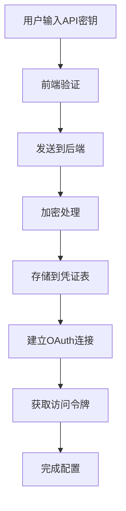
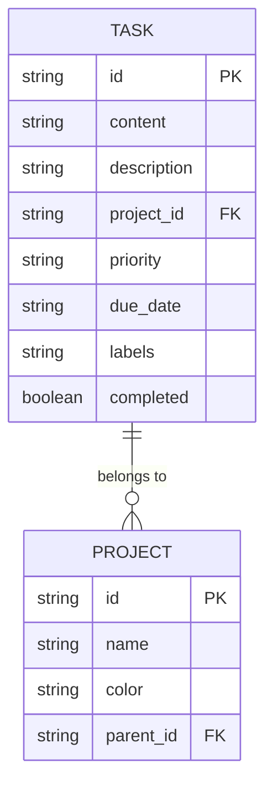
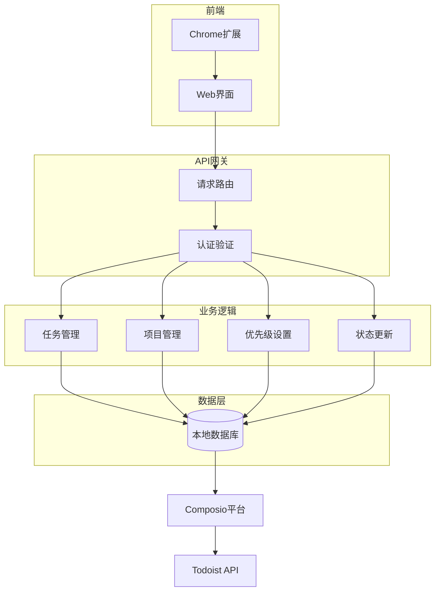

# Todoist集成

<cite>
**本文档引用的文件**   
- [todoist_composio.py](file://vibe_surf/langflow/components/composio/todoist_composio.py)
- [todoist_composio.py](file://vibe_surf/workflows/Integrations/todoist_composio.py)
- [composio_base.py](file://vibe_surf/langflow/base/composio/composio_base.py)
- [models.py](file://vibe_surf/backend/database/models.py)
- [v005_add_composio_integration.sql](file://vibe_surf/backend/database/migrations/v005_add_composio_integration.sql)
- [v006_add_credentials_table.sql](file://vibe_surf/backend/database/migrations/v006_add_credentials_table.sql)
- [settings-integrations.js](file://vibe_surf/chrome_extension/scripts/settings-integrations.js)
- [index.tsx](file://vibe_surf/frontend/src/icons/todoist/index.tsx)
- [vibesurf_tools.py](file://vibe_surf/tools/vibesurf_tools.py)
</cite>

## 目录
1. [简介](#简介)
2. [功能特性](#功能特性)
3. [配置指南](#配置指南)
4. [API调用模式与数据格式](#api调用模式与数据格式)
5. [错误处理与冲突解决](#错误处理与冲突解决)
6. [常见用例示例](#常见用例示例)
7. [架构与数据流](#架构与数据流)
8. [结论](#结论)

## 简介

VibeSurf的Todoist集成功能通过Composio平台实现，为用户提供强大的任务管理能力。该集成允许用户在VibeSurf环境中直接创建、管理和同步Todoist任务，实现无缝的工作流自动化。系统支持任务创建、项目管理、优先级设置和完成状态更新等核心功能，同时提供灵活的配置选项和安全的API密钥管理。

集成架构基于模块化设计，前端组件与后端服务通过清晰的API接口进行通信。用户可以通过Chrome扩展或Web界面访问集成功能，所有敏感数据均通过加密存储确保安全性。该集成不仅支持基本的任务操作，还为高级用例如待办事项同步、项目进度跟踪和自动化任务分配提供了完整的解决方案。

**Section sources**
- [todoist_composio.py](file://vibe_surf/langflow/components/composio/todoist_composio.py#L1-L11)
- [models.py](file://vibe_surf/backend/database/models.py#L1-L289)

## 功能特性

VibeSurf的Todoist集成提供了一套完整的任务管理功能，涵盖任务生命周期的各个方面。核心功能包括任务创建、项目管理、优先级设置和完成状态更新。

任务创建功能允许用户通过自然语言描述或结构化输入来生成新的待办事项。系统支持批量创建任务，并能自动将任务分配到指定的项目中。每个任务可以包含详细的描述、截止日期、标签和附件等元数据。

项目管理功能提供了对Todoist项目结构的完整控制。用户可以创建新项目、重命名现有项目、设置项目颜色和图标，以及管理项目间的层次关系。系统还支持项目模板功能，允许用户快速复制常用项目结构。

优先级设置功能允许用户为任务分配不同的优先级级别（P1-P4）。系统支持通过API动态调整任务优先级，并能根据优先级对任务列表进行排序和过滤。此外，用户可以设置自动化规则，根据任务属性自动调整优先级。

完成状态更新功能提供了对任务执行进度的精确控制。用户可以标记任务为完成、重新打开已完成的任务，或设置任务为重复任务。系统会同步更新任务状态到Todoist云端，并记录状态变更的历史。

**Section sources**
- [todoist_composio.py](file://vibe_surf/workflows/Integrations/todoist_composio.py#L1-L11)
- [composio_base.py](file://vibe_surf/langflow/base/composio/composio_base.py#L1-L800)

## 配置指南

### API密钥管理

Todoist集成使用Composio平台进行API密钥管理。用户的API密钥存储在加密的凭证表中，通过v006_add_credentials_table.sql迁移文件定义的数据库结构进行管理。凭证表包含key_name、encrypted_value等字段，其中encrypted_value字段存储使用MAC地址加密的API密钥。

在配置过程中，系统会引导用户输入Composio API密钥。该密钥用于身份验证和授权，确保只有授权用户才能访问Todoist API。密钥在存储前会经过加密处理，确保即使数据库泄露也不会暴露敏感信息。

**Diagram sources**
- [v006_add_credentials_table.sql](file://vibe_surf/backend/database/migrations/v006_add_credentials_table.sql#L1-L26)
- [composio_base.py](file://vibe_surf/langflow/base/composio/composio_base.py#L746-L789)

### 权限范围

Todoist集成的权限管理通过Composio的OAuth2.0授权机制实现。当用户首次配置集成时，系统会发起OAuth连接请求，引导用户完成授权流程。权限范围包括任务读写、项目管理、标签管理等基本操作权限。

系统在v005_add_composio_integration.sql迁移文件中定义了composio_toolkits表，用于管理集成工具包的启用状态和权限配置。每个工具包可以独立启用或禁用，管理员可以根据需要精细控制权限范围。

权限配置还支持多账户管理，允许用户连接多个Todoist账户并设置不同的访问权限。系统会为每个连接生成唯一的连接ID，并定期检查连接状态，确保权限的持续有效性。

**Section sources**
- [v005_add_composio_integration.sql](file://vibe_surf/backend/database/migrations/v005_add_composio_integration.sql#L1-L33)
- [composio_base.py](file://vibe_surf/langflow/base/composio/composio_base.py#L752-L789)

## API调用模式与数据格式

### API调用模式

VibeSurf的Todoist集成采用基于组件的API调用模式。核心功能由ComposioTodoistAPIComponent类实现，该类继承自ComposioBaseComponent，提供了标准化的API接口。所有API调用都通过Composio平台的统一网关进行路由和处理。

系统采用异步调用模式，确保长时间运行的操作不会阻塞用户界面。API请求通过HTTP POST方法发送，包含必要的认证信息和操作参数。响应采用JSON格式，包含操作结果、状态码和可能的错误信息。

对于批量操作，系统支持批处理模式，可以将多个API调用合并为单个请求，提高网络效率。系统还实现了智能重试机制，在遇到临时性错误时自动重试，确保操作的可靠性。

### 数据格式

Todoist集成使用标准化的数据格式进行数据交换。任务数据采用JSON对象表示，包含以下核心字段：

- **id**: 任务唯一标识符
- **content**: 任务标题
- **description**: 任务详细描述
- **project_id**: 所属项目ID
- **priority**: 优先级（P1-P4）
- **due_date**: 截止日期
- **labels**: 标签数组
- **completed**: 完成状态

数据格式设计遵循Todoist API的规范，确保与原生API的兼容性。系统在内部使用数据模型类进行类型安全的处理，所有数据在序列化和反序列化过程中都会经过验证。

**Diagram sources**
- [models.py](file://vibe_surf/backend/database/models.py#L94-L136)
- [todoist_composio.py](file://vibe_surf/workflows/Integrations/todoist_composio.py#L1-L11)

## 错误处理与冲突解决

### 错误处理策略

系统实现了多层次的错误处理机制。在API调用层面，所有请求都包含异常捕获和错误分类。错误被分为客户端错误（4xx）和服务器端错误（5xx），并根据错误类型采取不同的处理策略。

对于客户端错误，如认证失败或参数无效，系统会向用户提供清晰的错误信息和修复建议。对于服务器端错误，系统会自动触发重试机制，并在达到重试次数上限后通知用户。

在数据持久化层面，系统使用事务处理确保数据一致性。所有数据库操作都在事务中执行，如果发生错误，系统会自动回滚到一致状态，防止数据损坏。

### 冲突解决机制

数据同步过程中可能出现冲突，系统采用基于时间戳的冲突解决策略。每个任务记录都包含创建时间和更新时间戳，当检测到冲突时，系统会比较时间戳，以最新修改的版本为准。

对于并发编辑场景，系统实现了乐观锁机制。每次更新任务时，客户端需要提供当前版本号。如果服务器上的版本号已更改，更新请求将被拒绝，客户端需要先获取最新版本再进行修改。

系统还提供了冲突检测API，允许用户查询潜在的冲突并手动解决。在自动化任务分配场景中，系统会预先检查资源冲突，避免重复分配或资源争用。

**Section sources**
- [composio_base.py](file://vibe_surf/langflow/base/composio/composio_base.py#L187-L190)
- [task.py](file://vibe_surf/backend/api/task.py#L147-L151)

## 常见用例示例

### 待办事项同步

待办事项同步是Todoist集成的核心用例之一。系统提供了generate_todos方法，可以将用户提供的待办事项列表转换为markdown格式并保存到todo.md文件中。该功能在vibesurf_tools.py文件中实现，支持自动备份现有文件和时间戳命名。

同步过程包括以下步骤：首先验证输入数据的有效性，然后格式化任务项为markdown复选框格式，接着检查目标文件是否存在，如果存在则将其移动到备份目录，最后写入新的待办事项内容。整个过程确保数据的完整性和可追溯性。

### 项目进度跟踪

项目进度跟踪功能允许用户实时监控项目进展。系统通过定期同步Todoist中的任务状态，计算项目完成百分比，并生成可视化报告。用户可以设置自定义的进度计算规则，如按任务数量、工作量或优先级加权计算。

集成还支持里程碑跟踪，可以为项目设置关键节点，并在达到里程碑时触发通知或自动化工作流。进度数据可以导出为多种格式，包括CSV、JSON和PDF，便于进一步分析和分享。

### 自动化任务分配

自动化任务分配功能基于预定义的规则引擎实现。用户可以设置条件-动作规则，当满足特定条件时自动创建和分配任务。例如，当收到特定关键词的邮件时，自动创建相应的跟进任务并分配给负责人。

系统支持复杂的规则组合，包括时间条件、内容匹配、优先级评估等。任务分配可以基于负载均衡算法，确保工作量的合理分配。自动化规则可以按需启用或禁用，管理员可以随时调整规则参数。

**Section sources**
- [vibesurf_tools.py](file://vibe_surf/tools/vibesurf_tools.py#L1579-L1606)
- [settings-integrations.js](file://vibe_surf/chrome_extension/scripts/settings-integrations.js#L1-L200)

## 架构与数据流

### 系统架构

VibeSurf的Todoist集成采用分层架构设计，包括前端界面、API网关、业务逻辑层和数据持久化层。前端组件通过React框架实现，提供直观的用户界面。API网关负责请求路由和认证，业务逻辑层处理核心功能，数据持久化层管理数据存储和检索。

系统通过Composio平台与Todoist API进行通信，Composio作为中间件处理协议转换、错误处理和速率限制。这种架构设计提高了系统的可维护性和可扩展性，允许轻松添加新的集成服务。

**Diagram sources**
- [todoist_composio.py](file://vibe_surf/langflow/components/composio/todoist_composio.py#L1-L11)
- [composio_base.py](file://vibe_surf/langflow/base/composio/composio_base.py#L1-L800)

### 数据流分析

数据流从用户界面开始，用户操作被转换为标准化的API请求。请求经过认证验证后进入业务逻辑层，根据操作类型路由到相应的处理器。处理器执行业务规则，然后与数据持久化层交互。

对于需要外部服务的操作，系统通过Composio平台发送请求到Todoist API。响应数据经过处理后返回给前端，同时更新本地数据库以保持数据一致性。系统实现了双向数据同步机制，确保本地和云端数据的实时一致性。

数据流中包含多个监控点，用于跟踪请求处理时间和资源消耗。系统还实现了数据缓存机制，减少重复的API调用，提高响应速度和用户体验。

**Section sources**
- [models.py](file://vibe_surf/backend/database/models.py#L1-L289)
- [task.py](file://vibe_surf/backend/api/task.py#L1-L379)

## 结论

VibeSurf的Todoist集成提供了一套完整、安全且易于使用任务管理解决方案。通过与Composio平台的深度集成，系统实现了强大的功能特性和灵活的配置选项。架构设计注重可维护性和可扩展性，为未来的功能扩展奠定了坚实基础。

集成在安全性方面表现出色，采用加密存储和OAuth2.0授权机制保护用户数据。错误处理和冲突解决机制确保了系统的可靠性和数据一致性。丰富的API接口和数据格式支持为开发者提供了极大的灵活性。

对于用户而言，该集成简化了任务管理工作流，提高了生产力。通过自动化功能和智能规则引擎，用户可以专注于高价值任务，而将重复性工作交给系统处理。未来可以进一步增强机器学习功能，提供智能任务建议和优先级推荐。