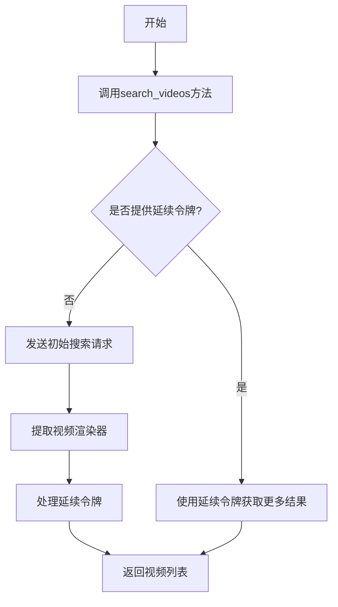
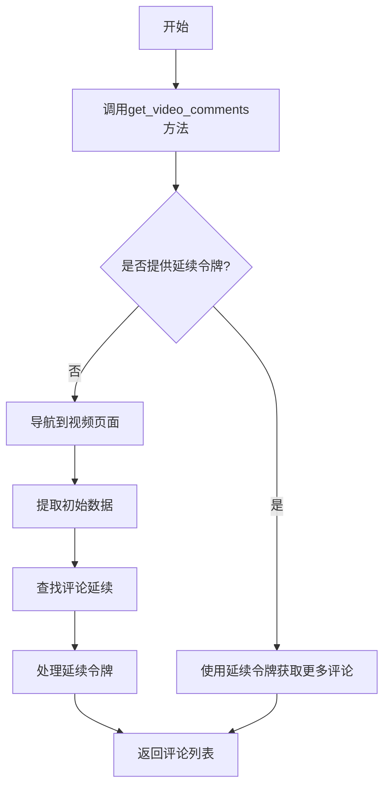
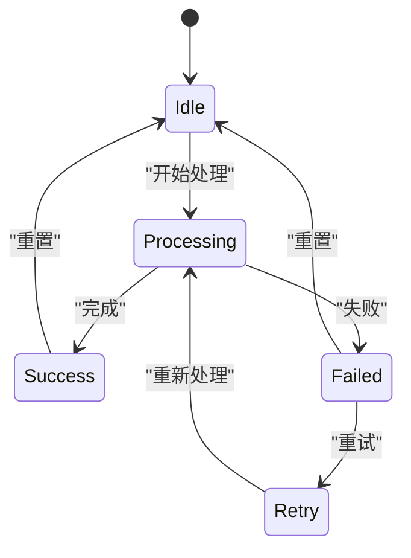

# YouTube集成

<cite>
**本文档引用的文件**   
- [youtube.py](file://vibe_surf/workflows/Integrations/youtube.py)
- [client.py](file://vibe_surf/tools/website_api/youtube/client.py)
- [helpers.py](file://vibe_surf/tools/website_api/youtube/helpers.py)
- [youtube_transcripts.py](file://vibe_surf/langflow/components/youtube/youtube_transcripts.py)
- [agent_browser_session.py](file://vibe_surf/browser/agent_browser_session.py)
- [youtube.jsx](file://vibe_surf/frontend/src/icons/Youtube/youtube.jsx)
- [youtube_composio.py](file://vibe_surf/langflow/components/composio/youtube_composio.py)
- [youtube.py](file://vibe_surf/tools/website_api/youtube/__init__.py)
</cite>

## 目录
1. [简介](#简介)
2. [功能特性](#功能特性)
3. [配置指南](#配置指南)
4. [API调用模式与数据格式](#api调用模式与数据格式)
5. [错误处理策略](#错误处理策略)
6. [常见用例](#常见用例)
7. [代码示例](#代码示例)
8. [结论](#结论)

## 简介

VibeSurf的YouTube集成提供了一套完整的功能，使用户能够通过浏览器会话访问YouTube平台的数据。该集成支持视频搜索、播放列表管理、评论分析和视频上传等功能。通过使用浏览器会话认证，避免了对API密钥的需求，从而简化了配置流程。

**Section sources**
- [youtube.py](file://vibe_surf/workflows/Integrations/youtube.py#L1-L252)
- [client.py](file://vibe_surf/tools/website_api/youtube/client.py#L1-L1268)

## 功能特性

### 视频搜索
VibeSurf的YouTube集成支持通过`search_videos`方法进行视频搜索。该方法允许用户指定查询关键词、最大结果数、延续令牌和请求间隔时间。搜索结果包括视频ID、标题、描述、时长、观看次数、点赞数、评论数、发布时间、缩略图URL、视频URL、频道ID、频道名称和频道URL。



**Diagram sources**
- [client.py](file://vibe_surf/tools/website_api/youtube/client.py#L304-L385)

### 播放列表管理
虽然当前代码中没有直接的播放列表管理功能，但可以通过搜索和获取频道视频来间接实现播放列表管理。未来可以扩展此功能以支持更复杂的播放列表操作。

### 评论分析
VibeSurf的YouTube集成支持通过`get_video_comments`方法获取视频评论。该方法允许用户指定视频ID、最大评论数、延续令牌、排序方式和请求间隔时间。评论信息包括评论ID、内容、作者姓名、作者频道ID、作者头像、点赞数、回复数、发布时间、是否被创作者点赞以及是否为回复。



**Diagram sources**
- [client.py](file://vibe_surf/tools/website_api/youtube/client.py#L515-L655)

### 视频上传
目前代码中未实现视频上传功能。这可能是一个未来的开发方向，以增强VibeSurf的YouTube集成能力。

**Section sources**
- [client.py](file://vibe_surf/tools/website_api/youtube/client.py#L304-L655)

## 配置指南

### API密钥管理
VibeSurf的YouTube集成不依赖于传统的API密钥，而是通过浏览器会话进行认证。这意味着用户需要在浏览器中登录YouTube账户，然后VibeSurf将利用该会话来执行API调用。

### OAuth流程
由于VibeSurf使用浏览器会话认证，因此不需要单独的OAuth流程。用户只需确保在浏览器中已登录YouTube账户即可。

**Section sources**
- [client.py](file://vibe_surf/tools/website_api/youtube/client.py#L40-L68)
- [agent_browser_session.py](file://vibe_surf/browser/agent_browser_session.py#L54-L123)

## API调用模式与数据格式

### API调用模式
VibeSurf的YouTube集成采用异步HTTP请求模式，使用`httpx.AsyncClient`库来发送请求。每个API调用都包含重试逻辑，以应对网络问题或速率限制。

### 数据格式
所有API响应均以JSON格式返回。对于视频搜索和评论分析等操作，返回的数据结构包含多个字段，如视频ID、标题、描述、时长、观看次数等。

**Section sources**
- [client.py](file://vibe_surf/tools/website_api/youtube/client.py#L193-L232)

## 错误处理策略

### 配额管理
当API调用超过速率限制时，VibeSurf会抛出`RateLimitError`异常。为了防止这种情况，建议在调用API时设置适当的请求间隔时间。

### 内容审核
如果请求的内容不存在，VibeSurf会抛出`ContentNotFoundError`异常。此外，如果访问被禁止（例如需要登录或验证），则会抛出`AuthenticationError`异常。



**Diagram sources**
- [client.py](file://vibe_surf/tools/website_api/youtube/client.py#L212-L220)

**Section sources**
- [client.py](file://vibe_surf/tools/website_api/youtube/client.py#L212-L220)
- [helpers.py](file://vibe_surf/tools/website_api/youtube/helpers.py#L338-L366)

## 常见用例

### 内容监控
用户可以使用VibeSurf的YouTube集成来监控特定主题或关键词的最新视频。通过定期调用`search_videos`方法并分析结果，可以及时发现新的相关内容。

### 视频推荐
基于用户的观看历史或兴趣，VibeSurf可以推荐相关的YouTube视频。通过分析用户的搜索记录和观看行为，系统可以生成个性化的视频推荐列表。

### 社交媒体分析
VibeSurf的YouTube集成可用于社交媒体分析，特别是评论分析。通过收集和分析视频评论，可以了解观众的情绪和反馈，从而为内容创作者提供有价值的见解。

**Section sources**
- [youtube.py](file://vibe_surf/workflows/Integrations/youtube.py#L63-L252)

## 代码示例

以下是一个使用VibeSurf的YouTube集成进行视频搜索的代码示例：

```python
from vibe_surf.tools.website_api.youtube.client import YouTubeApiClient
from vibe_surf.browser.agent_browser_session import AgentBrowserSession

# 创建浏览器会话
browser_session = AgentBrowserSession()

# 初始化YouTube API客户端
youtube_client = YouTubeApiClient(browser_session)

# 设置客户端
await youtube_client.setup()

# 搜索视频
videos = await youtube_client.search_videos(query="kimi-k2-thinking", max_results=20)

# 打印结果
for video in videos:
    print(video["title"])
```

**Section sources**
- [client.py](file://vibe_surf/tools/website_api/youtube/client.py#L304-L385)
- [agent_browser_session.py](file://vibe_surf/browser/agent_browser_session.py#L54-L123)

## 结论

VibeSurf的YouTube集成提供了一套强大且灵活的功能，使用户能够轻松地访问和分析YouTube平台的数据。通过使用浏览器会话认证，简化了配置流程，并提高了安全性。未来可以进一步扩展此集成，以支持更多的YouTube功能，如播放列表管理和视频上传。

[无来源，因为本节为总结性内容]