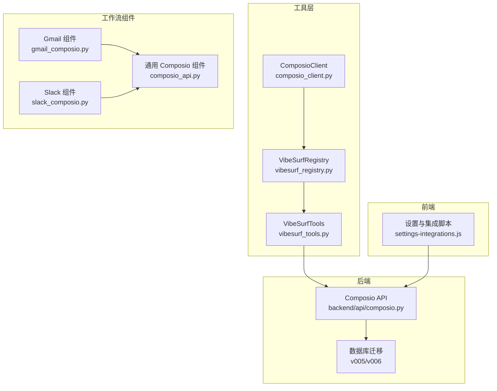
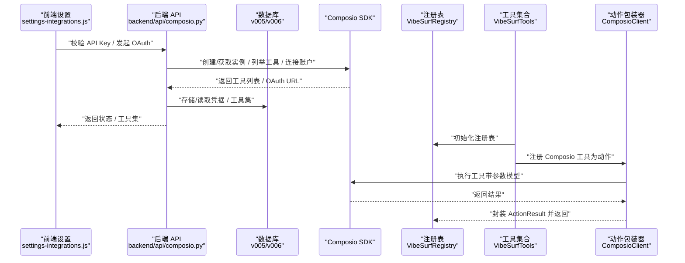
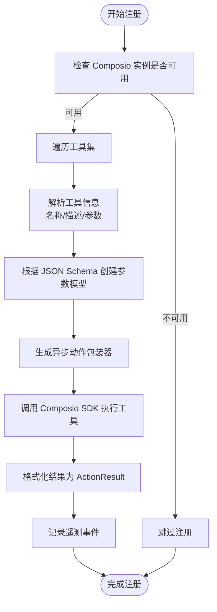
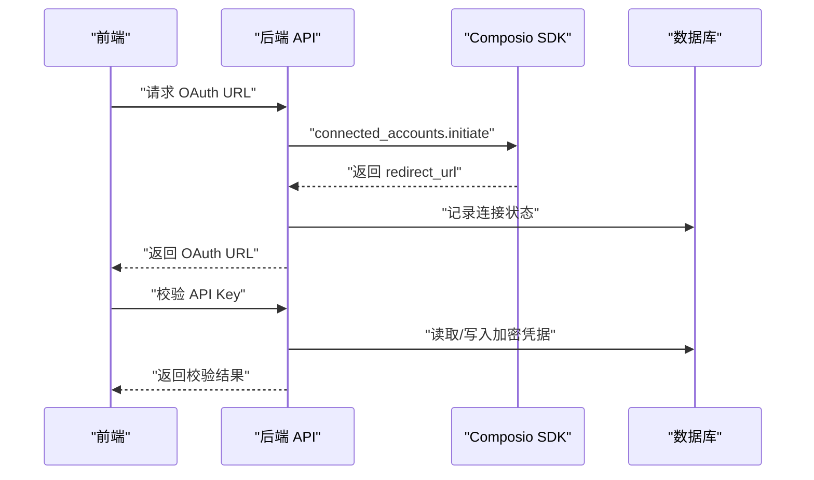
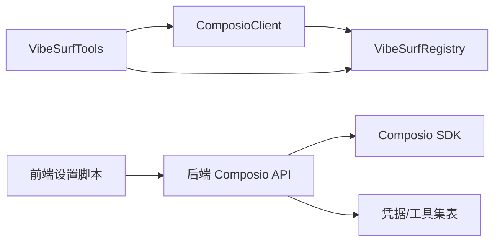

# 第三方集成

<cite>
**本文引用的文件**
- [composio_client.py](file://vibe_surf/tools/composio_client.py)
- [vibesurf_registry.py](file://vibe_surf/tools/vibesurf_registry.py)
- [vibesurf_tools.py](file://vibe_surf/tools/vibesurf_tools.py)
- [composio.py（后端）](file://vibe_surf/backend/api/composio.py)
- [gmail_composio.py](file://vibe_surf/workflows/Integrations/gmail_composio.py)
- [slack_composio.py](file://vibe_surf/workflows/Integrations/slack_composio.py)
- [composio_api.py](file://vibe_surf/workflows/Integrations/composio_api.py)
- [settings-integrations.js（前端）](file://vibe_surf/chrome_extension/scripts/settings-integrations.js)
- [v005_add_composio_integration.sql](file://vibe_surf/backend/database/migrations/v005_add_composio_integration.sql)
- [v006_add_credentials_table.sql](file://vibe_surf/backend/database/migrations/v006_add_credentials_table.sql)
- [Gmail Agent 测试](file://vibe_surf/frontend/tests/core/integrations/Gmail Agent.spec.ts)
</cite>

## 目录
1. [简介](#简介)
2. [项目结构与集成入口](#项目结构与集成入口)
3. [核心组件](#核心组件)
4. [架构总览](#架构总览)
5. [详细组件分析](#详细组件分析)
6. [依赖关系分析](#依赖关系分析)
7. [性能与可扩展性](#性能与可扩展性)
8. [安全与合规](#安全与合规)
9. [常见场景与示例](#常见场景与示例)
10. [集成开发指南](#集成开发指南)
11. [故障排查](#故障排查)
12. [结论](#结论)

## 简介
本文件系统性地文档化 VibeSurf 的第三方集成能力，重点围绕通过 Composio 实现的自动化工具桥接机制，涵盖：
- 如何连接 Gmail、Notion、Slack 等服务
- composio_client.py 中的客户端实现：认证、API 调用、参数模型转换与错误处理
- vibesurf_registry.py 中的工具注册机制：如何将 Composio 工具动态注册为 VibeSurf 动作
- 后端 Composio 集成 API：密钥验证、OAuth 连接、工具列表管理
- 前端设置与 OAuth 流程：API Key 输入、OAuth 授权弹窗与状态检查
- 安全与隐私：加密存储、最小权限原则、令牌生命周期
- 常见集成场景：自动邮件处理、笔记同步、团队协作

## 项目结构与集成入口
- 工具层：composio_client.py 将 Composio 工具动态包装为 VibeSurf 动作，并注册到 VibeSurf 注册表
- 注册表：vibesurf_registry.py 扩展了通用注册表，定义特殊参数类型
- 工具集合：vibesurf_tools.py 统一管理动作注册、额外工具与 Composio/MCP 客户端
- 后端 API：backend/api/composio.py 提供 Composio 集成管理接口（密钥、OAuth、工具列表）
- 工作流组件：workflows/Integrations 下的 gmail_composio.py、slack_composio.py 等封装具体应用的工具
- 前端设置：chrome_extension/scripts/settings-integrations.js 负责 API Key 校验、OAuth 引导与状态展示
- 数据库迁移：v005/v006 表用于存储 Composio 工具集与加密凭据

图表来源
- [composio_client.py](file://vibe_surf/tools/composio_client.py#L1-L120)
- [vibesurf_registry.py](file://vibe_surf/tools/vibesurf_registry.py#L1-L53)
- [vibesurf_tools.py](file://vibe_surf/tools/vibesurf_tools.py#L72-L120)
- [composio.py（后端）](file://vibe_surf/backend/api/composio.py#L1-L120)
- [gmail_composio.py](file://vibe_surf/workflows/Integrations/gmail_composio.py#L1-L39)
- [slack_composio.py](file://vibe_surf/workflows/Integrations/slack_composio.py#L1-L12)
- [composio_api.py](file://vibe_surf/workflows/Integrations/composio_api.py#L1-L120)
- [settings-integrations.js（前端）](file://vibe_surf/chrome_extension/scripts/settings-integrations.js#L147-L357)

章节来源
- [composio_client.py](file://vibe_surf/tools/composio_client.py#L1-L120)
- [vibesurf_registry.py](file://vibe_surf/tools/vibesurf_registry.py#L1-L53)
- [vibesurf_tools.py](file://vibe_surf/tools/vibesurf_tools.py#L72-L120)
- [composio.py（后端）](file://vibe_surf/backend/api/composio.py#L1-L120)
- [gmail_composio.py](file://vibe_surf/workflows/Integrations/gmail_composio.py#L1-L39)
- [slack_composio.py](file://vibe_surf/workflows/Integrations/slack_composio.py#L1-L12)
- [composio_api.py](file://vibe_surf/workflows/Integrations/composio_api.py#L1-L120)
- [settings-integrations.js（前端）](file://vibe_surf/chrome_extension/scripts/settings-integrations.js#L147-L357)

## 核心组件
- ComposioClient：负责将 Composio 工具解析为 Pydantic 参数模型，动态生成异步动作包装器，并注册到 VibeSurf 注册表；同时记录遥测事件
- VibeSurfRegistry：扩展通用注册表，定义特殊参数类型（浏览器会话、文件系统、LLM 等），确保动作执行时注入上下文
- VibeSurfTools：统一管理动作注册、额外工具、Composio/MCP 客户端初始化与工具集管理
- 后端 Composio API：提供 API Key 验证、OAuth 连接发起、工具列表与启用状态管理
- 工作流组件：以 Gmail、Slack 等为例，封装应用级工具与响应后处理逻辑
- 前端设置脚本：负责 API Key 校验、OAuth 引导、状态展示与确认

章节来源
- [composio_client.py](file://vibe_surf/tools/composio_client.py#L120-L299)
- [vibesurf_registry.py](file://vibe_surf/tools/vibesurf_registry.py#L34-L53)
- [vibesurf_tools.py](file://vibe_surf/tools/vibesurf_tools.py#L1292-L1323)
- [composio.py（后端）](file://vibe_surf/backend/api/composio.py#L1-L120)
- [gmail_composio.py](file://vibe_surf/workflows/Integrations/gmail_composio.py#L1-L39)
- [slack_composio.py](file://vibe_surf/workflows/Integrations/slack_composio.py#L1-L12)
- [settings-integrations.js（前端）](file://vibe_surf/chrome_extension/scripts/settings-integrations.js#L147-L357)

## 架构总览
下图展示了从前端设置到后端 API，再到 Composio SDK 的完整链路，以及工具注册与动作执行的关键节点。

图表来源
- [settings-integrations.js（前端）](file://vibe_surf/chrome_extension/scripts/settings-integrations.js#L147-L357)
- [composio.py（后端）](file://vibe_surf/backend/api/composio.py#L611-L638)
- [v005_add_composio_integration.sql](file://vibe_surf/backend/database/migrations/v005_add_composio_integration.sql#L1-L33)
- [v006_add_credentials_table.sql](file://vibe_surf/backend/database/migrations/v006_add_credentials_table.sql#L1-L26)
- [composio_client.py](file://vibe_surf/tools/composio_client.py#L120-L299)
- [vibesurf_registry.py](file://vibe_surf/tools/vibesurf_registry.py#L34-L53)
- [vibesurf_tools.py](file://vibe_surf/tools/vibesurf_tools.py#L72-L120)

## 详细组件分析

### ComposioClient：客户端实现与动作注册
- 初始化与实例更新：支持在运行时更新 Composio 实例，便于热切换或重连
- 工具注册流程：
  - 解析 toolkit_tools_dict，支持字符串 JSON 或字典列表
  - 逐个工具构建 Pydantic 参数模型，基于 JSON Schema 映射 Python 类型
  - 生成异步动作包装器，调用 Composio SDK 的 tools.execute
  - 将结果格式化为 ActionResult，记录执行耗时与错误信息
- 错误处理与遥测：
  - 捕获异常并返回失败的 ActionResult
  - 记录注册、工具调用的遥测事件，包含工具名、耗时、错误信息
- 反注册：支持批量移除已注册的 Composio 动作

图表来源
- [composio_client.py](file://vibe_surf/tools/composio_client.py#L60-L180)
- [composio_client.py](file://vibe_surf/tools/composio_client.py#L180-L299)

章节来源
- [composio_client.py](file://vibe_surf/tools/composio_client.py#L42-L120)
- [composio_client.py](file://vibe_surf/tools/composio_client.py#L120-L299)
- [composio_client.py](file://vibe_surf/tools/composio_client.py#L299-L458)

### VibeSurfRegistry：注册表与上下文注入
- 扩展通用注册表，定义特殊参数类型映射，确保动作执行时注入浏览器会话、文件系统、LLM 等上下文对象
- 降低动作对通用对象的强耦合，提升可测试性与可维护性

章节来源
- [vibesurf_registry.py](file://vibe_surf/tools/vibesurf_registry.py#L34-L53)

### VibeSurfTools：工具集合与额外工具
- 统一注册各类动作（搜索、报告、技能、文件、浏览器等）
- 提供“获取所有可用工具包类型”的动作，聚合 Composio 与 MCP 工具包
- 管理 Composio/MCP 客户端与工具集缓存

章节来源
- [vibesurf_tools.py](file://vibe_surf/tools/vibesurf_tools.py#L72-L120)
- [vibesurf_tools.py](file://vibe_surf/tools/vibesurf_tools.py#L1292-L1323)

### 后端 Composio API：OAuth 与工具管理
- API Key 验证：将 API Key 存入加密凭据表，支持读取与更新
- OAuth 连接：根据工具包发起授权，返回重定向 URL；轮询连接状态
- 工具列表与启用：列出工具包、工具，支持启用/禁用与选择性工具更新
- 数据持久化：通过 composio_toolkits 表存储工具包元数据与启用状态

图表来源
- [composio.py（后端）](file://vibe_surf/backend/api/composio.py#L611-L638)
- [v006_add_credentials_table.sql](file://vibe_surf/backend/database/migrations/v006_add_credentials_table.sql#L1-L26)

章节来源
- [composio.py（后端）](file://vibe_surf/backend/api/composio.py#L1-L200)
- [composio.py（后端）](file://vibe_surf/backend/api/composio.py#L611-L638)
- [v005_add_composio_integration.sql](file://vibe_surf/backend/database/migrations/v005_add_composio_integration.sql#L1-L33)
- [v006_add_credentials_table.sql](file://vibe_surf/backend/database/migrations/v006_add_credentials_table.sql#L1-L26)

### 工作流组件：Gmail 与 Slack
- Gmail 组件：定义默认工具，提供发送邮件与拉取邮件的响应后处理
- Slack 组件：定义默认工具，作为 Slack 应用的工具入口

章节来源
- [gmail_composio.py](file://vibe_surf/workflows/Integrations/gmail_composio.py#L1-L39)
- [slack_composio.py](file://vibe_surf/workflows/Integrations/slack_composio.py#L1-L12)

### 前端设置与 OAuth 流程
- API Key 校验：输入 Composio API Key，验证有效性并更新状态
- OAuth 引导：打开 OAuth URL，显示确认弹窗，完成后刷新工具包列表
- 状态检查：加载集成状态，展示连接有效性与实例可用性

章节来源
- [settings-integrations.js（前端）](file://vibe_surf/chrome_extension/scripts/settings-integrations.js#L147-L357)
- [settings-integrations.js（前端）](file://vibe_surf/chrome_extension/scripts/settings-integrations.js#L657-L704)

## 依赖关系分析
- ComposioClient 依赖注册表与遥测服务，动态生成动作包装器并调用 Composio SDK
- VibeSurfTools 依赖 VibeSurfRegistry 与 ComposioClient，统一管理动作与工具集
- 后端 API 依赖 Composio SDK、数据库查询与凭据表，提供 OAuth 与工具管理
- 前端设置脚本依赖后端 API，驱动 OAuth 与状态展示

图表来源
- [composio_client.py](file://vibe_surf/tools/composio_client.py#L120-L299)
- [vibesurf_registry.py](file://vibe_surf/tools/vibesurf_registry.py#L34-L53)
- [vibesurf_tools.py](file://vibe_surf/tools/vibesurf_tools.py#L72-L120)
- [composio.py（后端）](file://vibe_surf/backend/api/composio.py#L1-L120)
- [v005_add_composio_integration.sql](file://vibe_surf/backend/database/migrations/v005_add_composio_integration.sql#L1-L33)
- [v006_add_credentials_table.sql](file://vibe_surf/backend/database/migrations/v006_add_credentials_table.sql#L1-L26)
- [settings-integrations.js（前端）](file://vibe_surf/chrome_extension/scripts/settings-integrations.js#L147-L357)

## 性能与可扩展性
- 参数模型构建：基于 JSON Schema 的动态模型创建，避免硬编码，提升可扩展性
- 异步执行：动作包装器采用异步函数，减少阻塞
- 遥测与日志：记录工具调用耗时与错误，便于性能监控与问题定位
- 批量反注册：支持一键移除 Composio 动作，便于环境切换与清理

章节来源
- [composio_client.py](file://vibe_surf/tools/composio_client.py#L120-L299)
- [composio_client.py](file://vibe_surf/tools/composio_client.py#L412-L458)

## 安全与合规
- 凭据存储：使用加密凭据表存储 Composio API Key，避免明文泄露
- OAuth 流程：通过 Composio SDK 发起授权，前端引导用户完成授权并返回
- 最小权限：工具启用由用户控制，仅注册所需工具，降低风险面
- 数据隐私：动作返回内容经格式化输出，避免敏感信息泄露

章节来源
- [v006_add_credentials_table.sql](file://vibe_surf/backend/database/migrations/v006_add_credentials_table.sql#L1-L26)
- [composio.py（后端）](file://vibe_surf/backend/api/composio.py#L1-L120)
- [settings-integrations.js（前端）](file://vibe_surf/chrome_extension/scripts/settings-integrations.js#L147-L357)

## 常见场景与示例
- 自动邮件处理（Gmail）：通过 Gmail 组件的工具进行发件与收件处理，结合后端 OAuth 完成授权
- 笔记同步（Notion）：通过 Langflow 组件调用 Notion API 创建页面、查询数据库与用户列表
- 团队协作（Slack）：通过 Slack 组件的工具进行消息发送与频道管理

章节来源
- [gmail_composio.py](file://vibe_surf/workflows/Integrations/gmail_composio.py#L1-L39)
- [slack_composio.py](file://vibe_surf/workflows/Integrations/slack_composio.py#L1-L12)
- [Gmail Agent 测试](file://vibe_surf/frontend/tests/core/integrations/Gmail Agent.spec.ts#L1-L45)

## 集成开发指南
- 添加新的第三方服务支持步骤：
  1) 在后端 API 中新增工具包与工具列表管理接口（参考现有 Composio API）
  2) 在前端设置脚本中增加该服务的 OAuth 引导与状态检查
  3) 在工作流组件中定义应用级工具与响应后处理
  4) 在 ComposioClient 中注册该服务的工具为 VibeSurf 动作
  5) 在数据库迁移中新增必要的表字段或索引
  6) 编写集成测试，覆盖 OAuth、工具调用与错误处理

章节来源
- [composio.py（后端）](file://vibe_surf/backend/api/composio.py#L1-L200)
- [settings-integrations.js（前端）](file://vibe_surf/chrome_extension/scripts/settings-integrations.js#L657-L704)
- [gmail_composio.py](file://vibe_surf/workflows/Integrations/gmail_composio.py#L1-L39)
- [composio_client.py](file://vibe_surf/tools/composio_client.py#L60-L180)
- [v005_add_composio_integration.sql](file://vibe_surf/backend/database/migrations/v005_add_composio_integration.sql#L1-L33)

## 故障排查
- API Key 无效：检查后端凭据表是否正确存储与读取
- OAuth 授权失败：确认 redirect_url 是否有效，前端弹窗是否正确显示
- 工具未注册：检查 ComposioClient 的注册流程与 JSON Schema 解析
- 工具调用异常：查看 ActionResult 错误信息与遥测事件

章节来源
- [composio.py（后端）](file://vibe_surf/backend/api/composio.py#L1-L120)
- [settings-integrations.js（前端）](file://vibe_surf/chrome_extension/scripts/settings-integrations.js#L147-L357)
- [composio_client.py](file://vibe_surf/tools/composio_client.py#L180-L299)

## 结论
VibeSurf 通过 Composio 实现了强大的第三方服务集成能力，具备完善的认证、工具注册、OAuth 引导与错误处理机制。借助动态参数模型与异步动作包装器，系统能够快速适配新服务并保持良好的可维护性与安全性。建议在新增服务时遵循本文档的开发指南，确保从后端 API、前端设置到工具注册的全流程一致与可控。