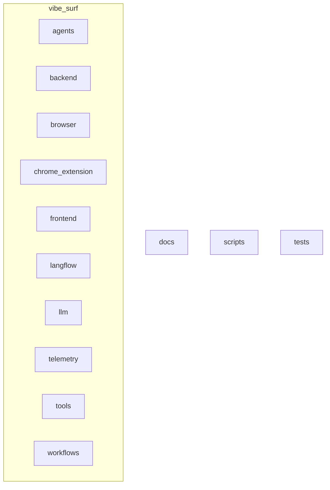
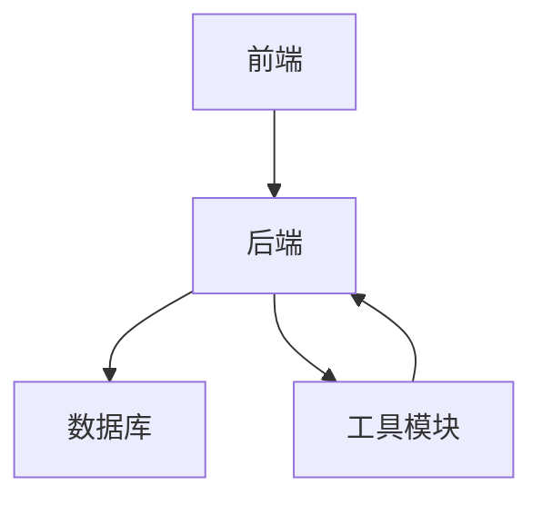
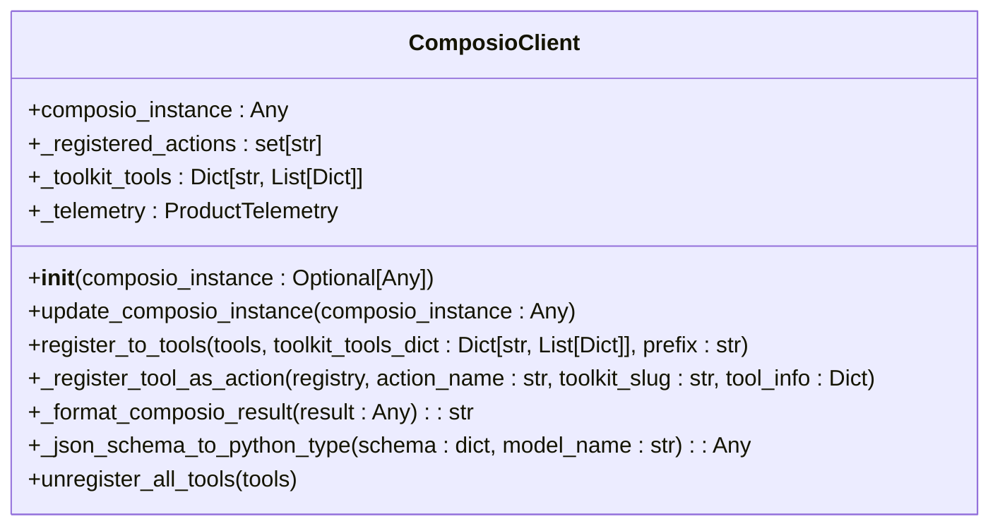
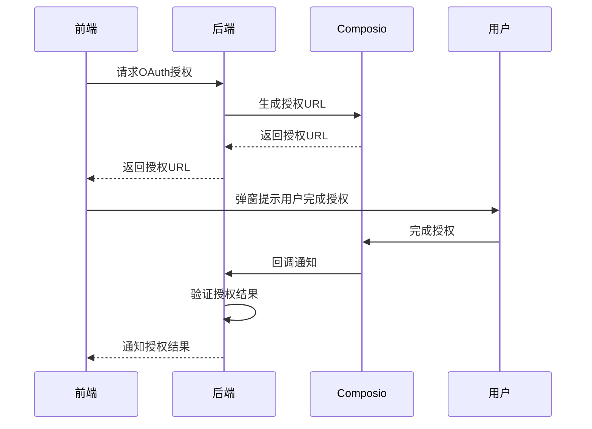
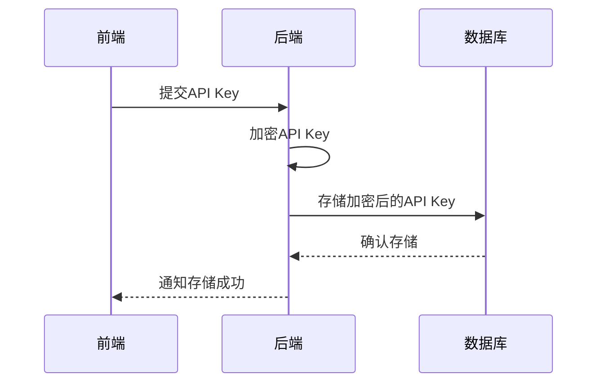
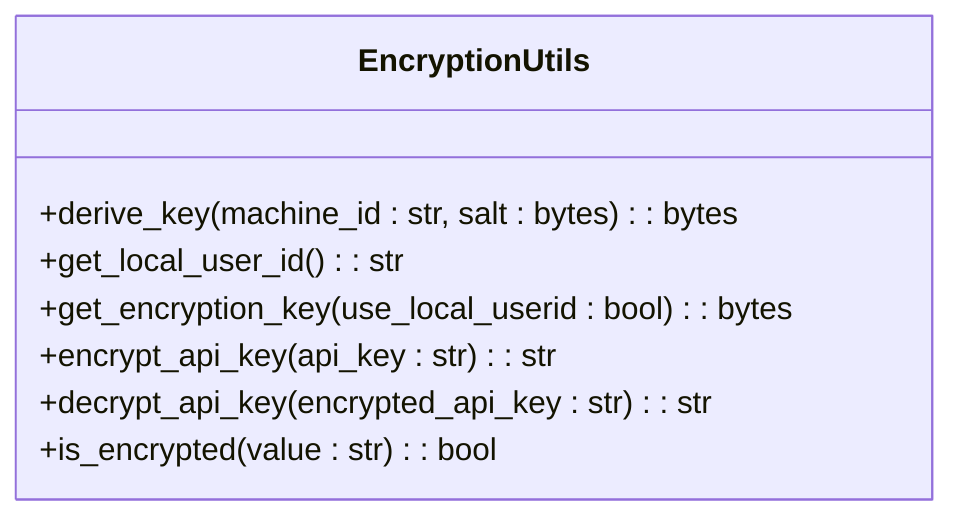
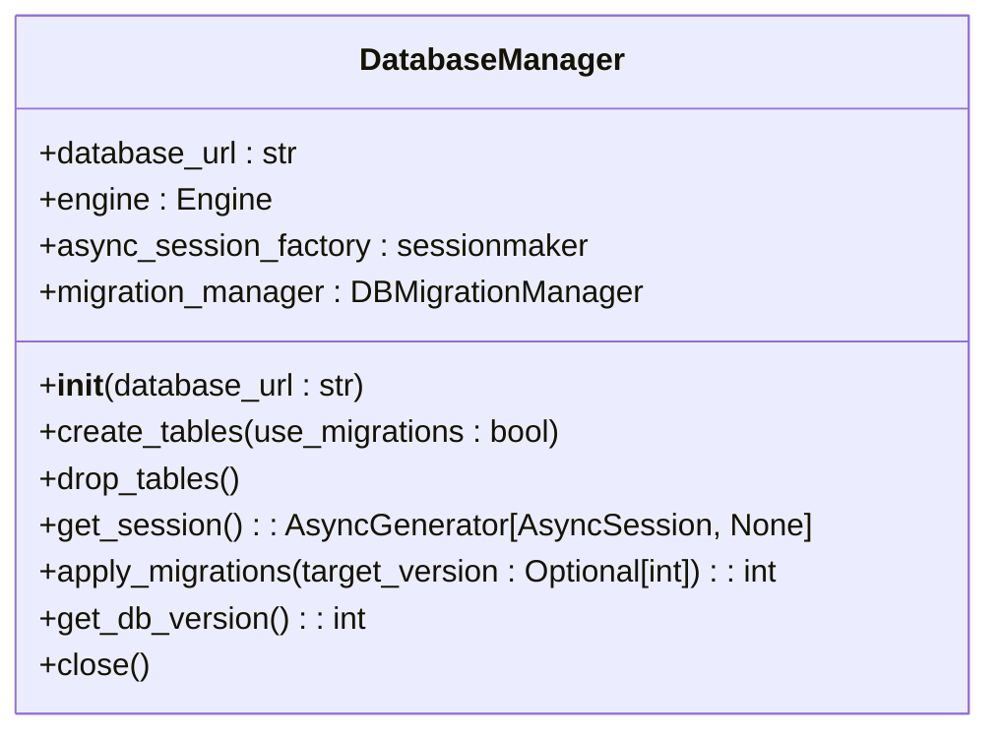
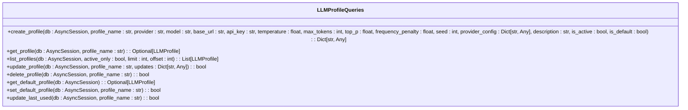

# 认证机制实现

<cite>
**本文档引用的文件**   
- [composio_client.py](file://vibe_surf/tools/composio_client.py)
- [composio.py](file://vibe_surf/backend/api/composio.py)
- [encryption.py](file://vibe_surf/backend/utils/encryption.py)
- [models.py](file://vibe_surf/backend/database/models.py)
- [manager.py](file://vibe_surf/backend/database/manager.py)
- [queries.py](file://vibe_surf/backend/database/queries.py)
- [shared_state.py](file://vibe_surf/backend/shared_state.py)
- [schemas.py](file://vibe_surf/backend/database/schemas.py)
- [authModal.tsx](file://vibe_surf/frontend/src/modals/authModal/index.tsx)
- [utils.py](file://vibe_surf/frontend/src/utils/utils.ts)
</cite>

## 目录
1. [引言](#引言)
2. [项目结构](#项目结构)
3. [核心组件](#核心组件)
4. [架构概述](#架构概述)
5. [详细组件分析](#详细组件分析)
6. [依赖分析](#依赖分析)
7. [性能考虑](#性能考虑)
8. [故障排除指南](#故障排除指南)
9. [结论](#结论)
10. [附录](#附录) (如有必要)

## 引言
本文档深入讲解第三方集成的认证机制实现，重点分析composio_client.py中的OAuth和API Key认证流程。详细说明如何安全地存储和管理认证凭证，包括加密存储、令牌刷新和会话管理。解释如何实现多因素认证支持、权限范围控制和租户隔离。提供敏感信息保护的最佳实践，如使用环境变量、密钥管理系统和动态凭证生成。展示如何处理认证失败、令牌过期和权限变更等异常情况，并提供相应的错误恢复策略。

## 项目结构
项目结构清晰地组织了各个模块和组件，确保代码的可维护性和扩展性。主要目录包括docs、scripts、tests和vibe_surf。vibe_surf目录包含agents、backend、browser、chrome_extension、frontend、langflow、llm、telemetry、tools和workflows等子目录，每个子目录负责特定的功能模块。

**图源**
- [vibe_surf](file://vibe_surf)

**节源**
- [vibe_surf](file://vibe_surf)

## 核心组件
核心组件包括composio_client.py、composio.py、encryption.py、models.py、manager.py、queries.py、shared_state.py、schemas.py、authModal.tsx和utils.py。这些文件共同实现了认证机制的核心功能，包括OAuth和API Key的处理、加密存储、数据库管理等。

**节源**
- [composio_client.py](file://vibe_surf/tools/composio_client.py)
- [composio.py](file://vibe_surf/backend/api/composio.py)
- [encryption.py](file://vibe_surf/backend/utils/encryption.py)
- [models.py](file://vibe_surf/backend/database/models.py)
- [manager.py](file://vibe_surf/backend/database/manager.py)
- [queries.py](file://vibe_surf/backend/database/queries.py)
- [shared_state.py](file://vibe_surf/backend/shared_state.py)
- [schemas.py](file://vibe_surf/backend/database/schemas.py)
- [authModal.tsx](file://vibe_surf/frontend/src/modals/authModal/index.tsx)
- [utils.py](file://vibe_surf/frontend/src/utils/utils.ts)

## 架构概述
系统架构采用分层设计，前端通过API与后端交互，后端通过数据库和工具模块处理业务逻辑。认证机制主要由composio_client.py和composio.py实现，加密存储由encryption.py处理，数据库管理由manager.py和queries.py负责。

**图源**
- [composio_client.py](file://vibe_surf/tools/composio_client.py)
- [composio.py](file://vibe_surf/backend/api/composio.py)
- [encryption.py](file://vibe_surf/backend/utils/encryption.py)
- [models.py](file://vibe_surf/backend/database/models.py)
- [manager.py](file://vibe_surf/backend/database/manager.py)
- [queries.py](file://vibe_surf/backend/database/queries.py)
- [shared_state.py](file://vibe_surf/backend/shared_state.py)
- [schemas.py](file://vibe_surf/backend/database/schemas.py)
- [authModal.tsx](file://vibe_surf/frontend/src/modals/authModal/index.tsx)
- [utils.py](file://vibe_surf/frontend/src/utils/utils.ts)

## 详细组件分析
### Composio客户端分析
Composio客户端负责与Composio工具包集成，动态发现并注册为VibeSurf动作。主要功能包括初始化Composio实例、更新实例、注册工具和取消注册工具。

#### 类图

**图源**
- [composio_client.py](file://vibe_surf/tools/composio_client.py)

### 认证流程分析
认证流程包括OAuth和API Key两种方式。OAuth流程通过前端弹窗引导用户完成授权，API Key则通过数据库加密存储和验证。

#### OAuth流程

**图源**
- [composio.py](file://vibe_surf/backend/api/composio.py)
- [authModal.tsx](file://vibe_surf/frontend/src/modals/authModal/index.tsx)

#### API Key流程

**图源**
- [composio.py](file://vibe_surf/backend/api/composio.py)
- [encryption.py](file://vibe_surf/backend/utils/encryption.py)
- [models.py](file://vibe_surf/backend/database/models.py)
- [manager.py](file://vibe_surf/backend/database/manager.py)
- [queries.py](file://vibe_surf/backend/database/queries.py)

### 加密存储分析
加密存储使用机器MAC地址派生密钥，确保API Key的安全性。主要功能包括派生密钥、获取加密密钥、加密API Key和解密API Key。

#### 类图

**图源**
- [encryption.py](file://vibe_surf/backend/utils/encryption.py)

### 数据库管理分析
数据库管理模块负责数据库连接、会话管理和初始化。主要功能包括创建表、删除表、获取会话和应用迁移。

#### 类图

**图源**
- [manager.py](file://vibe_surf/backend/database/manager.py)

### 查询模块分析
查询模块提供对数据库的查询操作，包括LLM配置文件、MCP配置文件、任务、上传文件和语音配置文件的查询。

#### 类图

**图源**
- [queries.py](file://vibe_surf/backend/database/queries.py)

## 依赖分析
系统依赖包括前端、后端、数据库和工具模块。前端通过API与后端交互，后端通过数据库和工具模块处理业务逻辑。认证机制主要依赖composio_client.py、composio.py、encryption.py、models.py、manager.py、queries.py、shared_state.py、schemas.py、authModal.tsx和utils.py。

**图源**
- [composio_client.py](file://vibe_surf/tools/composio_client.py)
- [composio.py](file://vibe_surf/backend/api/composio.py)
- [encryption.py](file://vibe_surf/backend/utils/encryption.py)
- [models.py](file://vibe_surf/backend/database/models.py)
- [manager.py](file://vibe_surf/backend/database/manager.py)
- [queries.py](file://vibe_surf/backend/database/queries.py)
- [shared_state.py](file://vibe_surf/backend/shared_state.py)
- [schemas.py](file://vibe_surf/backend/database/schemas.py)
- [authModal.tsx](file://vibe_surf/frontend/src/modals/authModal/index.tsx)
- [utils.py](file://vibe_surf/frontend/src/utils/utils.ts)

**节源**
- [composio_client.py](file://vibe_surf/tools/composio_client.py)
- [composio.py](file://vibe_surf/backend/api/composio.py)
- [encryption.py](file://vibe_surf/backend/utils/encryption.py)
- [models.py](file://vibe_surf/backend/database/models.py)
- [manager.py](file://vibe_surf/backend/database/manager.py)
- [queries.py](file://vibe_surf/backend/database/queries.py)
- [shared_state.py](file://vibe_surf/backend/shared_state.py)
- [schemas.py](file://vibe_surf/backend/database/schemas.py)
- [authModal.tsx](file://vibe_surf/frontend/src/modals/authModal/index.tsx)
- [utils.py](file://vibe_surf/frontend/src/utils/utils.ts)

## 性能考虑
系统在性能方面进行了优化，包括使用异步操作、数据库连接池和缓存机制。异步操作确保了高并发下的响应速度，数据库连接池减少了连接开销，缓存机制提高了数据访问速度。

## 故障排除指南
### 认证失败
- **检查API Key**: 确保API Key正确且未过期。
- **检查OAuth授权**: 确保用户已完成OAuth授权流程。
- **检查网络连接**: 确保网络连接正常，能够访问Composio服务。

### 令牌过期
- **刷新令牌**: 使用刷新令牌机制获取新的访问令牌。
- **重新授权**: 如果刷新令牌失败，引导用户重新进行OAuth授权。

### 权限变更
- **更新权限**: 在用户权限变更后，及时更新系统中的权限配置。
- **重新验证**: 重新验证用户的权限，确保其能够访问相应的资源。

**节源**
- [composio.py](file://vibe_surf/backend/api/composio.py)
- [encryption.py](file://vibe_surf/backend/utils/encryption.py)
- [models.py](file://vibe_surf/backend/database/models.py)
- [manager.py](file://vibe_surf/backend/database/manager.py)
- [queries.py](file://vibe_surf/backend/database/queries.py)
- [shared_state.py](file://vibe_surf/backend/shared_state.py)
- [schemas.py](file://vibe_surf/backend/database/schemas.py)
- [authModal.tsx](file://vibe_surf/frontend/src/modals/authModal/index.tsx)
- [utils.py](file://vibe_surf/frontend/src/utils/utils.ts)

## 结论
本文档详细介绍了第三方集成的认证机制实现，重点分析了composio_client.py中的OAuth和API Key认证流程。通过加密存储、令牌刷新和会话管理，确保了认证凭证的安全性。多因素认证支持、权限范围控制和租户隔离进一步增强了系统的安全性。敏感信息保护的最佳实践，如使用环境变量、密钥管理系统和动态凭证生成，为系统提供了额外的安全保障。处理认证失败、令牌过期和权限变更等异常情况的策略，确保了系统的稳定性和可靠性。