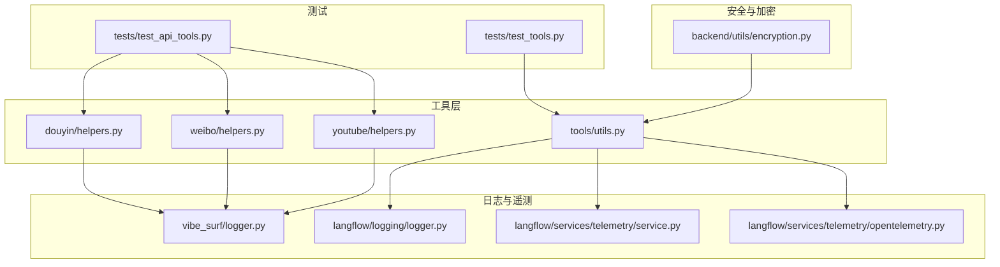
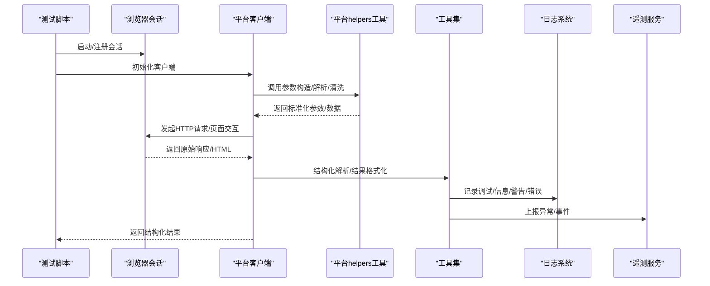
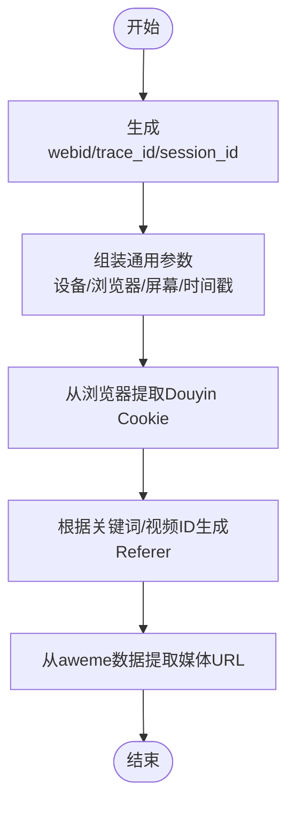
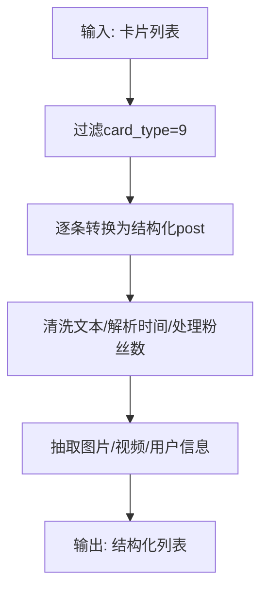
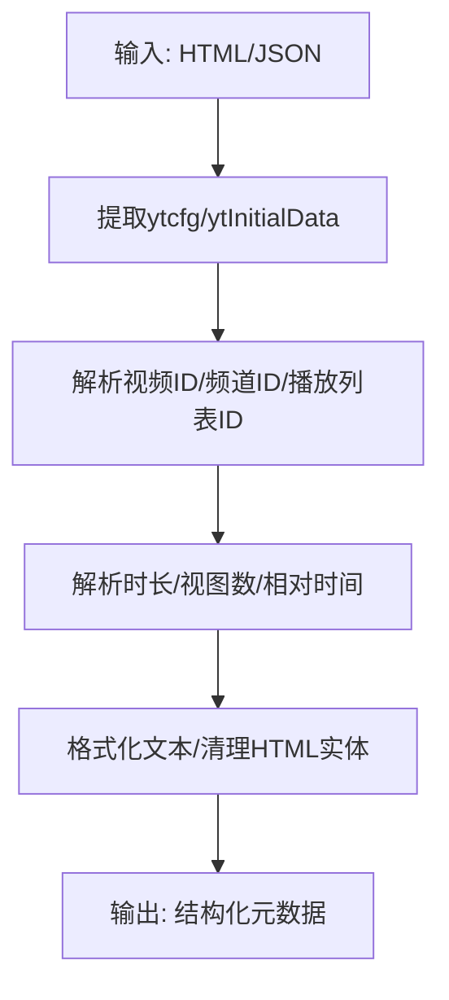
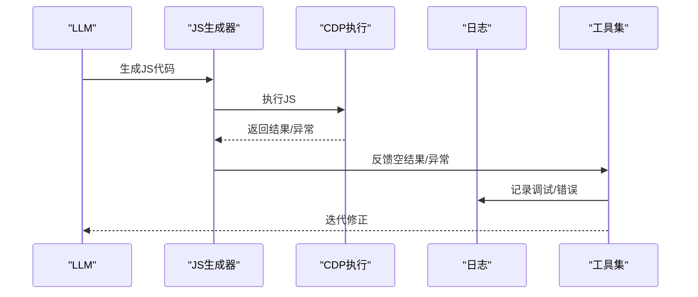
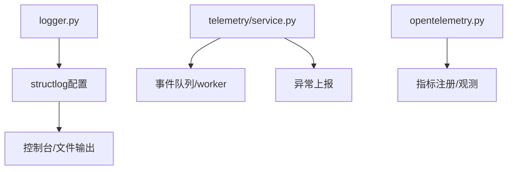
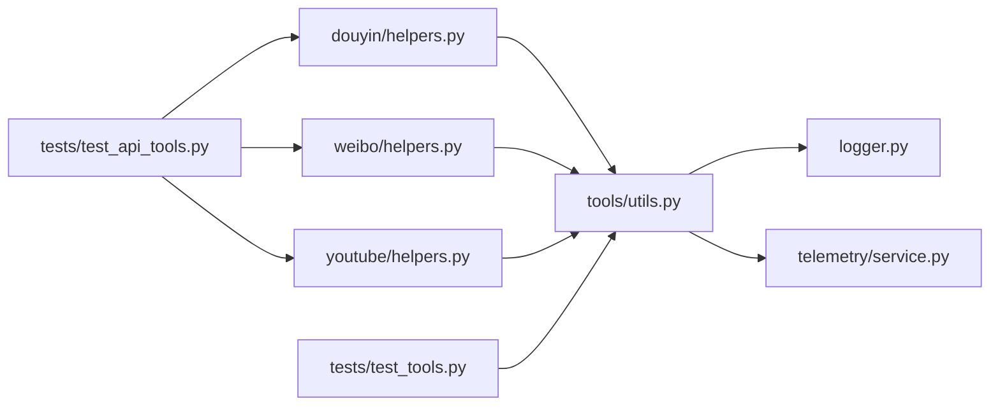

# 集成开发最佳实践

<cite>
**本文引用的文件**
- [douyin/helpers.py](file://vibe_surf/tools/website_api/douyin/helpers.py)
- [weibo/helpers.py](file://vibe_surf/tools/website_api/weibo/helpers.py)
- [youtube/helpers.py](file://vibe_surf/tools/website_api/youtube/helpers.py)
- [tools/utils.py](file://vibe_surf/tools/utils.py)
- [logger.py](file://vibe_surf/logger.py)
- [langflow/logging/logger.py](file://vibe_surf/langflow/logging/logger.py)
- [langflow/services/telemetry/service.py](file://vibe_surf/langflow/services/telemetry/service.py)
- [langflow/services/telemetry/opentelemetry.py](file://vibe_surf/langflow/services/telemetry/opentelemetry.py)
- [backend/utils/encryption.py](file://vibe_surf/backend/utils/encryption.py)
- [tests/test_api_tools.py](file://tests/test_api_tools.py)
- [tests/test_tools.py](file://tests/test_tools.py)
</cite>

## 目录
1. [引言](#引言)
2. [项目结构](#项目结构)
3. [核心组件](#核心组件)
4. [架构总览](#架构总览)
5. [详细组件分析](#详细组件分析)
6. [依赖关系分析](#依赖关系分析)
7. [性能考量](#性能考量)
8. [故障排查指南](#故障排查指南)
9. [结论](#结论)
10. [附录](#附录)

## 引言
本文件围绕抖音(douyin)、微博(weibo)与YouTube的helpers.py工具集，系统总结第三方集成开发的最佳实践，覆盖代码组织结构、错误码映射、日志记录、监控埋点、性能优化、可复用工具类设计、统一异常处理框架与响应格式化器、以及测试策略（单元测试、集成测试、端到端测试）。目标是帮助开发者在保证可维护性、可扩展性与安全性的前提下，快速构建稳定可靠的第三方平台集成模块。

## 项目结构
- 第三方网站工具位于 tools/website_api 下，每个平台一个子目录，包含 helpers.py 工具函数与 client.py 客户端实现。
- 统一日志通过 logger.py 与 langflow/logging 提供；遥测通过 langflow/services/telemetry 提供；加密工具位于 backend/utils/encryption.py。
- 测试位于 tests/，包含针对各平台API的集成测试脚本。

图表来源
- [douyin/helpers.py](file://vibe_surf/tools/website_api/douyin/helpers.py#L1-L239)
- [weibo/helpers.py](file://vibe_surf/tools/website_api/weibo/helpers.py#L1-L997)
- [youtube/helpers.py](file://vibe_surf/tools/website_api/youtube/helpers.py#L1-L420)
- [tools/utils.py](file://vibe_surf/tools/utils.py#L1-L800)
- [logger.py](file://vibe_surf/logger.py#L1-L99)
- [langflow/logging/logger.py](file://vibe_surf/langflow/logging/logger.py#L159-L407)
- [langflow/services/telemetry/service.py](file://vibe_surf/langflow/services/telemetry/service.py#L206-L281)
- [langflow/services/telemetry/opentelemetry.py](file://vibe_surf/langflow/services/telemetry/opentelemetry.py#L1-L253)
- [backend/utils/encryption.py](file://vibe_surf/backend/utils/encryption.py#L1-L172)
- [tests/test_api_tools.py](file://tests/test_api_tools.py#L1-L142)
- [tests/test_tools.py](file://tests/test_tools.py#L1-L251)

章节来源
- [douyin/helpers.py](file://vibe_surf/tools/website_api/douyin/helpers.py#L1-L239)
- [weibo/helpers.py](file://vibe_surf/tools/website_api/weibo/helpers.py#L1-L997)
- [youtube/helpers.py](file://vibe_surf/tools/website_api/youtube/helpers.py#L1-L420)
- [tools/utils.py](file://vibe_surf/tools/utils.py#L1-L800)
- [logger.py](file://vibe_surf/logger.py#L1-L99)
- [langflow/logging/logger.py](file://vibe_surf/langflow/logging/logger.py#L159-L407)
- [langflow/services/telemetry/service.py](file://vibe_surf/langflow/services/telemetry/service.py#L206-L281)
- [langflow/services/telemetry/opentelemetry.py](file://vibe_surf/langflow/services/telemetry/opentelemetry.py#L1-L253)
- [backend/utils/encryption.py](file://vibe_surf/backend/utils/encryption.py#L1-L172)
- [tests/test_api_tools.py](file://tests/test_api_tools.py#L1-L142)
- [tests/test_tools.py](file://tests/test_tools.py#L1-L251)

## 核心组件
- 平台工具函数：提供参数构造、Cookie提取、URL解析、数据清洗与转换等通用能力，便于上层客户端调用。
- 日志体系：统一控制台与文件输出，支持结构化日志与环境变量控制。
- 遥测服务：异常上报、任务队列与事件收集，支持异步工作线程与优雅停机。
- 加密工具：基于机器MAC或本地用户ID派生对称密钥，保护敏感配置。
- 测试框架：集成浏览器会话与平台API调用，覆盖端到端流程。

章节来源
- [douyin/helpers.py](file://vibe_surf/tools/website_api/douyin/helpers.py#L90-L239)
- [weibo/helpers.py](file://vibe_surf/tools/website_api/weibo/helpers.py#L38-L997)
- [youtube/helpers.py](file://vibe_surf/tools/website_api/youtube/helpers.py#L46-L420)
- [tools/utils.py](file://vibe_surf/tools/utils.py#L136-L800)
- [logger.py](file://vibe_surf/logger.py#L1-L99)
- [langflow/logging/logger.py](file://vibe_surf/langflow/logging/logger.py#L159-L407)
- [langflow/services/telemetry/service.py](file://vibe_surf/langflow/services/telemetry/service.py#L206-L281)
- [backend/utils/encryption.py](file://vibe_surf/backend/utils/encryption.py#L65-L148)

## 架构总览
下图展示从浏览器会话到平台API再到日志与遥测的整体调用链路。

图表来源
- [tests/test_api_tools.py](file://tests/test_api_tools.py#L22-L141)
- [douyin/helpers.py](file://vibe_surf/tools/website_api/douyin/helpers.py#L90-L239)
- [weibo/helpers.py](file://vibe_surf/tools/website_api/weibo/helpers.py#L193-L997)
- [youtube/helpers.py](file://vibe_surf/tools/website_api/youtube/helpers.py#L305-L420)
- [tools/utils.py](file://vibe_surf/tools/utils.py#L136-L800)
- [logger.py](file://vibe_surf/logger.py#L1-L99)
- [langflow/logging/logger.py](file://vibe_surf/langflow/logging/logger.py#L159-L407)
- [langflow/services/telemetry/service.py](file://vibe_surf/langflow/services/telemetry/service.py#L206-L281)

## 详细组件分析

### 抖音(douyin) helpers 分析
- 参数与标识生成
  - 设备/会话标识：生成webid、trace_id、session_id，用于请求去重与追踪。
  - 常用参数：设备平台、浏览器版本、屏幕分辨率、webid等，统一注入到请求参数中。
- Cookie与Referer
  - 从浏览器导出Douyin域Cookie，拼接为请求头字符串；根据关键词/视频ID动态构造Referer。
- 数据提取
  - 从aweme数据中抽取图片、视频播放地址、封面等字段，容错处理缺失键值。
- 错误类型
  - 定义网络、数据提取、认证、限流、验证等异常基类，便于上层捕获与分类处理。

图表来源
- [douyin/helpers.py](file://vibe_surf/tools/website_api/douyin/helpers.py#L33-L209)

章节来源
- [douyin/helpers.py](file://vibe_surf/tools/website_api/douyin/helpers.py#L33-L239)

### 微博(weibo) helpers 分析
- 参数与容器
  - 生成设备ID；根据搜索类型与关键词构造容器ID；解析M_WEIBOCN_PARAMS提取容器参数。
- Cookie与URL解析
  - 过滤Weibo域Cookie；从URL中提取mid、用户ID；解析移动端UA。
- 文本与时间处理
  - 清洗文本HTML标签与多余空白；解析“几分钟前/几小时前/天前”等相对时间；支持GBK/UTF-8解码。
- 图片代理与文件名清理
  - 构建代理URL绕过热链；清理非法字符并限制长度。
- 数据转换
  - 卡片过滤(card_type=9)；结构化帖子、评论、用户信息；处理粉丝数等数值后缀。
- 错误类型
  - 网络、数据提取、认证、限流、内容未找到、数据校验失败等。

图表来源
- [weibo/helpers.py](file://vibe_surf/tools/website_api/weibo/helpers.py#L174-L438)

章节来源
- [weibo/helpers.py](file://vibe_surf/tools/website_api/weibo/helpers.py#L1-L997)

### YouTube helpers 分析
- 搜索与排序枚举
  - 搜索类型、排序方式、时长筛选、上传日期筛选等枚举，便于参数组合。
- Cookie与ID解析
  - 提取YouTube域Cookie；从URL解析视频/频道/播放列表ID；解析时长字符串与视图数。
- 文本与时间处理
  - 清洗HTML实体；解析“X秒/分钟/小时/天前”等相对时间；清理特殊字符。
- 页面数据提取
  - 从HTML中提取ytcfg与初始数据；构建搜索URL与参数；提取缩略图URL。
- 错误类型
  - 网络、数据提取、认证、限流、内容未找到、数据校验失败等。

图表来源
- [youtube/helpers.py](file://vibe_surf/tools/website_api/youtube/helpers.py#L261-L420)

章节来源
- [youtube/helpers.py](file://vibe_surf/tools/website_api/youtube/helpers.py#L1-L420)

### 工具集(utils)与统一异常处理
- JavaScript代码生成与执行
  - 基于LLM生成JS代码，结合CDP执行并迭代修正；对空结果与异常进行反馈与重试。
- Google AI模型搜索与回退并行搜索
  - 提取AI回答与来源；并行多标签页搜索去重聚合。
- 统一异常处理
  - 在生成/执行阶段捕获异常，记录上下文并返回结构化结果，避免崩溃。

图表来源
- [tools/utils.py](file://vibe_surf/tools/utils.py#L136-L355)

章节来源
- [tools/utils.py](file://vibe_surf/tools/utils.py#L136-L800)

### 日志记录与监控埋点
- 日志配置
  - 支持控制台与文件输出，按环境变量切换格式；结构化日志缓冲与序列化；生产环境移除异常细节。
- 遥测服务
  - 异常上报、任务队列、优雅停机与flush；OpenTelemetry指标封装（计数器、直方图、可观测量）。

图表来源
- [logger.py](file://vibe_surf/logger.py#L1-L99)
- [langflow/logging/logger.py](file://vibe_surf/langflow/logging/logger.py#L159-L407)
- [langflow/services/telemetry/service.py](file://vibe_surf/langflow/services/telemetry/service.py#L206-L281)
- [langflow/services/telemetry/opentelemetry.py](file://vibe_surf/langflow/services/telemetry/opentelemetry.py#L1-L253)

章节来源
- [logger.py](file://vibe_surf/logger.py#L1-L99)
- [langflow/logging/logger.py](file://vibe_surf/langflow/logging/logger.py#L159-L407)
- [langflow/services/telemetry/service.py](file://vibe_surf/langflow/services/telemetry/service.py#L206-L281)
- [langflow/services/telemetry/opentelemetry.py](file://vibe_surf/langflow/services/telemetry/opentelemetry.py#L1-L253)

### 安全与加密
- 对称加密
  - 基于机器MAC或本地用户ID派生密钥，使用Fernet对API Key进行加解密；支持检测是否已加密。
- 敏感字段处理
  - 在MCP服务中对命令行参数进行脱敏，避免泄露密钥与令牌。

章节来源
- [backend/utils/encryption.py](file://vibe_surf/backend/utils/encryption.py#L65-L148)
- [langflow/services/mcp_composer/service.py](file://vibe_surf/langflow/services/mcp_composer/service.py#L255-L289)

## 依赖关系分析
- 平台helpers依赖
  - 通用参数构造、Cookie提取、URL解析、文本清洗、时间解析、数据转换等函数相互独立，便于复用。
- 工具集依赖
  - 与浏览器会话、LLM、CDP交互；依赖日志与遥测服务进行可观测性。
- 测试依赖
  - 通过tests/test_api_tools.py启动浏览器会话，分别调用各平台客户端进行端到端验证。

图表来源
- [douyin/helpers.py](file://vibe_surf/tools/website_api/douyin/helpers.py#L90-L239)
- [weibo/helpers.py](file://vibe_surf/tools/website_api/weibo/helpers.py#L193-L997)
- [youtube/helpers.py](file://vibe_surf/tools/website_api/youtube/helpers.py#L305-L420)
- [tools/utils.py](file://vibe_surf/tools/utils.py#L136-L800)
- [logger.py](file://vibe_surf/logger.py#L1-L99)
- [langflow/services/telemetry/service.py](file://vibe_surf/langflow/services/telemetry/service.py#L206-L281)
- [tests/test_api_tools.py](file://tests/test_api_tools.py#L22-L141)
- [tests/test_tools.py](file://tests/test_tools.py#L1-L251)

章节来源
- [tests/test_api_tools.py](file://tests/test_api_tools.py#L1-L142)
- [tests/test_tools.py](file://tests/test_tools.py#L1-L251)

## 性能考量
- 请求参数最小化与去重
  - 使用webid/trace_id/session_id降低重复请求概率，减少平台风控触发。
- 数据提取与转换
  - 采用容错式提取与字段裁剪，避免大对象传输；必要时分页/分批处理。
- 日志与遥测
  - 控制台与文件输出分离，生产环境关闭详细堆栈；遥测队列异步处理，避免阻塞主流程。
- 浏览器自动化
  - 通过LLM驱动的JS生成与CDP执行，减少手动交互成本；对空结果与异常进行快速反馈与重试。

[本节为通用指导，无需具体文件引用]

## 故障排查指南
- 常见问题定位
  - 网络错误：检查Cookie有效性、Referer合法性、UA与设备参数一致性。
  - 数据提取失败：确认字段存在性与格式，必要时降级处理。
  - 认证失败：提示用户完成OAuth授权或刷新令牌。
- 日志与遥测
  - 查看控制台与文件日志；关注异常上报与堆栈哈希；检查遥测队列是否正常flush。
- 测试验证
  - 使用tests/test_api_tools.py启动真实浏览器会话，逐一调用平台API，观察返回与异常。

章节来源
- [tests/test_api_tools.py](file://tests/test_api_tools.py#L22-L141)
- [langflow/logging/logger.py](file://vibe_surf/langflow/logging/logger.py#L159-L407)
- [langflow/services/telemetry/service.py](file://vibe_surf/langflow/services/telemetry/service.py#L206-L281)

## 结论
通过对抖音、微博、YouTube的helpers工具集与工具集(utils)、日志与遥测、加密与测试的系统梳理，可以形成一套可复用、可维护、可扩展且安全的第三方集成开发范式。建议在实际项目中：
- 将平台差异抽象为统一接口，复用helpers中的参数构造、Cookie提取、URL解析与数据转换逻辑；
- 建立统一异常处理框架与响应格式化器，确保错误可追踪、可诊断；
- 强化日志与遥测，实现可观测性闭环；
- 注重性能与稳定性，结合LLM与CDP提升自动化效率；
- 严格遵循安全规范，对敏感字段进行加密存储与传输。

[本节为总结性内容，无需具体文件引用]

## 附录
- 测试策略建议
  - 单元测试：针对helpers中的纯函数（如URL解析、时间解析、数据清洗）编写断言，覆盖边界与异常路径。
  - 集成测试：使用tests/test_api_tools.py启动浏览器会话，调用各平台客户端，验证端到端流程与错误处理。
  - 端到端测试：模拟真实用户场景，结合LLM生成JS与CDP执行，验证复杂交互与结果聚合。
- 最佳实践清单
  - 统一参数构造与校验，避免硬编码。
  - 明确错误类型与分级，提供清晰的用户提示。
  - 保持日志简洁但可追踪，生产环境避免泄露敏感信息。
  - 使用指标与异常上报完善可观测性。
  - 对API Key与令牌等敏感信息进行加密存储与传输。

[本节为通用指导，无需具体文件引用]