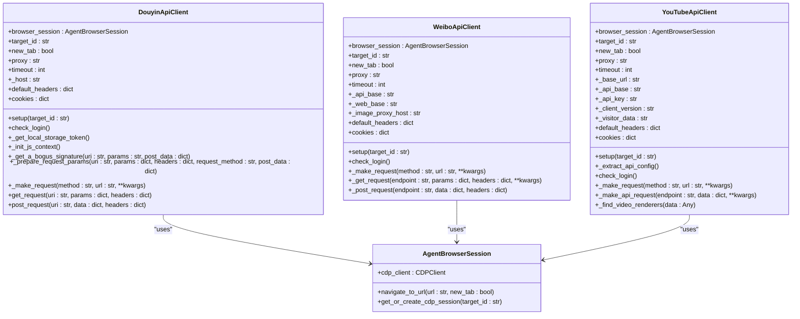
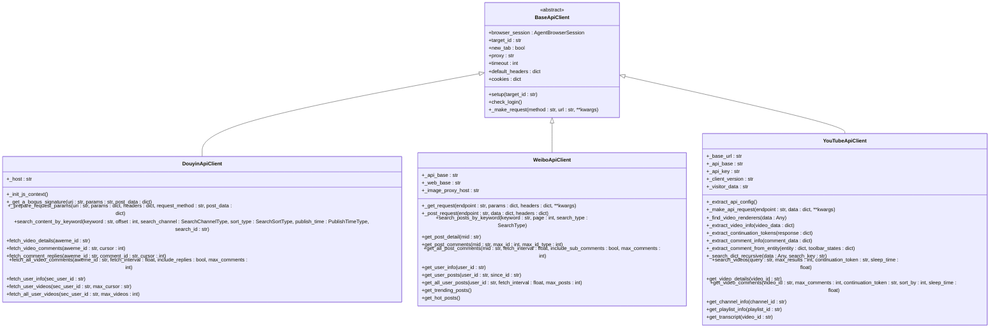
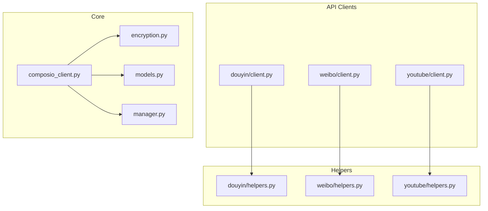

# 集成开发流程

<cite>
**本文档引用的文件**  
- [composio_client.py](file://vibe_surf/tools/composio_client.py)
- [douyin/client.py](file://vibe_surf/tools/website_api/douyin/client.py)
- [weibo/client.py](file://vibe_surf/tools/website_api/weibo/client.py)
- [youtube/client.py](file://vibe_surf/tools/website_api/youtube/client.py)
- [douyin/helpers.py](file://vibe_surf/tools/website_api/douyin/helpers.py)
- [weibo/helpers.py](file://vibe_surf/tools/website_api/weibo/helpers.py)
- [youtube/helpers.py](file://vibe_surf/tools/website_api/youtube/helpers.py)
- [encryption.py](file://vibe_surf/backend/utils/encryption.py)
- [models.py](file://vibe_surf/backend/database/models.py)
- [manager.py](file://vibe_surf/backend/database/manager.py)
</cite>

## 目录
1. [集成开发概述](#集成开发概述)
2. [认证机制实现](#认证机制实现)
3. [API客户端构建](#api客户端构建)
4. [请求封装与响应处理](#请求封装与响应处理)
5. [错误码映射与重试策略](#错误码映射与重试策略)
6. [代码结构组织](#代码结构组织)
7. [环境配置与敏感信息管理](#环境配置与敏感信息管理)
8. [多租户支持](#多租户支持)

## 集成开发概述

本文档详细说明了基于composio_client.py构建新的API客户端的完整开发流程。通过分析抖音、微博和YouTube的client.py实现，展示了RESTful API封装的最佳实践。文档涵盖了从认证机制实现、请求封装到响应处理的完整流程，并解释了如何定义统一的错误码映射、重试策略和超时控制。同时，指导开发者如何组织代码结构以实现可复用的客户端工具类，并涵盖环境配置管理、敏感信息加密存储和多租户支持等高级主题。

**Section sources**
- [composio_client.py](file://vibe_surf/tools/composio_client.py#L1-L458)
- [douyin/client.py](file://vibe_surf/tools/website_api/douyin/client.py#L1-L849)
- [weibo/client.py](file://vibe_surf/tools/website_api/weibo/client.py#L1-L768)
- [youtube/client.py](file://vibe_surf/tools/website_api/youtube/client.py#L1-L1268)

## 认证机制实现

在第三方集成开发中，认证机制是确保安全访问API的关键。本项目通过浏览器会话管理实现认证，利用浏览器的Cookie和本地存储来维护登录状态。

### 浏览器会话认证

所有API客户端都继承了统一的认证模式，通过`AgentBrowserSession`管理浏览器会话。客户端在初始化时接收一个浏览器会话实例，并在`setup`方法中导航到目标网站以提取认证信息。



**Diagram sources**
- [douyin/client.py](file://vibe_surf/tools/website_api/douyin/client.py#L35-L800)
- [weibo/client.py](file://vibe_surf/tools/website_api/weibo/client.py#L31-L768)
- [youtube/client.py](file://vibe_surf/tools/website_api/youtube/client.py#L34-L1268)
- [browser/agent_browser_session.py](file://vibe_surf/browser/agent_browser_session.py)

### 特定平台认证实现

不同平台的认证机制有所差异，需要针对具体平台进行适配。

#### 抖音认证

抖音客户端通过JavaScript执行生成签名，使用`execjs`库执行`douyin.js`文件中的签名函数。客户端从浏览器本地存储中获取`msToken`，并生成`a-bogus`签名来验证请求。

```python
def _init_js_context(self):
    """Initialize JavaScript context for signature generation"""
    if not HAS_EXECJS:
        logger.warning("execjs not available, signature generation disabled")
        return None

    try:
        js_file_path = os.path.join(os.path.dirname(__file__), 'douyin.js')
        if not os.path.exists(js_file_path):
            logger.warning(f"douyin.js file not found at {js_file_path}")
            return None

        with open(js_file_path, 'r', encoding='utf-8-sig') as f:
            js_content = f.read()

        return execjs.compile(js_content)
    except Exception as e:
        logger.error(f"Failed to initialize JS context: {e}")
        return None
```

#### 微博认证

微博客户端通过移动版网站进行认证，提取Cookie并验证登录状态。客户端使用`get_mobile_user_agent()`获取移动设备的用户代理，以确保API兼容性。

```python
def get_mobile_user_agent() -> str:
    ua_list = [
        "Mozilla/5.0 (iPhone; CPU iPhone OS 16_5 like Mac OS X) AppleWebKit/605.1.15 (KHTML, like Gecko) Version/16.5 Mobile/15E148 Safari/604.1",
        "Mozilla/5.0 (iPad; CPU OS 16_5 like Mac OS X) AppleWebKit/605.1.15 (KHTML, like Gecko) Version/16.5 Mobile/15E148 Safari/604.1",
        # ... 其他移动设备用户代理
    ]
    return random.choice(ua_list)
```

#### YouTube认证

YouTube客户端通过提取API密钥和配置信息实现认证。客户端从页面HTML中提取`INNERTUBE_API_KEY`和`clientVersion`，并使用这些信息构建API请求。

```python
async def _extract_api_config(self):
    """Extract API key and configuration from YouTube page"""
    try:
        cdp_session = await self.browser_session.get_or_create_cdp_session(target_id=self.target_id)

        # Get page content to extract API key
        content_result = await cdp_session.cdp_client.send.Runtime.evaluate(
            params={
                'expression': "document.documentElement.outerHTML",
                'returnByValue': True,
            },
            session_id=cdp_session.session_id,
        )

        html_content = content_result.get('result', {}).get('value', '')

        # Extract API key from page
        api_key_match = re.search(r'"INNERTUBE_API_KEY":"([^"]+)"', html_content)
        if api_key_match:
            self._api_key = api_key_match.group(1)
            logger.info(f"Extracted YouTube API key: {self._api_key[:10]}...")

        # Extract client version
        version_match = re.search(r'"clientVersion":"([^"]+)"', html_content)
        if version_match:
            self._client_version = version_match.group(1)
            self.default_headers["X-YouTube-Client-Version"] = self._client_version

    except Exception as e:
        logger.warning(f"Failed to extract YouTube API config: {e}")
```

**Section sources**
- [douyin/client.py](file://vibe_surf/tools/website_api/douyin/client.py#L150-L203)
- [weibo/client.py](file://vibe_surf/tools/website_api/weibo/client.py#L31-L768)
- [youtube/client.py](file://vibe_surf/tools/website_api/youtube/client.py#L137-L173)

## API客户端构建

API客户端的构建遵循统一的设计模式，确保代码的可维护性和可扩展性。每个客户端都封装了特定平台的API调用，并提供简洁的接口供上层应用使用。

### 客户端基类设计

所有API客户端都继承自一个统一的基类设计模式，包含以下核心组件：

- **浏览器会话管理**: 通过`AgentBrowserSession`管理浏览器会话
- **HTTP客户端**: 使用`httpx.AsyncClient`进行异步HTTP请求
- **错误处理**: 统一的错误处理机制，包括网络错误、认证错误等
- **重试机制**: 使用`tenacity`库实现请求重试



**Diagram sources**
- [douyin/client.py](file://vibe_surf/tools/website_api/douyin/client.py#L35-L800)
- [weibo/client.py](file://vibe_surf/tools/website_api/weibo/client.py#L31-L768)
- [youtube/client.py](file://vibe_surf/tools/website_api/youtube/client.py#L34-L1268)

### RESTful API封装最佳实践

在封装RESTful API时，遵循以下最佳实践：

#### 统一的请求参数处理

所有客户端都实现了统一的请求参数处理机制，包括：

- **公共参数**: 为每个请求添加平台特定的公共参数
- **签名生成**: 为需要签名的请求生成相应的签名
- **Cookie管理**: 从浏览器会话中提取并管理Cookie

```python
async def _prepare_request_params(self, uri: str, params: Optional[Dict] = None,
                                  headers: Optional[Dict] = None, request_method: str = "GET",
                                  post_data: Optional[Dict] = None):
    """
    Prepare request parameters with common Douyin parameters and signatures
    
    Args:
        uri: Request URI
        params: Request parameters
        headers: Request headers
        request_method: HTTP method
        post_data: POST data if applicable
    """
    if not params:
        params = {}

    headers = headers or copy.deepcopy(self.default_headers)

    # Add common parameters
    common_params = create_common_params()

    # Add msToken from local storage
    ms_token = await self._get_local_storage_token()
    if ms_token:
        common_params["msToken"] = ms_token

    params.update(common_params)

    # Generate query string
    query_string = urllib.parse.urlencode(params)

    # Get a-bogus signature
    post_data = post_data or {}
    if "/v1/web/general/search" not in uri:
        a_bogus = await self._get_a_bogus_signature(uri, query_string, post_data)
        params["a_bogus"] = a_bogus

    return params, headers
```

#### 分页处理

所有客户端都实现了分页处理机制，支持获取大量数据。分页处理包括：

- **游标管理**: 使用游标或偏移量进行分页
- **批量获取**: 支持一次性获取多页数据
- **速率控制**: 在请求之间添加延迟以避免速率限制

```python
async def fetch_all_video_comments(
        self,
        aweme_id: str,
        fetch_interval: float = 1.0,
        include_replies: bool = False,
        max_comments: int = 1000,
) -> List[Dict]:
    """
    Fetch all comments for a video, including replies if requested
    
    Args:
        aweme_id: Video ID
        fetch_interval: Delay between requests
        include_replies: Whether to fetch comment replies
        max_comments: Maximum comments to fetch
        
    Returns:
        List of all simplified comments
    """
    all_comments = []
    has_more = True
    cursor = 0

    while has_more and len(all_comments) < max_comments:
        uri = "/aweme/v1/web/comment/list/"
        params = {
            "aweme_id": aweme_id,
            "cursor": cursor,
            "count": 20,
            "item_type": 0
        }

        headers = copy.copy(self.default_headers)
        headers["Referer"] = create_referer_url(aweme_id=aweme_id)

        comments_data = await self.get_request(uri, params, headers)
        has_more = comments_data.get("has_more", False)
        cursor = comments_data.get("cursor", 0)

        # Get simplified comments from this batch
        batch_comments = []
        for comment_item in comments_data.get("comments", []):
            if not comment_item.get("cid"):
                continue

            # ... 处理评论数据

            batch_comments.append(comment_data)

        if not batch_comments:
            break

        # Limit comments to max_comments
        remaining_slots = max_comments - len(all_comments)
        if remaining_slots <= 0:
            break

        if len(batch_comments) > remaining_slots:
            batch_comments = batch_comments[:remaining_slots]

        all_comments.extend(batch_comments)

        await asyncio.sleep(fetch_interval)

        # Fetch replies if requested
        if include_replies:
            for comment in batch_comments:
                reply_count = int(comment.get("sub_comment_count", 0))

                if reply_count > 0:
                    comment_id = comment.get("comment_id")
                    replies = await self.fetch_comment_replies(aweme_id, comment_id, 0)
                    all_comments.extend(replies)

                    await asyncio.sleep(fetch_interval)

    logger.info(f"Fetched {len(all_comments)} comments for video {aweme_id}")
    return all_comments
```

**Section sources**
- [douyin/client.py](file://vibe_surf/tools/website_api/douyin/client.py#L204-L242)
- [weibo/client.py](file://vibe_surf/tools/website_api/weibo/client.py#L188-L211)
- [youtube/client.py](file://vibe_surf/tools/website_api/youtube/client.py#L304-L384)

## 请求封装与响应处理

请求封装与响应处理是API客户端的核心功能，确保请求的正确性和响应的可用性。

### 请求封装

请求封装包括请求的构建、发送和错误处理。所有客户端都使用`httpx.AsyncClient`进行异步HTTP请求，并实现了统一的错误处理机制。

```python
@retry(stop=stop_after_attempt(3), wait=wait_fixed(2))
async def _make_request(self, method: str, url: str, **kwargs) -> Union[str, Dict]:
    """
    Make HTTP request with error handling and retries
    
    Args:
        method: HTTP method
        url: Request URL
        **kwargs: Additional request parameters
        
    Returns:
        Response data
    """
    async with httpx.AsyncClient(proxy=self.proxy) as client:
        response = await client.request(method, url, timeout=self.timeout, **kwargs)

    # Handle common error responses
    if response.text == "" or response.text == "blocked":
        logger.error(f"Request blocked, response.text: {response.text}")
        raise VerificationError("Account may be blocked or requires verification")

    try:
        data = response.json()

        # Check for successful response
        if response.status_code == 200:
            return data
        else:
            error_msg = data.get("message", "Request failed")
            raise DataExtractionError(f"API error: {error_msg}")

    except json.JSONDecodeError:
        if response.status_code == 200:
            return response.text
        else:
            raise DataExtractionError(f"Invalid response: {response.text[:200]}")
```

### 响应处理

响应处理包括数据的提取、转换和验证。所有客户端都实现了统一的响应处理机制，确保返回的数据格式一致。

```python
def _extract_video_info(self, video_data: Dict) -> Optional[Dict]:
    """Extract simplified video information from YouTube video data"""
    try:
        video_id = video_data.get("videoId")
        if not video_id:
            return None

        title = video_data.get("title", {}).get("runs", [{}])[0].get("text", "")
        if not title and "accessibility" in video_data.get("title", {}):
            title = video_data["title"]["accessibility"]["accessibilityData"]["label"]

        # Extract view count
        view_count_text = ""
        view_count_runs = video_data.get("viewCountText", {}).get("simpleText", "")
        if not view_count_runs:
            view_count_runs = video_data.get("shortViewCountText", {}).get("simpleText", "")
        view_count = format_view_count(view_count_runs)

        # Extract duration
        duration_text = video_data.get("lengthText", {}).get("simpleText", "")
        duration_seconds = 0
        if duration_text:
            # Convert MM:SS or HH:MM:SS to seconds
            time_parts = duration_text.split(":")
            if len(time_parts) == 2:  # MM:SS
                duration_seconds = int(time_parts[0]) * 60 + int(time_parts[1])
            elif len(time_parts) == 3:  # HH:MM:SS
                duration_seconds = int(time_parts[0]) * 3600 + int(time_parts[1]) * 60 + int(time_parts[2])

        # Extract channel info
        channel_data = video_data.get("longBylineText", {}).get("runs", [{}])[0]
        channel_name = channel_data.get("text", "")
        channel_url = channel_data.get("navigationEndpoint", {}).get("commandMetadata", {}).get(
            "webCommandMetadata", {}).get("url", "")
        channel_id = extract_channel_id_from_url(channel_url) if channel_url else ""

        # Extract thumbnail
        thumbnails = video_data.get("thumbnail", {}).get("thumbnails", [])
        thumbnail_url = extract_thumbnail_url(thumbnails)

        # Extract published time
        published_time_text = video_data.get("publishedTimeText", {}).get("simpleText", "")

        description = ''
        if 'descriptionSnippet' in video_data:
            for desc in video_data.get('descriptionSnippet', {}).get('runs', {}):
                description += desc.get('text', '')

        return {
            "video_id": video_id,
            "title": process_youtube_text(title),
            "description": description,
            "duration": duration_seconds,
            "view_count": view_count,
            "like_count": -1,  # Not available in search results
            "comment_count": -1,  # Not available in search results
            "published_time": published_time_text,
            "thumbnail_url": thumbnail_url,
            "video_url": f"https://www.youtube.com/watch?v={video_id}",
            "channel_id": channel_id,
            "channel_name": channel_name,
            "channel_url": f"https://www.youtube.com{channel_url}" if channel_url else "",
        }

    except Exception as e:
        logger.error(f"Failed to extract video info: {e}")
        return None
```

**Section sources**
- [douyin/client.py](file://vibe_surf/tools/website_api/douyin/client.py#L243-L280)
- [weibo/client.py](file://vibe_surf/tools/website_api/weibo/client.py#L134-L187)
- [youtube/client.py](file://vibe_surf/tools/website_api/youtube/client.py#L193-L232)

## 错误码映射与重试策略

错误码映射与重试策略是确保API客户端稳定性的关键。

### 错误码映射

所有客户端都定义了统一的错误码映射，将平台特定的错误码转换为通用的错误类型。

```python
class DouyinError(Exception):
    """Base exception for Douyin API errors"""
    pass

class NetworkError(DouyinError):
    """Network connection error"""
    pass

class DataExtractionError(DouyinError):
    """Data extraction error"""
    pass

class AuthenticationError(DouyinError):
    """Authentication error"""
    pass

class RateLimitError(DouyinError):
    """Rate limit exceeded error"""
    pass

class VerificationError(DouyinError):
    """Account verification required error"""
    pass
```

### 重试策略

所有客户端都使用`tenacity`库实现重试策略，确保在临时性错误发生时能够自动重试。

```python
@retry(stop=stop_after_attempt(3), wait=wait_fixed(2))
async def _make_request(self, method: str, url: str, **kwargs) -> Union[str, Dict]:
    """
    Make HTTP request with error handling and retries
    
    Args:
        method: HTTP method
        url: Request URL
        **kwargs: Additional request parameters
        
    Returns:
        Response data
    """
    async with httpx.AsyncClient(proxy=self.proxy) as client:
        response = await client.request(method, url, timeout=self.timeout, **kwargs)

    # Handle common error responses
    if response.text == "" or response.text == "blocked":
        logger.error(f"Request blocked, response.text: {response.text}")
        raise VerificationError("Account may be blocked or requires verification")

    try:
        data = response.json()

        # Check for successful response
        if response.status_code == 200:
            return data
        else:
            error_msg = data.get("message", "Request failed")
            raise DataExtractionError(f"API error: {error_msg}")

    except json.JSONDecodeError:
        if response.status_code == 200:
            return response.text
        else:
            raise DataExtractionError(f"Invalid response: {response.text[:200]}")
```

**Section sources**
- [douyin/helpers.py](file://vibe_surf/tools/website_api/douyin/helpers.py#L212-L239)
- [weibo/helpers.py](file://vibe_surf/tools/website_api/weibo/helpers.py#L256-L284)
- [youtube/helpers.py](file://vibe_surf/tools/website_api/youtube/helpers.py#L339-L366)

## 代码结构组织

代码结构组织遵循模块化设计原则，确保代码的可维护性和可扩展性。

### 模块化设计

代码结构采用模块化设计，将不同功能分离到不同的模块中。



**Diagram sources**
- [douyin/client.py](file://vibe_surf/tools/website_api/douyin/client.py)
- [weibo/client.py](file://vibe_surf/tools/website_api/weibo/client.py)
- [youtube/client.py](file://vibe_surf/tools/website_api/youtube/client.py)
- [douyin/helpers.py](file://vibe_surf/tools/website_api/douyin/helpers.py)
- [weibo/helpers.py](file://vibe_surf/tools/website_api/weibo/helpers.py)
- [youtube/helpers.py](file://vibe_surf/tools/website_api/youtube/helpers.py)
- [composio_client.py](file://vibe_surf/tools/composio_client.py)
- [encryption.py](file://vibe_surf/backend/utils/encryption.py)
- [models.py](file://vibe_surf/backend/database/models.py)
- [manager.py](file://vibe_surf/backend/database/manager.py)

### 可复用的客户端工具类

通过抽象公共功能，创建可复用的客户端工具类，减少代码重复。

```python
class BaseApiClient:
    """Base class for API clients"""
    
    def __init__(self, browser_session: AgentBrowserSession, timeout: int = 60, proxy: Optional[str] = None):
        """
        Initialize the API client
        
        Args:
            browser_session: Browser session for authentication
            timeout: Request timeout in seconds
            proxy: Proxy URL if needed
        """
        self.browser_session = browser_session
        self.target_id = None
        self.new_tab = False
        self.proxy = proxy
        self.timeout = timeout
        self.default_headers = {}
        self.cookies = {}
    
    async def setup(self, target_id: Optional[str] = None):
        """Setup the API client by navigating to the site and extracting cookies"""
        raise NotImplementedError
    
    async def check_login(self) -> bool:
        """Check if login state is valid"""
        raise NotImplementedError
    
    async def _make_request(self, method: str, url: str, **kwargs):
        """Make HTTP request with error handling and retry logic"""
        raise NotImplementedError
```

**Section sources**
- [douyin/client.py](file://vibe_surf/tools/website_api/douyin/client.py#L41-L56)
- [weibo/client.py](file://vibe_surf/tools/website_api/weibo/client.py#L37-L51)
- [youtube/client.py](file://vibe_surf/tools/website_api/youtube/client.py#L40-L54)

## 环境配置与敏感信息管理

环境配置与敏感信息管理是确保应用安全性的关键。

### 环境配置管理

环境配置通过环境变量和配置文件进行管理，确保配置的灵活性和安全性。

```python
from vibe_surf.backend.database.manager import DatabaseManager
from vibe_surf.backend import shared_state

# Initialize database manager
database_url = os.getenv(
    'VIBESURF_DATABASE_URL',
    f'sqlite+aiosqlite:///{os.path.join(shared_state.workspace_dir, "vibe_surf.db")}'
)
shared_state.db_manager = DatabaseManager(database_url)
```

### 敏感信息加密存储

敏感信息如API密钥通过加密存储，确保数据的安全性。加密使用机器MAC地址作为密钥，确保密钥的唯一性。

```python
def derive_key(machine_id: str, salt: bytes = None) -> bytes:
    """Derive encryption key from machine ID."""
    if salt is None:
        # Use a fixed salt for consistency across sessions
        salt = b'vibesurf_warmshao_2025'
    
    # Convert machine_id to bytes
    password = machine_id.encode('utf-8')
    
    # Derive key using PBKDF2
    kdf = PBKDF2HMAC(
        algorithm=hashes.SHA256(),
        length=32,
        salt=salt,
        iterations=100000,
    )
    key = base64.urlsafe_b64encode(kdf.derive(password))
    return key

def get_encryption_key(use_local_userid=False) -> bytes:
    """Get the encryption key for this machine."""
    machine_id1 = ''
    if not use_local_userid:
        machine_id1 = get_mac_address()
    if not machine_id1:
        logger.info("Use local user id as encryption key.")
        # fallback to get user id
        machine_id1 = get_local_user_id()
    return derive_key(machine_id1)

def encrypt_api_key(api_key: str) -> str:
    """
    Encrypt API key using machine-specific key.
    
    Args:
        api_key: Plain text API key
        
    Returns:
        str: Base64 encoded encrypted API key
    """
    if not api_key or api_key.strip() == "":
        return ""
    
    try:
        key = get_encryption_key()
        fernet = Fernet(key)
        encrypted_data = fernet.encrypt(api_key.encode('utf-8'))
        return base64.urlsafe_b64encode(encrypted_data).decode('utf-8')
    except Exception as e:
        logger.error(f"Failed to encrypt API key: {e}")
        raise ValueError("Encryption failed")

def decrypt_api_key(encrypted_api_key: str) -> str:
    """
    Decrypt API key using machine-specific key.
    
    Args:
        encrypted_api_key: Base64 encoded encrypted API key
        
    Returns:
        str: Decrypted API key
    """
    if not encrypted_api_key or encrypted_api_key.strip() == "":
        return ""
    
    try:
        key = get_encryption_key()
        fernet = Fernet(key)
        encrypted_data = base64.urlsafe_b64decode(encrypted_api_key.encode('utf-8'))
        decrypted_data = fernet.decrypt(encrypted_data)
        return decrypted_data.decode('utf-8')
    except Exception as e:
        try:
            key = get_encryption_key(use_local_userid=True)
            fernet = Fernet(key)
            encrypted_data = base64.urlsafe_b64decode(encrypted_api_key.encode('utf-8'))
            decrypted_data = fernet.decrypt(encrypted_data)
            return decrypted_data.decode('utf-8')
        except Exception as e:
            logger.error(f"Failed to decrypt API key: {e}")
            raise ValueError("Decryption failed")
```

**Section sources**
- [encryption.py](file://vibe_surf/backend/utils/encryption.py#L23-L127)
- [models.py](file://vibe_surf/backend/database/models.py#L69-L70)
- [models.py](file://vibe_surf/backend/database/models.py#L224-L225)

## 多租户支持

多租户支持通过数据库设计和会话管理实现，确保不同用户的数据隔离。

### 数据库设计

数据库设计通过会话ID和用户ID实现数据隔离，确保不同用户的数据不会混淆。

```python
class Task(Base):
    """Task model with LLM profile reference and workspace directory"""
    __tablename__ = 'tasks'
    
    # Primary identifier
    task_id = Column(String(36), primary_key=True, default=lambda: str(uuid4()))
    
    # Session tracking
    session_id = Column(String(36), nullable=False)
    
    # Task definition
    task_description = Column(Text, nullable=False)
    status = Column(Enum(TaskStatus, values_callable=lambda obj: [e.value for e in obj]), nullable=False, default=TaskStatus.PENDING)
    
    # LLM Profile reference (instead of storing LLM config directly)
    llm_profile_name = Column(String(100), nullable=False)  # Reference to LLMProfile.profile_name
    
    # File uploads and workspace
    upload_files_path = Column(String(500), nullable=True)  # Path to uploaded files
    workspace_dir = Column(String(500), nullable=True)     # Workspace directory for this task
    
    # Configuration (JSON strings without API keys)
    mcp_server_config = Column(Text, nullable=True)  # MCP server config as JSON string
    
    # Agent execution mode
    agent_mode = Column(String(50), nullable=False, default='thinking')  # Agent mode: 'thinking' or 'direct'
    
    # Results
    task_result = Column(Text, nullable=True)  # Final markdown result
    error_message = Column(Text, nullable=True)
    report_path = Column(String(500), nullable=True)  # Generated report file path
    
    # Timestamps
    created_at = Column(DateTime, nullable=False, default=func.now())
    updated_at = Column(DateTime, nullable=False, default=func.now(), onupdate=func.now())
    started_at = Column(DateTime, nullable=True)
    completed_at = Column(DateTime, nullable=True)
    
    # Additional metadata
    task_metadata = Column(JSON, nullable=True)  # Additional context
    
    def __repr__(self):
        return f"<Task(task_id={self.task_id}, status={self.status.value}, llm_profile={self.llm_profile_name})>"
```

### 会话管理

会话管理通过`shared_state`实现，确保每个用户的会话数据隔离。

```python
class SharedState:
    """Shared state across the application"""
    
    def __init__(self):
        self.workspace_dir = None
        self.db_manager = None
        self.llm_factory = None
        self.voice_model_config = None
        self.vibesurf_version = None
        
    def initialize(self, workspace_dir: str):
        """Initialize shared state"""
        self.workspace_dir = workspace_dir
        # Create workspace directory if it doesn't exist
        os.makedirs(self.workspace_dir, exist_ok=True)
        # Create subdirectories
        os.makedirs(os.path.join(self.workspace_dir, "uploads"), exist_ok=True)
        os.makedirs(os.path.join(self.workspace_dir, "workspace"), exist_ok=True)
        os.makedirs(os.path.join(self.workspace_dir, "telemetry"), exist_ok=True)
```

**Section sources**
- [models.py](file://vibe_surf/backend/database/models.py#L94-L137)
- [shared_state.py](file://vibe_surf/backend/shared_state.py)