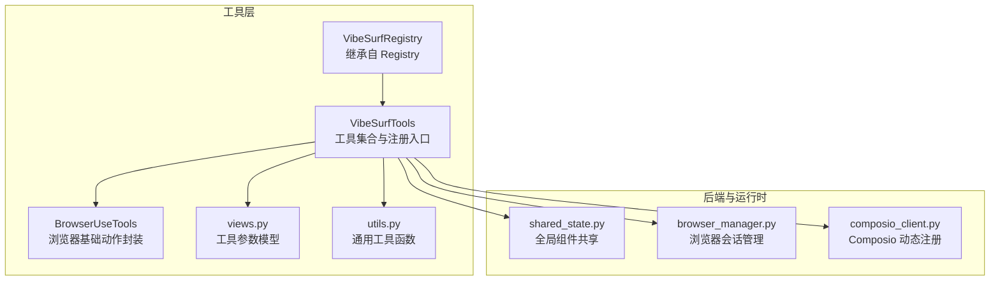
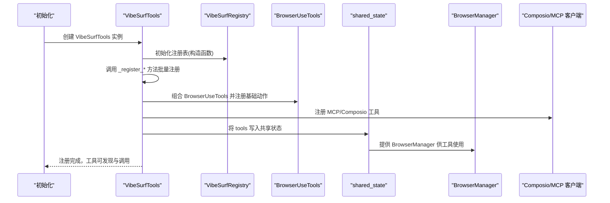
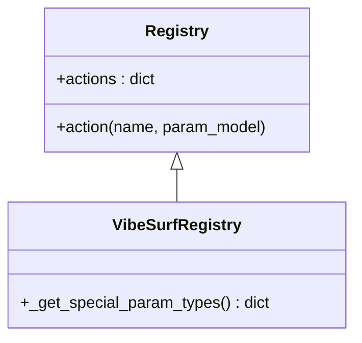
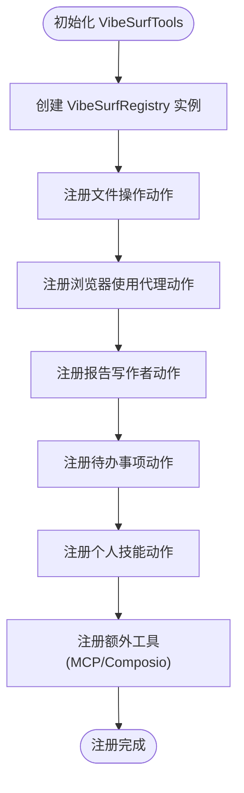
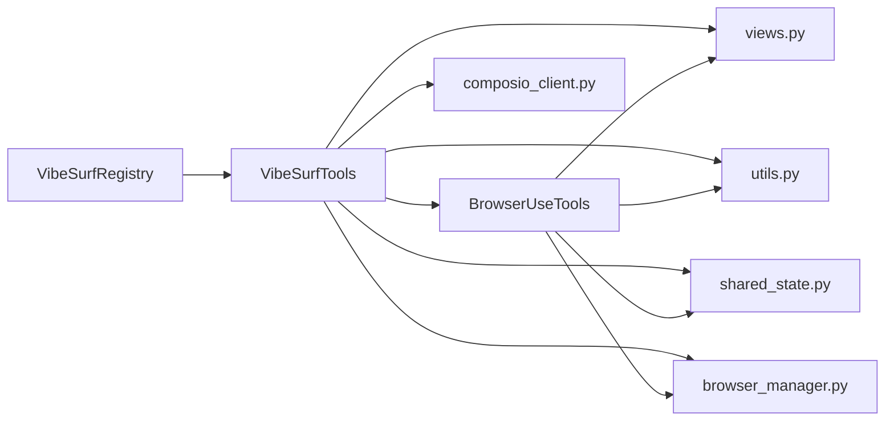

# 集成注册机制

<cite>
**本文引用的文件**
- [vibesurf_registry.py](file://vibe_surf/tools/vibesurf_registry.py)
- [vibesurf_tools.py](file://vibe_surf/tools/vibesurf_tools.py)
- [browser_use_tools.py](file://vibe_surf/tools/browser_use_tools.py)
- [views.py](file://vibe_surf/tools/views.py)
- [utils.py](file://vibe_surf/tools/utils.py)
- [shared_state.py](file://vibe_surf/backend/shared_state.py)
- [browser_manager.py](file://vibe_surf/browser/browser_manager.py)
- [composio_client.py](file://vibe_surf/tools/composio_client.py)
</cite>

## 目录
1. [引言](#引言)
2. [项目结构](#项目结构)
3. [核心组件](#核心组件)
4. [架构总览](#架构总览)
5. [详细组件分析](#详细组件分析)
6. [依赖分析](#依赖分析)
7. [性能考虑](#性能考虑)
8. [故障排查指南](#故障排查指南)
9. [结论](#结论)

## 引言
本文件围绕 vibe_surf 工具注册体系进行深入解析，重点阐述以下方面：
- 如何通过装饰器模式在运行时注册新的集成工具；
- 注册表的数据结构设计、工具元数据定义与动态加载机制；
- 工具签名、参数类型与返回值规范的约定；
- 工具发现与加载流程（模块扫描与缓存策略）；
- 错误处理机制（重复注册检测、类型验证等）；
- 与 vibe_surf 后端共享状态及外部集成（如 Composio、MCP）的协作关系，确保工具的可发现性与可调用性。

## 项目结构
vibesurf 的工具注册与执行主要分布在 tools 子模块中，结合后端共享状态与浏览器会话管理，形成“注册表驱动 + 动态加载 + 外部集成”的整体架构。

图表来源
- [vibesurf_registry.py](file://vibe_surf/tools/vibesurf_registry.py#L1-L53)
- [vibesurf_tools.py](file://vibe_surf/tools/vibesurf_tools.py#L1-L120)
- [browser_use_tools.py](file://vibe_surf/tools/browser_use_tools.py#L1-L120)
- [views.py](file://vibe_surf/tools/views.py#L1-L120)
- [utils.py](file://vibe_surf/tools/utils.py#L1-L120)
- [shared_state.py](file://vibe_surf/backend/shared_state.py#L1-L120)
- [browser_manager.py](file://vibe_surf/browser/browser_manager.py#L47-L72)
- [composio_client.py](file://vibe_surf/tools/composio_client.py#L108-L160)

章节来源
- [vibesurf_registry.py](file://vibe_surf/tools/vibesurf_registry.py#L1-L53)
- [vibesurf_tools.py](file://vibe_surf/tools/vibesurf_tools.py#L1-L120)
- [browser_use_tools.py](file://vibe_surf/tools/browser_use_tools.py#L1-L120)
- [views.py](file://vibe_surf/tools/views.py#L1-L120)
- [utils.py](file://vibe_surf/tools/utils.py#L1-L120)
- [shared_state.py](file://vibe_surf/backend/shared_state.py#L1-L120)
- [browser_manager.py](file://vibe_surf/browser/browser_manager.py#L47-L72)
- [composio_client.py](file://vibe_surf/tools/composio_client.py#L108-L160)

## 核心组件
- VibeSurfRegistry：在 browser_use 的 Registry 基础上扩展，定义特殊参数类型映射，为工具函数注入上下文参数（如浏览器会话、文件系统、LLM 等），并提供统一的注册入口。
- VibeSurfTools：工具集合类，负责创建注册表实例并在初始化阶段批量注册各类技能与动作；同时维护外部集成（MCP、Composio）客户端。
- BrowserUseTools：在 browser_use 的 Tools 基础上扩展，注册浏览器基础动作（悬停、导航、截图、下载等），并与 VibeSurfTools 组合使用。
- views.py：定义工具参数模型（Pydantic BaseModel），用于约束工具签名、参数类型与默认值。
- utils.py：提供通用工具函数（如 JavaScript 代码生成、网页内容提取、搜索等），被工具函数调用以完成具体任务。
- shared_state.py：后端全局共享状态，保存浏览器管理器、工具实例、LLM 等组件，便于跨模块访问。
- browser_manager.py：浏览器会话管理器，负责为代理分配独立会话与目标页，支持并行任务。
- composio_client.py：从 Composio 工具包动态解析工具信息，转换为 VibeSurf 动作并注册到注册表。

章节来源
- [vibesurf_registry.py](file://vibe_surf/tools/vibesurf_registry.py#L34-L53)
- [vibesurf_tools.py](file://vibe_surf/tools/vibesurf_tools.py#L72-L120)
- [browser_use_tools.py](file://vibe_surf/tools/browser_use_tools.py#L62-L120)
- [views.py](file://vibe_surf/tools/views.py#L1-L120)
- [utils.py](file://vibe_surf/tools/utils.py#L136-L210)
- [shared_state.py](file://vibe_surf/backend/shared_state.py#L1-L120)
- [browser_manager.py](file://vibe_surf/browser/browser_manager.py#L47-L72)
- [composio_client.py](file://vibe_surf/tools/composio_client.py#L108-L160)

## 架构总览
下图展示了工具注册与调用的关键交互路径：工具通过装饰器注册到 VibeSurfRegistry，VibeSurfTools 在初始化时批量触发注册，最终由后端共享状态统一暴露给代理或工作流使用。

图表来源
- [vibesurf_tools.py](file://vibe_surf/tools/vibesurf_tools.py#L72-L120)
- [vibesurf_registry.py](file://vibe_surf/tools/vibesurf_registry.py#L34-L53)
- [browser_use_tools.py](file://vibe_surf/tools/browser_use_tools.py#L62-L120)
- [shared_state.py](file://vibe_surf/backend/shared_state.py#L520-L598)
- [browser_manager.py](file://vibe_surf/browser/browser_manager.py#L47-L72)
- [composio_client.py](file://vibe_surf/tools/composio_client.py#L108-L160)

## 详细组件分析

### VibeSurfRegistry：装饰器注册与特殊参数类型映射
- 继承自 browser_use 的 Registry，扩展了对“特殊参数类型”的映射，用于自动注入上下文参数（如浏览器会话、文件系统、LLM 等）。这些参数在工具函数签名中作为可选依赖出现，但不强制要求显式传入，而是由注册表在运行时按需注入。
- 特殊参数类型映射包含：上下下文、浏览器会话、页面 URL、CDP 客户端、页面提取 LLM、可用文件路径、敏感数据标记、文件系统、通用 LLM、浏览器管理器等。
- 这种设计使得工具函数签名更简洁，同时保持对底层资源的灵活访问。

图表来源
- [vibesurf_registry.py](file://vibe_surf/tools/vibesurf_registry.py#L34-L53)

章节来源
- [vibesurf_registry.py](file://vibe_surf/tools/vibesurf_registry.py#L34-L53)

### VibeSurfTools：批量注册与动态加载
- 在构造函数中创建 VibeSurfRegistry 实例，并在后续方法中批量注册各类工具：
  - 文件操作类动作（如截图、下载媒体）
  - 报告与任务完成动作
  - 浏览器使用代理相关动作（占位实现，后续扩展）
  - 个人技能（高级搜索、爬取、摘要、截图、代码生成、金融数据、各平台 API 技能等）
  - 外部工具（MCP、Composio）的动态注册
- 提供工具名称查询接口，支持排除特定动作名前缀或包含关键字的动作列表过滤。

图表来源
- [vibesurf_tools.py](file://vibe_surf/tools/vibesurf_tools.py#L72-L120)
- [vibesurf_tools.py](file://vibe_surf/tools/vibesurf_tools.py#L1531-L1553)

章节来源
- [vibesurf_tools.py](file://vibe_surf/tools/vibesurf_tools.py#L72-L120)
- [vibesurf_tools.py](file://vibe_surf/tools/vibesurf_tools.py#L1531-L1553)

### BrowserUseTools：浏览器基础动作与结构化输出
- 继承自 browser_use 的 Tools，组合 VibeSurfTools，注册浏览器基础动作（悬停、导航、返回、截图、下载媒体等），并提供结构化输出的“完成”动作。
- 结构化输出动作根据是否传入输出模型，决定返回内容的格式与内存记录方式。

章节来源
- [browser_use_tools.py](file://vibe_surf/tools/browser_use_tools.py#L62-L120)
- [browser_use_tools.py](file://vibe_surf/tools/browser_use_tools.py#L146-L210)
- [browser_use_tools.py](file://vibe_surf/tools/browser_use_tools.py#L290-L350)
- [browser_use_tools.py](file://vibe_surf/tools/browser_use_tools.py#L381-L420)
- [browser_use_tools.py](file://vibe_surf/tools/browser_use_tools.py#L421-L492)

### 工具参数模型（views.py）：签名与类型约束
- 使用 Pydantic BaseModel 定义工具参数，包含字段描述、默认值、长度限制、枚举取值范围等，确保工具签名清晰、可序列化且具备运行时校验能力。
- 典型参数模型包括：
  - 技能类：高级搜索、爬取、摘要、截图、代码生成、金融数据、各平台 API 技能等
  - 浏览器动作类：悬停、导航、返回、截图、下载媒体等
  - 任务完成类：结构化输出与普通完成动作

章节来源
- [views.py](file://vibe_surf/tools/views.py#L1-L120)
- [views.py](file://vibe_surf/tools/views.py#L120-L220)
- [views.py](file://vibe_surf/tools/views.py#L220-L366)

### 动态加载与缓存策略
- 工具注册发生在初始化阶段，通过装饰器将工具函数注册到注册表；注册完成后，工具即可被后端共享状态统一持有并对外提供。
- 对于外部集成（MCP、Composio），采用“配置变更检测 + 工具更新”的策略：当数据库中的配置发生变化时，后端会重新构建工具集合并替换旧工具，从而实现动态加载与缓存更新。
- 浏览器会话管理器为每个代理分配独立会话，避免并发冲突，支持并行任务场景下的隔离执行。

章节来源
- [shared_state.py](file://vibe_surf/backend/shared_state.py#L255-L338)
- [shared_state.py](file://vibe_surf/backend/shared_state.py#L520-L598)
- [browser_manager.py](file://vibe_surf/browser/browser_manager.py#L47-L72)

### 错误处理机制
- 类型验证：通过 Pydantic 模型对工具参数进行强类型校验，保证输入合法性；对于外部工具（Composio），在注册过程中解析参数并构建对应模型，避免运行期类型错误。
- 重复注册检测：Composio 注册逻辑中对已注册动作进行去重判断，避免重复注册导致的冲突。
- 运行时异常捕获：工具函数内部使用 try-except 捕获异常，统一返回 ActionResult，包含错误信息与可选的提取内容，便于上层处理与日志记录。
- 资源清理：部分工具在 finally 中进行资源清理（如关闭浏览器会话、删除临时文件等），降低泄漏风险。

章节来源
- [composio_client.py](file://vibe_surf/tools/composio_client.py#L108-L160)
- [vibesurf_tools.py](file://vibe_surf/tools/vibesurf_tools.py#L100-L180)
- [browser_use_tools.py](file://vibe_surf/tools/browser_use_tools.py#L146-L210)

### 与 vibe_surf 后端的协作关系
- 共享状态：后端初始化时创建 VibeSurfTools 实例，并将其写入共享状态，供代理与工作流使用。
- 浏览器管理：BrowserManager 为工具提供独立的浏览器会话与目标页，支持并行任务与多标签页操作。
- 外部集成：MCP 与 Composio 工具通过后端配置动态注册到工具集合，实现“即插即用”的扩展能力。

章节来源
- [shared_state.py](file://vibe_surf/backend/shared_state.py#L520-L598)
- [browser_manager.py](file://vibe_surf/browser/browser_manager.py#L47-L72)
- [composio_client.py](file://vibe_surf/tools/composio_client.py#L108-L160)

## 依赖分析
- 组件耦合与内聚：
  - VibeSurfRegistry 与 VibeSurfTools 高内聚，前者负责注册表扩展，后者负责批量注册与外部集成。
  - BrowserUseTools 与 VibeSurfTools 组合使用，既提供浏览器基础动作，又复用 VibeSurf 的注册机制。
  - views.py 为工具签名提供强类型约束，提升可发现性与可调用性。
- 直接与间接依赖：
  - VibeSurfTools 依赖 VibeSurfRegistry、views.py、utils.py、shared_state、browser_manager、composio_client。
  - BrowserUseTools 依赖 browser_use 的 Tools、views.py、utils、shared_state、browser_manager。
- 外部依赖：
  - browser_use：提供 Registry、Tools、ActionResult、CDP 会话等基础设施。
  - pydantic：用于参数模型与类型校验。
  - aiohttp：用于下载媒体等异步网络请求。

图表来源
- [vibesurf_registry.py](file://vibe_surf/tools/vibesurf_registry.py#L34-L53)
- [vibesurf_tools.py](file://vibe_surf/tools/vibesurf_tools.py#L72-L120)
- [browser_use_tools.py](file://vibe_surf/tools/browser_use_tools.py#L62-L120)
- [views.py](file://vibe_surf/tools/views.py#L1-L120)
- [utils.py](file://vibe_surf/tools/utils.py#L1-L120)
- [shared_state.py](file://vibe_surf/backend/shared_state.py#L520-L598)
- [browser_manager.py](file://vibe_surf/browser/browser_manager.py#L47-L72)
- [composio_client.py](file://vibe_surf/tools/composio_client.py#L108-L160)

## 性能考虑
- 异步执行：工具函数普遍采用 async/await，充分利用浏览器 CDP 与 LLM 的异步能力，减少阻塞。
- 批量注册：在初始化阶段集中注册工具，避免运行时频繁扫描与解析，提高启动效率。
- 缓存策略：浏览器会话与 DOM 缓存（如选择器映射）在工具执行期间复用，减少重复计算与网络请求。
- 外部集成：MCP/Composio 工具通过配置变更触发更新，避免每次请求都进行昂贵的初始化。

## 故障排查指南
- 工具未出现在可发现列表：
  - 检查是否正确使用装饰器注册到 VibeSurfRegistry；
  - 确认工具参数模型已在 views.py 中定义并被正确引用；
  - 核对共享状态是否成功写入 VibeSurfTools 实例。
- 参数类型错误或缺失：
  - 使用 Pydantic 模型进行参数校验，查看报错信息定位字段问题；
  - 确保必填字段与默认值设置合理。
- 外部集成失败：
  - 检查 Composio/MCP 配置是否正确，确认后端已触发工具更新流程；
  - 查看注册日志，确认动作名称未重复注册。
- 浏览器会话异常：
  - 确认 BrowserManager 是否为代理分配了正确的 target_id；
  - 检查会话生命周期与清理逻辑，避免资源泄漏。

章节来源
- [vibesurf_tools.py](file://vibe_surf/tools/vibesurf_tools.py#L72-L120)
- [views.py](file://vibe_surf/tools/views.py#L1-L120)
- [shared_state.py](file://vibe_surf/backend/shared_state.py#L255-L338)
- [composio_client.py](file://vibe_surf/tools/composio_client.py#L108-L160)
- [browser_manager.py](file://vibe_surf/browser/browser_manager.py#L47-L72)

## 结论
vibesurf 的工具注册机制通过“装饰器 + 注册表 + 参数模型 + 动态加载”的组合，实现了高内聚、低耦合、强类型约束与可扩展的工具体系。VibeSurfRegistry 为工具函数注入上下文参数，VibeSurfTools 负责批量注册与外部集成，views.py 提供强类型签名，shared_state 保障工具的可发现性与可调用性。配合 Composio/MCP 的动态注册与 BrowserManager 的会话管理，整体架构在保证安全性的同时，提供了良好的扩展性与运行时性能。