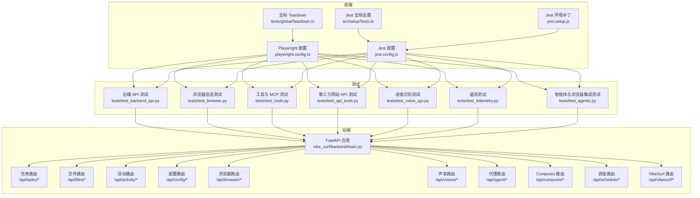
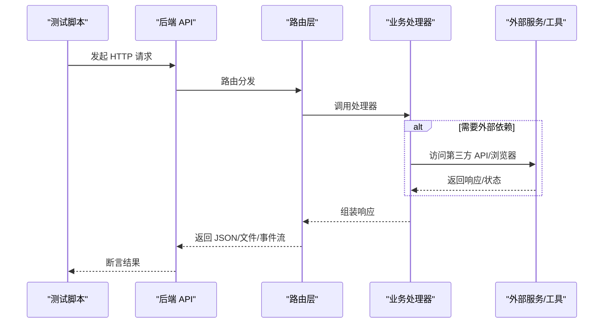
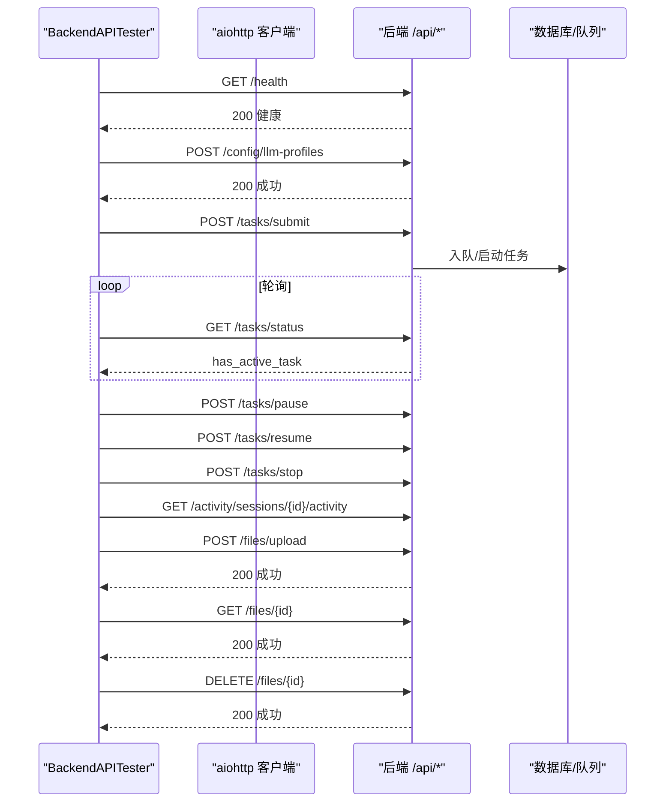
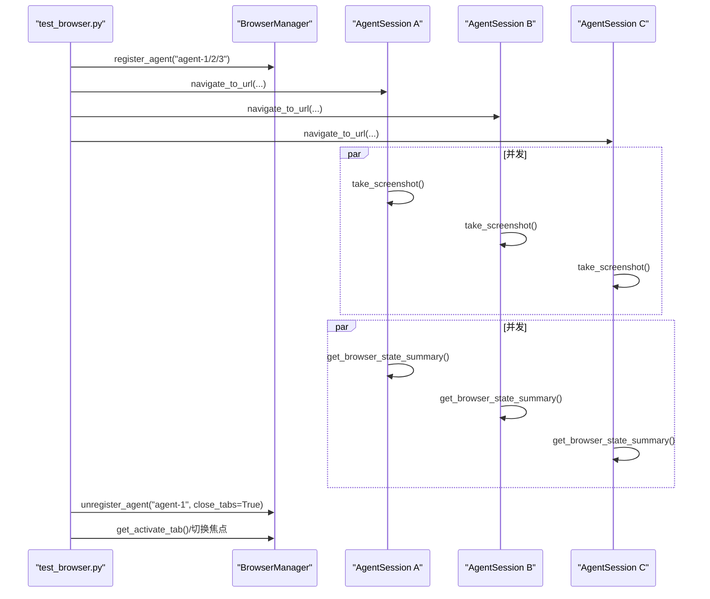
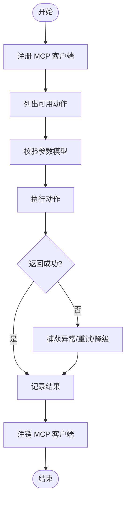
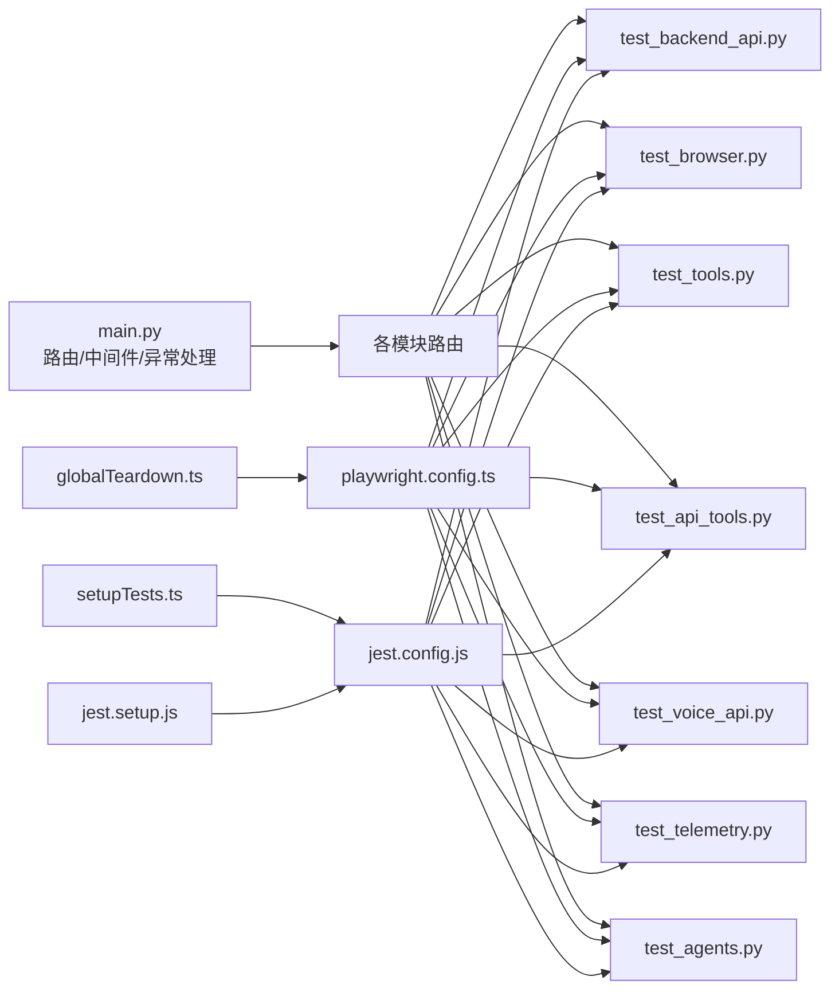

# 集成测试与验证

<cite>
**本文引用的文件**
- [tests/test_agents.py](file://tests/test_agents.py)
- [tests/test_api_tools.py](file://tests/test_api_tools.py)
- [tests/test_backend_api.py](file://tests/test_backend_api.py)
- [tests/test_browser.py](file://tests/test_browser.py)
- [tests/test_tools.py](file://tests/test_tools.py)
- [tests/test_voice_api.py](file://tests/test_voice_api.py)
- [tests/test_telemetry.py](file://tests/test_telemetry.py)
- [vibe_surf/backend/main.py](file://vibe_surf/backend/main.py)
- [vibe_surf/frontend/playwright.config.ts](file://vibe_surf/frontend/playwright.config.ts)
- [vibe_surf/frontend/jest.config.js](file://vibe_surf/frontend/jest.config.js)
- [vibe_surf/frontend/src/setupTests.ts](file://vibe_surf/frontend/src/setupTests.ts)
- [vibe_surf/frontend/jest.setup.js](file://vibe_surf/frontend/jest.setup.js)
- [vibe_surf/frontend/tests/globalTeardown.ts](file://vibe_surf/frontend/tests/globalTeardown.ts)
- [vibe_surf/frontend/tests/utils/withEventDeliveryModes.ts](file://vibe_surf/frontend/tests/utils/withEventDeliveryModes.ts)
- [pyproject.toml](file://pyproject.toml)
</cite>

## 目录
1. [引言](#引言)
2. [项目结构](#项目结构)
3. [核心组件](#核心组件)
4. [架构总览](#架构总览)
5. [详细组件分析](#详细组件分析)
6. [依赖关系分析](#依赖关系分析)
7. [性能考虑](#性能考虑)
8. [故障排查指南](#故障排查指南)
9. [结论](#结论)
10. [附录](#附录)

## 引言
本指南面向开发者，系统化地说明如何为新开发的第三方集成进行“端到端”的集成测试与验证。内容覆盖：
- 单元测试：覆盖正常流程与异常场景（网络错误、认证失败、API限流等）
- 使用 mock 对象隔离外部依赖
- 构造测试数据以验证请求/响应正确性
- 端到端测试：测试环境搭建、测试数据准备与结果断言
- 性能测试建议：并发测试与响应时间监控
- 测试覆盖率要求与持续集成流水线中的测试执行策略

## 项目结构
该仓库包含后端 FastAPI 应用、前端 Playwright/Jest 测试、以及多类集成测试脚本，用于验证浏览器自动化、第三方 API 工具、语音识别、遥测等功能。

图表来源
- [vibe_surf/backend/main.py](file://vibe_surf/backend/main.py#L543-L731)
- [tests/test_backend_api.py](file://tests/test_backend_api.py#L1-L120)
- [tests/test_browser.py](file://tests/test_browser.py#L1-L120)
- [tests/test_tools.py](file://tests/test_tools.py#L1-L120)
- [tests/test_api_tools.py](file://tests/test_api_tools.py#L1-L120)
- [tests/test_voice_api.py](file://tests/test_voice_api.py#L1-L45)
- [tests/test_telemetry.py](file://tests/test_telemetry.py#L1-L31)
- [vibe_surf/frontend/playwright.config.ts](file://vibe_surf/frontend/playwright.config.ts#L1-L42)
- [vibe_surf/frontend/jest.config.js](file://vibe_surf/frontend/jest.config.js#L1-L60)
- [vibe_surf/frontend/src/setupTests.ts](file://vibe_surf/frontend/src/setupTests.ts#L1-L62)
- [vibe_surf/frontend/jest.setup.js](file://vibe_surf/frontend/jest.setup.js#L1-L61)
- [vibe_surf/frontend/tests/globalTeardown.ts](file://vibe_surf/frontend/tests/globalTeardown.ts#L1-L34)

章节来源
- [vibe_surf/backend/main.py](file://vibe_surf/backend/main.py#L543-L731)
- [tests/test_backend_api.py](file://tests/test_backend_api.py#L1-L120)
- [tests/test_browser.py](file://tests/test_browser.py#L1-L120)
- [tests/test_tools.py](file://tests/test_tools.py#L1-L120)
- [tests/test_api_tools.py](file://tests/test_api_tools.py#L1-L120)
- [tests/test_voice_api.py](file://tests/test_voice_api.py#L1-L45)
- [tests/test_telemetry.py](file://tests/test_telemetry.py#L1-L31)
- [vibe_surf/frontend/playwright.config.ts](file://vibe_surf/frontend/playwright.config.ts#L1-L42)
- [vibe_surf/frontend/jest.config.js](file://vibe_surf/frontend/jest.config.js#L1-L60)
- [vibe_surf/frontend/src/setupTests.ts](file://vibe_surf/frontend/src/setupTests.ts#L1-L62)
- [vibe_surf/frontend/jest.setup.js](file://vibe_surf/frontend/jest.setup.js#L1-L61)
- [vibe_surf/frontend/tests/globalTeardown.ts](file://vibe_surf/frontend/tests/globalTeardown.ts#L1-L34)

## 核心组件
- 后端 FastAPI 应用：提供统一的 REST 接口，包含任务、文件、活动、配置、浏览器、声音、代理、Composio、调度、VibeSurf 等路由，并内置健康检查、静态资源挂载、CORS、中间件与异常处理。
- 前端测试框架：Playwright（端到端）与 Jest（单元/集成），配合全局设置与 Teardown。
- 集成测试脚本：覆盖浏览器会话、第三方网站 API、工具与 MCP、语音识别、遥测等。

章节来源
- [vibe_surf/backend/main.py](file://vibe_surf/backend/main.py#L543-L731)
- [tests/test_backend_api.py](file://tests/test_backend_api.py#L1-L120)
- [tests/test_browser.py](file://tests/test_browser.py#L1-L120)
- [tests/test_tools.py](file://tests/test_tools.py#L1-L120)
- [tests/test_api_tools.py](file://tests/test_api_tools.py#L1-L120)
- [tests/test_voice_api.py](file://tests/test_voice_api.py#L1-L45)
- [tests/test_telemetry.py](file://tests/test_telemetry.py#L1-L31)
- [vibe_surf/frontend/playwright.config.ts](file://vibe_surf/frontend/playwright.config.ts#L1-L42)
- [vibe_surf/frontend/jest.config.js](file://vibe_surf/frontend/jest.config.js#L1-L60)
- [vibe_surf/frontend/src/setupTests.ts](file://vibe_surf/frontend/src/setupTests.ts#L1-L62)
- [vibe_surf/frontend/jest.setup.js](file://vibe_surf/frontend/jest.setup.js#L1-L61)
- [vibe_surf/frontend/tests/globalTeardown.ts](file://vibe_surf/frontend/tests/globalTeardown.ts#L1-L34)

## 架构总览
后端应用通过 include_router 注入多个子模块路由；前端 Playwright/Jest 通过配置文件与全局设置参与测试生命周期管理。测试脚本直接调用后端接口或浏览器会话，验证端到端行为。

图表来源
- [vibe_surf/backend/main.py](file://vibe_surf/backend/main.py#L580-L648)
- [tests/test_backend_api.py](file://tests/test_backend_api.py#L54-L96)
- [tests/test_browser.py](file://tests/test_browser.py#L367-L416)

章节来源
- [vibe_surf/backend/main.py](file://vibe_surf/backend/main.py#L580-L648)
- [tests/test_backend_api.py](file://tests/test_backend_api.py#L54-L96)
- [tests/test_browser.py](file://tests/test_browser.py#L367-L416)

## 详细组件分析

### 后端 API 测试（端到端）
- 健康检查与等待后端就绪
- LLM 配置、MCP 配置的增删改查
- 任务生命周期：提交、暂停、恢复、停止
- 活动日志与历史查询
- 文件上传/下载/删除
- 配置状态与系统状态查询

图表来源
- [tests/test_backend_api.py](file://tests/test_backend_api.py#L98-L175)
- [tests/test_backend_api.py](file://tests/test_backend_api.py#L242-L351)
- [tests/test_backend_api.py](file://tests/test_backend_api.py#L353-L427)
- [tests/test_backend_api.py](file://tests/test_backend_api.py#L458-L551)
- [tests/test_backend_api.py](file://tests/test_backend_api.py#L582-L733)

章节来源
- [tests/test_backend_api.py](file://tests/test_backend_api.py#L98-L175)
- [tests/test_backend_api.py](file://tests/test_backend_api.py#L242-L351)
- [tests/test_backend_api.py](file://tests/test_backend_api.py#L353-L427)
- [tests/test_backend_api.py](file://tests/test_backend_api.py#L458-L551)
- [tests/test_backend_api.py](file://tests/test_backend_api.py#L582-L733)

### 浏览器会话与多智能体隔离测试
- 多智能体并发导航与截图
- 代理清理与标签页隔离
- 并发状态抓取与页面切换
- 第三方网站 API 调用示例（微博、小红书、抖音、YouTube）

图表来源
- [tests/test_browser.py](file://tests/test_browser.py#L22-L82)
- [tests/test_browser.py](file://tests/test_browser.py#L83-L210)
- [tests/test_browser.py](file://tests/test_browser.py#L242-L333)
- [tests/test_browser.py](file://tests/test_browser.py#L334-L416)

章节来源
- [tests/test_browser.py](file://tests/test_browser.py#L22-L82)
- [tests/test_browser.py](file://tests/test_browser.py#L83-L210)
- [tests/test_browser.py](file://tests/test_browser.py#L242-L333)
- [tests/test_browser.py](file://tests/test_browser.py#L334-L416)

### 工具与 MCP 集成测试
- MCP 服务器注册与动作调用
- 自定义文件系统工具
- Finance 数据检索
- Composio 工具集连接与配置

图表来源
- [tests/test_tools.py](file://tests/test_tools.py#L15-L92)
- [tests/test_tools.py](file://tests/test_tools.py#L94-L129)
- [tests/test_tools.py](file://tests/test_tools.py#L131-L251)

章节来源
- [tests/test_tools.py](file://tests/test_tools.py#L15-L92)
- [tests/test_tools.py](file://tests/test_tools.py#L94-L129)
- [tests/test_tools.py](file://tests/test_tools.py#L131-L251)

### 第三方网站 API 测试
- 小红书、微博、抖音、YouTube 等客户端初始化与调用
- 示例：搜索、热门、趋势、视频详情、转录等

章节来源
- [tests/test_api_tools.py](file://tests/test_api_tools.py#L22-L83)
- [tests/test_api_tools.py](file://tests/test_api_tools.py#L84-L142)

### 语音识别 API 测试
- 支持多种模型（通义、OpenAI、Gemini）的 ASR 调用
- 使用本地音频文件进行识别

章节来源
- [tests/test_voice_api.py](file://tests/test_voice_api.py#L1-L45)

### 遥测测试
- 验证遥测事件结构与发送流程

章节来源
- [tests/test_telemetry.py](file://tests/test_telemetry.py#L1-L31)

### 智能体与浏览器集成测试
- 单/多智能体运行、控制（暂停/恢复/停止）、状态查询
- 与浏览器会话交互、文件系统路径管理

章节来源
- [tests/test_agents.py](file://tests/test_agents.py#L1-L120)
- [tests/test_agents.py](file://tests/test_agents.py#L120-L220)
- [tests/test_agents.py](file://tests/test_agents.py#L229-L391)

## 依赖关系分析
- 后端路由与中间件：CORS、JavaScript MIME 类型修正、内容大小限制、Sentry、OpenTelemetry、静态资源挂载、健康检查、会话 ID 生成、系统状态查询。
- 前端测试：Playwright 全局配置、Jest 全局设置与 Teardown、事件传递模式包装器。

图表来源
- [vibe_surf/backend/main.py](file://vibe_surf/backend/main.py#L543-L731)
- [tests/test_backend_api.py](file://tests/test_backend_api.py#L1-L120)
- [tests/test_browser.py](file://tests/test_browser.py#L1-L120)
- [tests/test_tools.py](file://tests/test_tools.py#L1-L120)
- [tests/test_api_tools.py](file://tests/test_api_tools.py#L1-L120)
- [tests/test_voice_api.py](file://tests/test_voice_api.py#L1-L45)
- [tests/test_telemetry.py](file://tests/test_telemetry.py#L1-L31)
- [tests/test_agents.py](file://tests/test_agents.py#L1-L120)
- [vibe_surf/frontend/playwright.config.ts](file://vibe_surf/frontend/playwright.config.ts#L1-L42)
- [vibe_surf/frontend/jest.config.js](file://vibe_surf/frontend/jest.config.js#L1-L60)
- [vibe_surf/frontend/src/setupTests.ts](file://vibe_surf/frontend/src/setupTests.ts#L1-L62)
- [vibe_surf/frontend/jest.setup.js](file://vibe_surf/frontend/jest.setup.js#L1-L61)
- [vibe_surf/frontend/tests/globalTeardown.ts](file://vibe_surf/frontend/tests/globalTeardown.ts#L1-L34)

章节来源
- [vibe_surf/backend/main.py](file://vibe_surf/backend/main.py#L543-L731)
- [vibe_surf/frontend/playwright.config.ts](file://vibe_surf/frontend/playwright.config.ts#L1-L42)
- [vibe_surf/frontend/jest.config.js](file://vibe_surf/frontend/jest.config.js#L1-L60)
- [vibe_surf/frontend/src/setupTests.ts](file://vibe_surf/frontend/src/setupTests.ts#L1-L62)
- [vibe_surf/frontend/jest.setup.js](file://vibe_surf/frontend/jest.setup.js#L1-L61)
- [vibe_surf/frontend/tests/globalTeardown.ts](file://vibe_surf/frontend/tests/globalTeardown.ts#L1-L34)

## 性能考虑
- 并发测试：利用 asyncio.gather 并发导航、截图、状态抓取，观察总耗时与单任务耗时，评估浏览器与外部 API 的吞吐能力。
- 响应时间监控：对关键接口（/api/tasks/submit、/api/files/upload、/api/activity/sessions/*/activity）增加超时与重试策略，结合 OpenTelemetry 进行指标采集。
- 资源占用：监控浏览器进程数量、内存与 CPU；对长时间运行的任务设置最大执行时长与取消机制。
- 前端端到端：Playwright 配置了超时与并行度，可在 CI 中调整 workers 与 retries 以平衡速度与稳定性。

章节来源
- [tests/test_browser.py](file://tests/test_browser.py#L120-L210)
- [vibe_surf/frontend/playwright.config.ts](file://vibe_surf/frontend/playwright.config.ts#L1-L42)
- [vibe_surf/backend/main.py](file://vibe_surf/backend/main.py#L649-L694)

## 故障排查指南
- 网络错误与超时：后端对 HTTPX 请求设置了超时，遇到 RequestError/TimeoutException 时记录错误并降级处理；前端上传需满足 multipart/form-data 边界格式校验。
- 认证失败：检查环境变量与配置项（如 OPENAI/ALIBABA/DEEPSEEK 等），确保 API Key 与 Endpoint 正确；对 Composio 连接状态进行检查与重试。
- API 限流：对第三方 API 设置指数退避与最大重试次数；在测试中模拟 429/5xx 场景，验证重试与降级逻辑。
- 浏览器连接中断：后端有浏览器监控任务，若检测不到浏览器则触发优雅关闭；前端测试结束后确保浏览器进程被正确清理。
- 日志与遥测：启用 Sentry/OpenTelemetry，收集异常堆栈与性能指标；前端 Jest/Playwright 报告输出到 CI 可视化平台。

章节来源
- [vibe_surf/backend/main.py](file://vibe_surf/backend/main.py#L103-L148)
- [vibe_surf/backend/main.py](file://vibe_surf/backend/main.py#L150-L163)
- [vibe_surf/backend/main.py](file://vibe_surf/backend/main.py#L592-L626)
- [tests/test_backend_api.py](file://tests/test_backend_api.py#L1-L120)
- [tests/test_tools.py](file://tests/test_tools.py#L131-L251)
- [vibe_surf/frontend/jest.config.js](file://vibe_surf/frontend/jest.config.js#L40-L60)
- [vibe_surf/frontend/playwright.config.ts](file://vibe_surf/frontend/playwright.config.ts#L1-L42)

## 结论
通过上述测试体系，可以系统性地验证第三方集成在真实环境下的行为与鲁棒性。建议在新增集成时，优先编写单元测试覆盖正常/异常路径，再补充端到端测试与性能测试，并在 CI 中强制执行测试与覆盖率报告，确保质量与可维护性。

## 附录

### 如何编写单元测试（覆盖正常与异常）
- 使用 aiohttp/aiofiles 等异步客户端发起请求，断言状态码与响应结构
- 使用 pytest/asyncio 的 fixtures 管理测试资源（会话、配置、临时文件）
- 对网络错误、认证失败、API 限流等场景进行模拟与断言
- 使用 mock 对外部依赖进行隔离，避免真实第三方调用

章节来源
- [tests/test_backend_api.py](file://tests/test_backend_api.py#L54-L96)
- [tests/test_api_tools.py](file://tests/test_api_tools.py#L22-L83)
- [tests/test_voice_api.py](file://tests/test_voice_api.py#L1-L45)

### 如何使用 mock 对象隔离外部依赖
- 对第三方 SDK（如 Composio、OpenAI、DashScope）进行 patch 或替换实现
- 使用 aiohttp 的 ClientSession 替换真实 HTTP 调用，返回预设响应
- 对文件系统与浏览器会话进行 mock，确保测试可重复且不依赖外部环境

章节来源
- [tests/test_tools.py](file://tests/test_tools.py#L131-L251)
- [tests/test_voice_api.py](file://tests/test_voice_api.py#L1-L45)

### 如何构造测试数据验证请求/响应
- 使用随机 session_id、时间戳与测试文件，保证幂等与可追踪
- 对上传文件进行断言（原始文件名、session_id、file_id 等字段）
- 对活动日志与任务状态进行轮询断言，确保最终状态符合预期

章节来源
- [tests/test_backend_api.py](file://tests/test_backend_api.py#L458-L551)
- [tests/test_backend_api.py](file://tests/test_backend_api.py#L353-L427)

### 端到端测试实施方法
- 启动后端服务（uvicorn），等待 /health 就绪
- 使用 Playwright/Jest 执行端到端脚本，断言页面交互与 API 行为
- 使用全局 Teardown 清理临时目录与浏览器进程

章节来源
- [tests/test_backend_api.py](file://tests/test_backend_api.py#L41-L53)
- [vibe_surf/frontend/playwright.config.ts](file://vibe_surf/frontend/playwright.config.ts#L1-L42)
- [vibe_surf/frontend/tests/globalTeardown.ts](file://vibe_surf/frontend/tests/globalTeardown.ts#L1-L34)

### 性能测试建议
- 并发：对多智能体导航、截图、状态抓取进行并发压测，统计总耗时与 P95/P99
- 响应时间：对关键接口添加超时与重试，结合 OpenTelemetry 指标
- 资源：监控浏览器进程数、内存/CPU，设置最大执行时长与取消

章节来源
- [tests/test_browser.py](file://tests/test_browser.py#L120-L210)
- [vibe_surf/backend/main.py](file://vibe_surf/backend/main.py#L649-L694)

### 测试覆盖率与持续集成
- 前端覆盖率：Jest 配置了 collectCoverageFrom 与输出格式，建议在 CI 中开启覆盖率阈值
- 后端覆盖率：建议在 CI 中引入 pytest-cov 并配置阈值
- Playwright 报告：在 CI 中启用 blob/html 报告，便于问题定位

章节来源
- [vibe_surf/frontend/jest.config.js](file://vibe_surf/frontend/jest.config.js#L1-L38)
- [vibe_surf/frontend/jest.config.js](file://vibe_surf/frontend/jest.config.js#L40-L60)
- [vibe_surf/frontend/playwright.config.ts](file://vibe_surf/frontend/playwright.config.ts#L28-L42)
- [pyproject.toml](file://pyproject.toml#L1-L282)