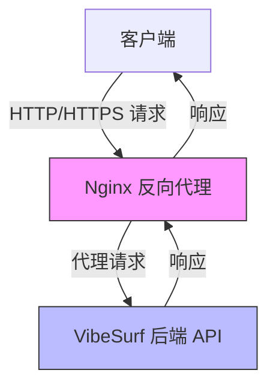
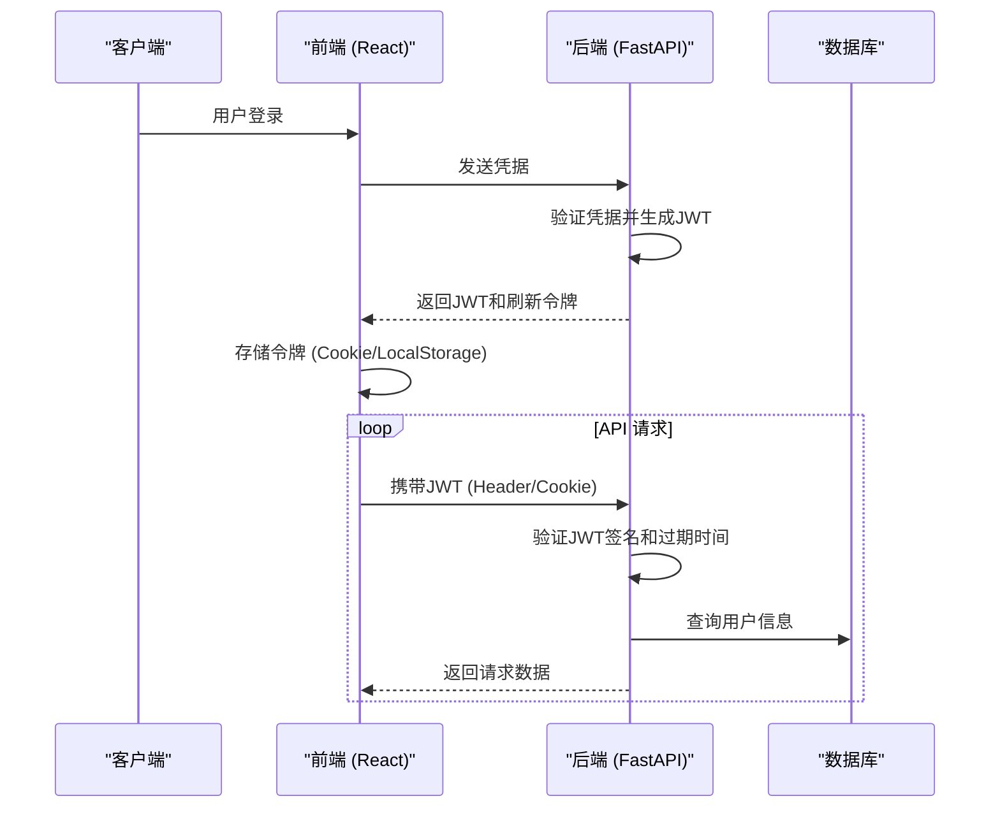
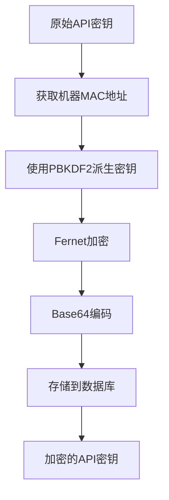

# 安全加固

<cite>
**本文档中引用的文件**  
- [main.py](file://vibe_surf/backend/main.py)
- [encryption.py](file://vibe_surf/backend/utils/encryption.py)
- [authContext.tsx](file://vibe_surf/frontend/src/contexts/authContext.tsx)
- [authStore.ts](file://vibe_surf/frontend/src/stores/authStore.ts)
- [models.py](file://vibe_surf/backend/database/models.py)
- [utils.py](file://vibe_surf/langflow/services/auth/utils.py)
- [nginx.conf](file://vibe_surf/frontend/nginx.conf)
- [start-nginx.sh](file://vibe_surf/frontend/start-nginx.sh)
</cite>

## 目录
1. [引言](#引言)
2. [防火墙配置与HTTPS强制策略](#防火墙配置与https强制策略)
3. [身份验证与授权机制](#身份验证与授权机制)
4. [数据加密指南](#数据加密指南)
5. [安全更新与漏洞管理](#安全更新与漏洞管理)
6. [常见安全威胁防护](#常见安全威胁防护)
7. [结论](#结论)

## 引言
VibeSurf是一个强大的浏览器助手，用于实现“氛围冲浪”（vibe surfing）功能。本安全加固指南详细阐述了VibeSurf在防火墙配置、SSL/TLS证书管理、HTTPS强制策略、身份验证与授权机制、数据加密、安全更新策略以及常见安全威胁防护方面的具体实现和最佳实践。通过本指南，用户可以全面了解VibeSurf的安全架构，并据此进行部署和配置，以确保系统的安全性。

## 防火墙配置与HTTPS强制策略

VibeSurf的前端通过Nginx作为反向代理服务器，负责处理所有外部HTTP请求。其配置文件`nginx.conf`定义了基本的防火墙规则和HTTPS重定向策略。

Nginx监听80端口，并通过`try_files`指令将所有请求路由到`index.html`，这为单页应用（SPA）提供了支持。虽然当前配置未直接在Nginx中强制HTTPS，但其设计允许通过环境变量`BACKEND_URL`进行动态配置，这通常在生产环境中设置为HTTPS地址。

**Diagram sources**
- [nginx.conf](file://vibe_surf/frontend/nginx.conf)
- [start-nginx.sh](file://vibe_surf/frontend/start-nginx.sh)

**Section sources**
- [nginx.conf](file://vibe_surf/frontend/nginx.conf#L1-L21)
- [start-nginx.sh](file://vibe_surf/frontend/start-nginx.sh#L1-L9)

## 身份验证与授权机制

VibeSurf的身份验证与授权机制主要基于JWT（JSON Web Token）令牌和API密钥，并集成了OAuth2的某些概念。系统通过多层依赖注入和安全检查来实现细粒度的访问控制。

### JWT令牌管理
后端使用`python-jose`库生成和验证JWT令牌。令牌的创建和验证依赖于一个由`SECRET_KEY`派生的密钥。当用户登录时，系统会生成一个包含用户ID（`sub`）和令牌类型（`type`）的JWT，并设置过期时间（`exp`）。在后续的API调用中，FastAPI的依赖项`get_current_user_by_jwt`会自动验证令牌的有效性，检查其签名、过期时间，并从数据库中查询对应的用户信息。

**Diagram sources**
- [authContext.tsx](file://vibe_surf/frontend/src/contexts/authContext.tsx)
- [utils.py](file://vibe_surf/langflow/services/auth/utils.py#L161-L219)

### OAuth2集成与RBAC权限控制
尽管VibeSurf没有完全实现标准的OAuth2授权码流程，但其认证系统借鉴了OAuth2的概念。系统通过`oauth2_login`安全依赖项来处理JWT令牌。此外，系统实现了基于角色的访问控制（RBAC），定义了`get_current_active_user`和`get_current_active_superuser`等依赖项。

这些依赖项会检查用户的`is_active`和`is_superuser`字段，从而实现权限分级。例如，只有超级用户才能访问某些管理API。API密钥也可以作为替代认证方式，系统会通过`check_key`函数验证API密钥的有效性。

**Section sources**
- [authContext.tsx](file://vibe_surf/frontend/src/contexts/authContext.tsx#L1-L126)
- [authStore.ts](file://vibe_surf/frontend/src/stores/authStore.ts#L1-L46)
- [utils.py](file://vibe_surf/langflow/services/auth/utils.py#L143-L259)

## 数据加密指南

VibeSurf对静态和传输中的敏感数据实施了加密保护，特别是针对API密钥等机密信息。

### 传输中数据的加密
所有客户端与服务器之间的通信都应通过HTTPS进行，以确保数据在传输过程中的机密性和完整性。如前所述，前端Nginx配置和后端FastAPI应用共同确保了这一点。FastAPI应用本身通过`CORSMiddleware`处理跨域请求，虽然当前配置允许所有来源（`*`），但在生产环境中应将其限制为特定的可信来源。

### 静态数据的加密
对于存储在数据库中的敏感数据，如API密钥，VibeSurf采用了基于机器标识的加密方案。`encryption.py`模块中的`encrypt_api_key`和`decrypt_api_key`函数使用Fernet对称加密算法。

加密密钥并非硬编码，而是通过`derive_key`函数从设备的MAC地址（或本地用户ID作为后备）派生而来。这确保了加密密钥与特定机器绑定，即使数据库被泄露，攻击者也无法在其他机器上解密这些密钥。

**Diagram sources**
- [encryption.py](file://vibe_surf/backend/utils/encryption.py)

**Section sources**
- [encryption.py](file://vibe_surf/backend/utils/encryption.py#L1-L172)
- [models.py](file://vibe_surf/backend/database/models.py#L40-L41)

## 安全更新与漏洞管理

VibeSurf的安全更新和漏洞管理主要通过其依赖项管理和代码库的持续维护来实现。

### 安全更新策略
项目使用`pyproject.toml`来管理Python依赖项，其中明确列出了所有第三方库及其版本。这种声明式的方法使得依赖项的更新和审计变得简单。当发现依赖库中的安全漏洞时，维护者可以及时更新`pyproject.toml`中的版本号，并发布新版本。

### 漏洞扫描与渗透测试
虽然代码库中没有直接包含自动化漏洞扫描脚本，但其架构设计考虑了安全性。例如，在MCP（Model Context Protocol）服务器的实现中，有专门的`validate_headers`函数来检查HTTP头是否符合RFC 7230标准，防止头部注入攻击。这表明项目在设计时就融入了安全考量。

建议的渗透测试应重点关注：
1.  JWT令牌的生成和验证逻辑。
2.  API密钥的加密和存储机制。
3.  前端与后端之间的认证流程。
4.  数据库查询是否存在SQL注入风险（尽管使用了SQLModel，但仍需验证）。

**Section sources**
- [pyproject.toml](file://pyproject.toml)
- [util.py](file://vibe_surf/langflow/base/mcp/util.py#L85-L120)

## 常见安全威胁防护

VibeSurf通过多种机制来防御常见的安全威胁。

### XSS与CSRF防护
- **XSS (跨站脚本攻击)**: FastAPI和前端框架（React）的默认行为有助于缓解XSS。FastAPI的`JSONResponse`会正确设置`Content-Type`，而React的JSX会自动转义动态内容。此外，Nginx配置中未启用不安全的`Content-Type`嗅探，减少了风险。
- **CSRF (跨站请求伪造)**: 系统主要依赖JWT令牌进行认证。由于JWT通常存储在HttpOnly Cookie中，并且浏览器的同源策略会阻止跨域请求携带该Cookie，这在很大程度上缓解了CSRF攻击。此外，关键操作（如文件上传）有专门的中间件进行边界检查。

### SQL注入防护
后端使用SQLModel（基于SQLAlchemy ORM）来构建数据库查询。ORM通过参数化查询（预编译语句）从根本上防止了SQL注入攻击。开发者应避免使用原始SQL字符串拼接，而应始终使用ORM提供的安全方法。

### DDoS攻击防御
VibeSurf本身不包含复杂的DDoS防御机制，但其架构可以与外部服务集成。Nginx可以配置速率限制（rate limiting）来防止请求泛洪。此外，MCP服务器的配置中包含了`mcp_max_sessions_per_server`和`mcp_session_idle_timeout`等设置，可以有效防止会话耗尽攻击。

**Section sources**
- [main.py](file://vibe_surf/backend/main.py#L592-L625)
- [util.py](file://vibe_surf/langflow/base/mcp/util.py#L47-L59)

## 结论
VibeSurf通过结合现代Web安全实践和精心设计的架构，构建了一个相对安全的平台。其核心安全特性包括基于JWT和API密钥的强身份验证、使用机器绑定密钥对静态数据进行加密、以及通过Nginx和FastAPI实现的安全通信。尽管某些配置（如CORS）在开发模式下较为宽松，但系统为生产环境的安全加固提供了坚实的基础。遵循本指南中的建议，可以进一步提升VibeSurf部署的整体安全性。