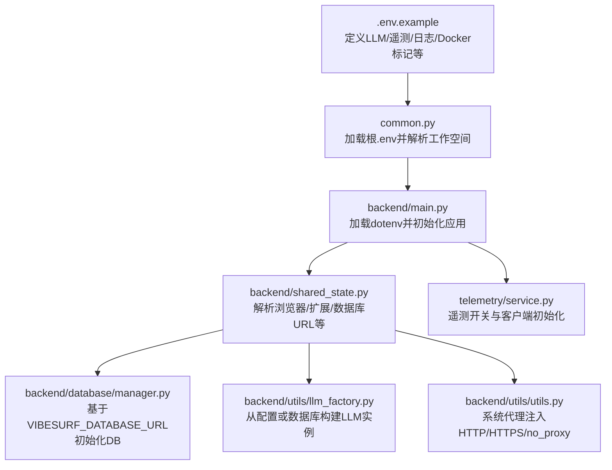
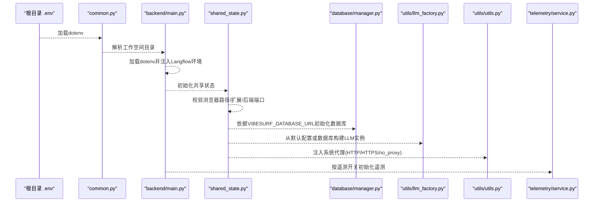
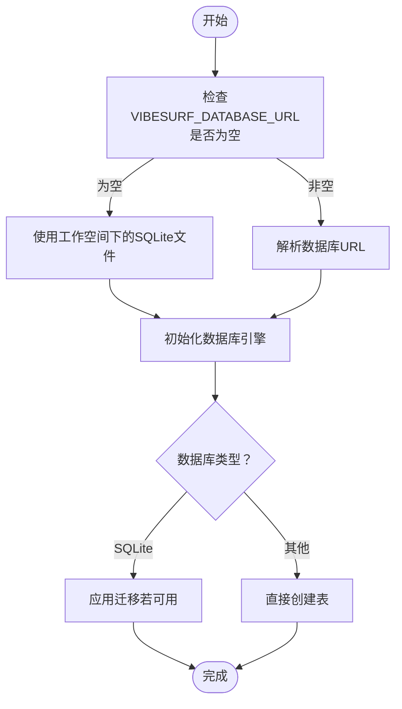
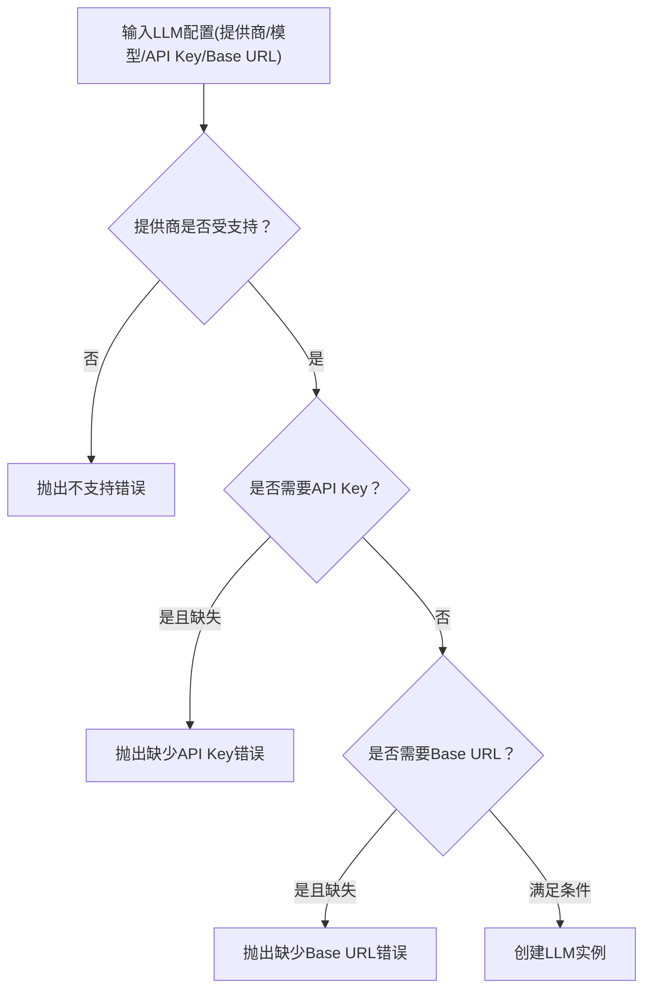
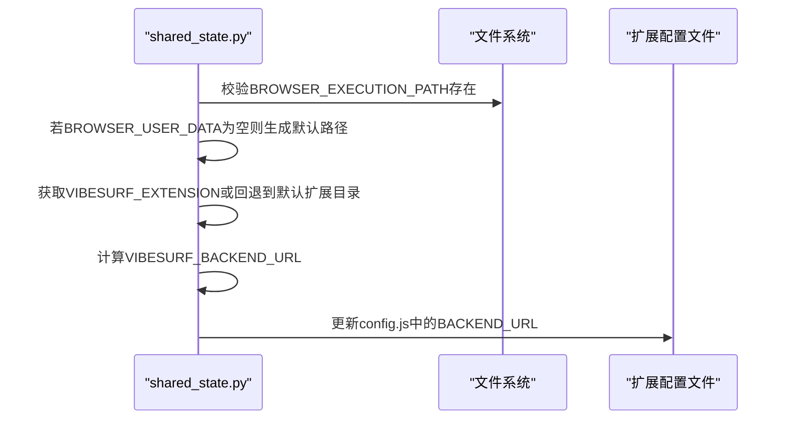
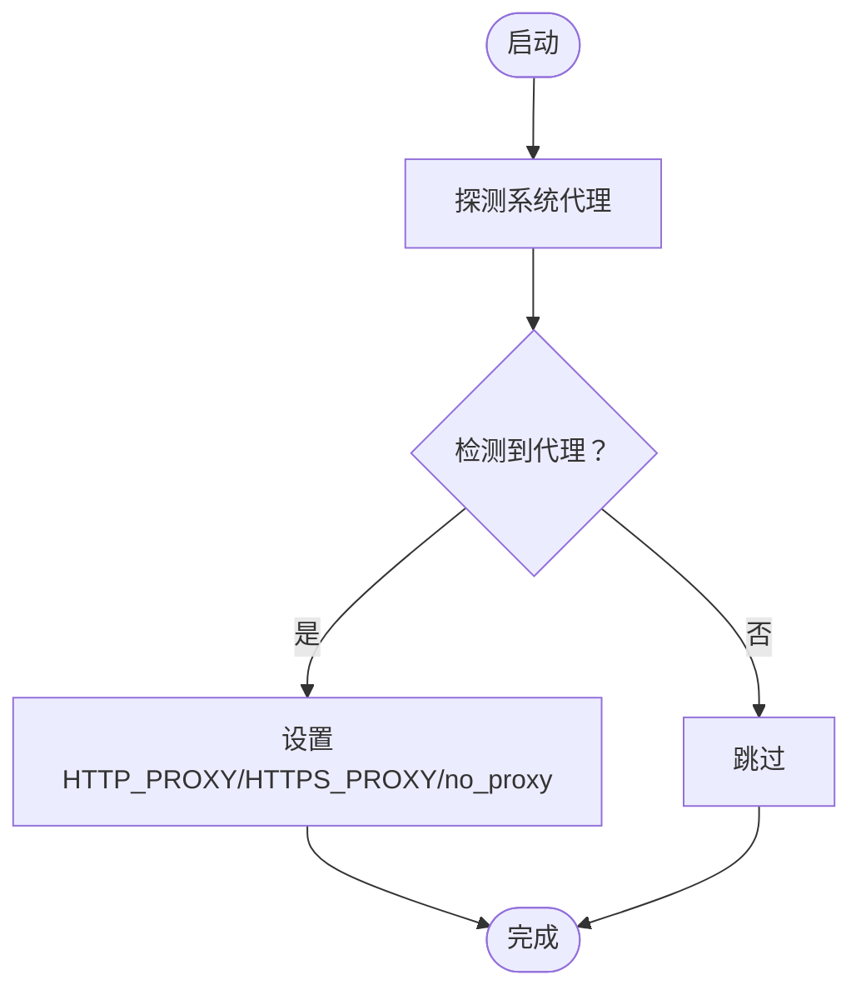
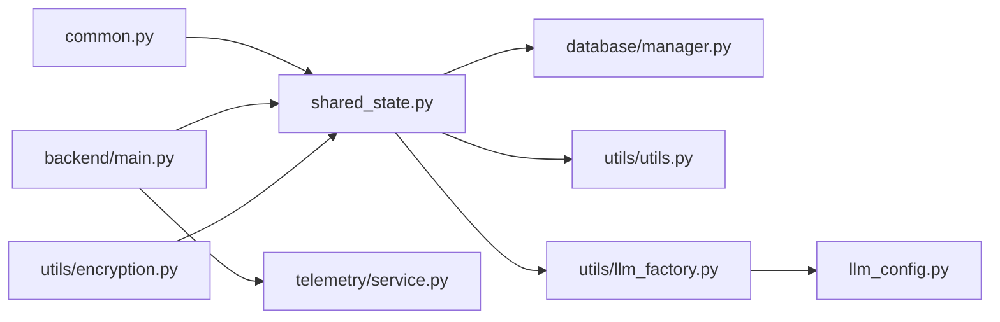

# 环境配置

<cite>
**本文引用的文件**
- [.env.example](file://.env.example)
- [vibe_surf/common.py](file://vibe_surf/common.py)
- [vibe_surf/backend/main.py](file://vibe_surf/backend/main.py)
- [vibe_surf/backend/shared_state.py](file://vibe_surf/backend/shared_state.py)
- [vibe_surf/backend/database/manager.py](file://vibe_surf/backend/database/manager.py)
- [vibe_surf/backend/utils/encryption.py](file://vibe_surf/backend/utils/encryption.py)
- [vibe_surf/backend/utils/llm_factory.py](file://vibe_surf/backend/utils/llm_factory.py)
- [vibe_surf/backend/llm_config.py](file://vibe_surf/backend/llm_config.py)
- [vibe_surf/backend/api/config.py](file://vibe_surf/backend/api/config.py)
- [vibe_surf/backend/utils/utils.py](file://vibe_surf/backend/utils/utils.py)
- [vibe_surf/telemetry/service.py](file://vibe_surf/telemetry/service.py)
- [vibe_surf/langflow/services/variable/service.py](file://vibe_surf/langflow/services/variable/service.py)
- [vibe_surf/langflow/services/variable/kubernetes.py](file://vibe_surf/langflow/services/variable/kubernetes.py)
- [vibe_surf/langflow/components/datastax/dotenv.py](file://vibe_surf/langflow/components/datastax/dotenv.py)
- [vibe_surf/frontend/dev.Dockerfile](file://vibe_surf/frontend/dev.Dockerfile)
- [vibe_surf/frontend/cdk.Dockerfile](file://vibe_surf/frontend/cdk.Dockerfile)
</cite>

## 目录
1. [简介](#简介)
2. [项目结构与配置入口](#项目结构与配置入口)
3. [核心配置组件](#核心配置组件)
4. [架构总览](#架构总览)
5. [详细组件解析](#详细组件解析)
6. [依赖关系分析](#依赖关系分析)
7. [性能与可维护性建议](#性能与可维护性建议)
8. [故障排查指南](#故障排查指南)
9. [结论](#结论)
10. [附录：配置模板与最佳实践](#附录配置模板与最佳实践)

## 简介
本文件面向运维与开发人员，系统化梳理 VibeSurf 的环境配置体系，覆盖数据库连接、LLM API 密钥、浏览器执行路径、代理与网络、遥测与日志、扩展与前端集成、以及敏感信息管理与安全策略。文档同时给出不同部署环境（开发、测试、生产）的配置差异与最佳实践，并提供配置验证与错误处理方法，帮助快速定位与修复配置问题。

## 项目结构与配置入口
- 配置加载顺序
  - 启动时通过通用模块加载根目录 .env 文件，随后在应用生命周期中按需读取环境变量。
  - 工作空间目录由通用模块决定，默认根据操作系统平台选择路径，并确保存在。
  - 应用启动后，后台服务会从工作空间中的持久化配置文件加载环境变量并写回系统环境，以保证运行期一致性。
- 关键入口
  - 根 .env 示例文件定义了 LLM 提供商、遥测、日志级别、Docker 运行标记等常用环境变量。
  - 后台主程序负责加载 .env 并初始化 Langflow 环境变量、Sentry 错误上报、浏览器监控任务等。
  - 共享状态模块负责解析浏览器执行路径、用户数据目录、扩展路径、后端端口、数据库 URL 等，并在初始化阶段进行校验与落盘。

图表来源
- [.env.example](file://.env.example#L1-L55)
- [vibe_surf/common.py](file://vibe_surf/common.py#L1-L36)
- [vibe_surf/backend/main.py](file://vibe_surf/backend/main.py#L1-L120)
- [vibe_surf/backend/shared_state.py](file://vibe_surf/backend/shared_state.py#L453-L598)
- [vibe_surf/backend/database/manager.py](file://vibe_surf/backend/database/manager.py#L148-L202)
- [vibe_surf/backend/utils/llm_factory.py](file://vibe_surf/backend/utils/llm_factory.py#L23-L216)
- [vibe_surf/telemetry/service.py](file://vibe_surf/telemetry/service.py#L42-L82)
- [vibe_surf/backend/utils/utils.py](file://vibe_surf/backend/utils/utils.py#L8-L42)

章节来源
- [vibe_surf/common.py](file://vibe_surf/common.py#L1-L36)
- [vibe_surf/backend/main.py](file://vibe_surf/backend/main.py#L1-L120)
- [vibe_surf/backend/shared_state.py](file://vibe_surf/backend/shared_state.py#L453-L598)

## 核心配置组件
- 数据库连接
  - 变量：VIBESURF_DATABASE_URL
  - 默认：未设置时自动在工作空间下创建 SQLite 数据库文件。
  - 支持：SQLite（开发/单机）、PostgreSQL/MySQL（生产）；SQLite 自带迁移支持。
- LLM API 密钥与提供商
  - 变量：各提供商前缀（如 OPENAI_、ANTHROPIC_、GOOGLE_、AZURE_OPENAI_、DEEPSEEK_、MISTRAL_、OLLAMA_、DASHSCOPE_、MOONSHOT_、UNBOUND_、SILICONFLOW_）
  - 默认：未设置时回退到环境变量 LLM_MODEL、OPENAI_ENDPOINT、OPENAI_API_KEY。
  - 验证：LLM 工厂对提供商、模型、API Key、Base URL 进行参数校验。
- 浏览器与扩展
  - 变量：BROWSER_EXECUTION_PATH、BROWSER_USER_DATA、VIBESURF_EXTENSION、VIBESURF_BACKEND_PORT
  - 校验：初始化时断言浏览器可执行路径存在，必要时生成默认用户数据目录。
- 代理与网络
  - 变量：HTTP_PROXY、HTTPS_PROXY、no_proxy
  - 行为：系统代理自动注入；Docker 构建镜像中也注入 BACKEND_URL。
- 遥测与日志
  - 变量：ANONYMIZED_TELEMETRY、BROWSER_USE_LOGGING_LEVEL、BROWSER_USE_CALCULATE_COST
  - 行为：遥测客户端按开关启用；日志级别受调试模式影响。
- 安全与敏感信息
  - 变量：COMPOSIO_API_KEY
  - 加密：API Key 可加密存储，解密失败时回退策略。
- Langflow 集成
  - 变量：LANGFLOW_*（由后台脚本统一注入），含数据库、日志、认证等。
- 前端与扩展
  - 变量：BACKEND_URL（Docker 构建时注入），扩展配置文件中可更新后端地址。

章节来源
- [.env.example](file://.env.example#L1-L55)
- [vibe_surf/backend/database/manager.py](file://vibe_surf/backend/database/manager.py#L148-L202)
- [vibe_surf/backend/utils/llm_factory.py](file://vibe_surf/backend/utils/llm_factory.py#L222-L275)
- [vibe_surf/backend/shared_state.py](file://vibe_surf/backend/shared_state.py#L483-L513)
- [vibe_surf/backend/utils/utils.py](file://vibe_surf/backend/utils/utils.py#L8-L42)
- [vibe_surf/telemetry/service.py](file://vibe_surf/telemetry/service.py#L42-L82)
- [vibe_surf/backend/utils/encryption.py](file://vibe_surf/backend/utils/encryption.py#L65-L127)
- [vibe_surf/backend/main.py](file://vibe_surf/backend/main.py#L66-L81)

## 架构总览
下图展示了从 .env 到运行时环境变量的传递链路，以及关键组件如何消费这些变量。

图表来源
- [.env.example](file://.env.example#L1-L55)
- [vibe_surf/common.py](file://vibe_surf/common.py#L1-L36)
- [vibe_surf/backend/main.py](file://vibe_surf/backend/main.py#L66-L120)
- [vibe_surf/backend/shared_state.py](file://vibe_surf/backend/shared_state.py#L453-L598)
- [vibe_surf/backend/database/manager.py](file://vibe_surf/backend/database/manager.py#L148-L202)
- [vibe_surf/backend/utils/llm_factory.py](file://vibe_surf/backend/utils/llm_factory.py#L23-L216)
- [vibe_surf/backend/utils/utils.py](file://vibe_surf/backend/utils/utils.py#L8-L42)
- [vibe_surf/telemetry/service.py](file://vibe_surf/telemetry/service.py#L42-L82)

## 详细组件解析

### 数据库配置（VIBESURF_DATABASE_URL）
- 作用：决定数据库类型与连接字符串，支持 SQLite、PostgreSQL、MySQL。
- 默认行为：未设置时在工作空间下创建 SQLite 文件。
- 迁移支持：仅 SQLite 支持内置迁移；其他数据库需自行迁移。
- 初始化流程：初始化时创建表或应用迁移，失败时回退到直接建表。

图表来源
- [vibe_surf/backend/database/manager.py](file://vibe_surf/backend/database/manager.py#L148-L202)
- [vibe_surf/backend/database/manager.py](file://vibe_surf/backend/database/manager.py#L203-L249)

章节来源
- [vibe_surf/backend/database/manager.py](file://vibe_surf/backend/database/manager.py#L148-L202)
- [vibe_surf/backend/database/manager.py](file://vibe_surf/backend/database/manager.py#L203-L249)

### LLM 配置与密钥管理
- 提供商与模型：集中定义于 LLM 配置模块，包含各提供商支持能力与默认模型。
- 参数校验：工厂函数对提供商、模型、API Key、Base URL 进行严格校验。
- 回退策略：当数据库无默认配置时，回退到环境变量（如 OPENAI_ENDPOINT、OPENAI_API_KEY、LLM_MODEL）。
- 加密存储：敏感密钥可加密存储，解密失败时有回退逻辑。

图表来源
- [vibe_surf/backend/utils/llm_factory.py](file://vibe_surf/backend/utils/llm_factory.py#L222-L275)
- [vibe_surf/backend/llm_config.py](file://vibe_surf/backend/llm_config.py#L1-L226)

章节来源
- [vibe_surf/backend/utils/llm_factory.py](file://vibe_surf/backend/utils/llm_factory.py#L23-L216)
- [vibe_surf/backend/llm_config.py](file://vibe_surf/backend/llm_config.py#L1-L226)
- [vibe_surf/backend/shared_state.py](file://vibe_surf/backend/shared_state.py#L604-L642)
- [vibe_surf/backend/utils/encryption.py](file://vibe_surf/backend/utils/encryption.py#L65-L127)

### 浏览器与扩展配置
- 关键变量：BROWSER_EXECUTION_PATH、BROWSER_USER_DATA、VIBESURF_EXTENSION、VIBESURF_BACKEND_PORT
- 校验与默认：初始化时断言浏览器可执行路径存在，必要时自动生成用户数据目录；扩展路径不存在时回退到项目内默认扩展目录。
- 后端 URL：根据端口拼接后端地址，并更新扩展配置文件中的后端地址。

图表来源
- [vibe_surf/backend/shared_state.py](file://vibe_surf/backend/shared_state.py#L483-L513)
- [vibe_surf/backend/shared_state.py](file://vibe_surf/backend/shared_state.py#L714-L738)

章节来源
- [vibe_surf/backend/shared_state.py](file://vibe_surf/backend/shared_state.py#L483-L513)
- [vibe_surf/backend/shared_state.py](file://vibe_surf/backend/shared_state.py#L714-L738)

### 代理与网络（HTTP/HTTPS/no_proxy）
- 自动注入：系统代理通过 urllib 探测并写入 HTTP_PROXY、HTTPS_PROXY、no_proxy。
- Docker 构建：前端 Dockerfile 在构建时注入 BACKEND_URL，便于容器内访问。

图表来源
- [vibe_surf/backend/utils/utils.py](file://vibe_surf/backend/utils/utils.py#L8-L42)
- [vibe_surf/frontend/dev.Dockerfile](file://vibe_surf/frontend/dev.Dockerfile#L1-L26)
- [vibe_surf/frontend/cdk.Dockerfile](file://vibe_surf/frontend/cdk.Dockerfile#L1-L26)

章节来源
- [vibe_surf/backend/utils/utils.py](file://vibe_surf/backend/utils/utils.py#L8-L42)
- [vibe_surf/frontend/dev.Dockerfile](file://vibe_surf/frontend/dev.Dockerfile#L1-L26)
- [vibe_surf/frontend/cdk.Dockerfile](file://vibe_surf/frontend/cdk.Dockerfile#L1-L26)

### 遥测与日志
- 遥测：可通过 ANONYMIZED_TELEMETRY 控制是否启用匿名遥测。
- 日志：日志级别受 VIBESURF_DEBUG 影响，Langflow 日志级别也会相应调整。
- Sentry：若配置了 DSN，则在应用中启用 Sentry 中间件。

章节来源
- [.env.example](file://.env.example#L33-L55)
- [vibe_surf/backend/main.py](file://vibe_surf/backend/main.py#L66-L81)
- [vibe_surf/backend/main.py](file://vibe_surf/backend/main.py#L85-L101)
- [vibe_surf/telemetry/service.py](file://vibe_surf/telemetry/service.py#L42-L82)

### Langflow 环境变量注入
- 后台脚本会将部分 Langflow 环境变量注入到进程环境中，例如数据库 URL、日志文件、认证开关等。
- 这些变量通常以 LANGFLOW_ 前缀命名，便于与应用其他配置区分。

章节来源
- [vibe_surf/backend/main.py](file://vibe_surf/backend/main.py#L66-L81)

### 环境变量管理 API
- 后台提供环境变量查询与更新接口，允许在运行时修改部分环境变量并持久化到工作空间的 envs.json。
- 更新时会对传入的键进行过滤，仅接受已存在的键。

章节来源
- [vibe_surf/backend/api/config.py](file://vibe_surf/backend/api/config.py#L690-L762)
- [vibe_surf/backend/shared_state.py](file://vibe_surf/backend/shared_state.py#L684-L712)

### 敏感信息管理与安全
- 加密存储：API Key 使用机器 MAC 或本地用户 ID 派生密钥进行加解密。
- 解密回退：若当前派生失败，尝试使用本地用户 ID 派生密钥进行解密。
- Kubernetes 存储：Langflow 变量服务支持将指定环境变量写入 Kubernetes Secret。
- .env 加载：Langflow 组件支持将 .env 内容注入到运行时环境变量。

章节来源
- [vibe_surf/backend/utils/encryption.py](file://vibe_surf/backend/utils/encryption.py#L65-L127)
- [vibe_surf/langflow/services/variable/kubernetes.py](file://vibe_surf/langflow/services/variable/kubernetes.py#L32-L59)
- [vibe_surf/langflow/components/datastax/dotenv.py](file://vibe_surf/langflow/components/datastax/dotenv.py#L1-L35)

## 依赖关系分析
- 配置耦合
  - shared_state 依赖 common 的工作空间解析，依赖 utils 的代理注入，依赖 database 的数据库 URL。
  - llm_factory 依赖 llm_config 的提供商元数据与模型列表。
  - main 负责加载 dotenv 并初始化 Sentry、Langflow 环境变量。
- 外部依赖
  - dotenv：根 .env 加载。
  - aiosqlite/sqlalchemy：数据库连接与迁移。
  - cryptography：敏感信息加密。
  - urllib：系统代理探测。

图表来源
- [vibe_surf/common.py](file://vibe_surf/common.py#L1-L36)
- [vibe_surf/backend/shared_state.py](file://vibe_surf/backend/shared_state.py#L453-L598)
- [vibe_surf/backend/database/manager.py](file://vibe_surf/backend/database/manager.py#L148-L202)
- [vibe_surf/backend/utils/llm_factory.py](file://vibe_surf/backend/utils/llm_factory.py#L23-L216)
- [vibe_surf/backend/llm_config.py](file://vibe_surf/backend/llm_config.py#L1-L226)
- [vibe_surf/backend/main.py](file://vibe_surf/backend/main.py#L66-L120)
- [vibe_surf/telemetry/service.py](file://vibe_surf/telemetry/service.py#L42-L82)
- [vibe_surf/backend/utils/encryption.py](file://vibe_surf/backend/utils/encryption.py#L65-L127)

## 性能与可维护性建议
- 数据库
  - 生产环境优先使用 PostgreSQL/MySQL，避免 SQLite 的并发限制。
  - 使用连接池参数（pool_size、max_overflow、pre_ping、recycle）提升稳定性。
- LLM
  - 选择合适的默认模型与温度参数，减少不必要的重试与超时。
  - 对外部 API 调用增加超时与重试策略，避免阻塞主线程。
- 浏览器
  - 在容器中运行时开启 IN_DOCKER 标记，优化 Chrome 启动参数。
- 遥测
  - 仅在需要时启用遥测，避免额外网络开销。
- 配置管理
  - 将敏感信息放入加密存储或密钥管理系统，避免明文写入 .env。
  - 使用环境变量注入工具（如 Kubernetes Secret）管理多租户密钥。

[本节为通用建议，无需源码引用]

## 故障排查指南
- 数据库无法初始化
  - 检查 VIBESURF_DATABASE_URL 是否正确；SQLite 需要工作空间可写权限。
  - 查看数据库迁移是否成功；失败时回退到直接建表。
- LLM 创建失败
  - 确认提供商名称是否受支持；检查模型名、API Key、Base URL 是否齐全。
  - 若使用数据库默认配置，请确认密钥已加密并可正常解密。
- 浏览器无法启动
  - 确认 BROWSER_EXECUTION_PATH 指向有效可执行文件；必要时设置 BROWSER_USER_DATA。
  - 若在容器中运行，确保 IN_DOCKER 标记正确。
- 代理导致请求异常
  - 检查 HTTP_PROXY/HTTPS_PROXY/no_proxy 是否正确；必要时禁用代理。
- 遥测未生效
  - 检查 ANONYMIZED_TELEMETRY 开关；确认 DSN 配置正确。
- 环境变量更新无效
  - 通过后台 API 查询当前环境变量；确认键名在允许列表中。
  - 检查工作空间 envs.json 是否成功写入。

章节来源
- [vibe_surf/backend/database/manager.py](file://vibe_surf/backend/database/manager.py#L203-L249)
- [vibe_surf/backend/utils/llm_factory.py](file://vibe_surf/backend/utils/llm_factory.py#L222-L275)
- [vibe_surf/backend/shared_state.py](file://vibe_surf/backend/shared_state.py#L483-L513)
- [vibe_surf/backend/utils/utils.py](file://vibe_surf/backend/utils/utils.py#L8-L42)
- [vibe_surf/backend/api/config.py](file://vibe_surf/backend/api/config.py#L690-L762)

## 结论
VibeSurf 的环境配置围绕“根 .env 加载 + 运行时共享状态解析 + 组件按需消费”的模式展开。通过明确的变量命名、严格的参数校验、可选的加密存储与代理注入，系统在不同部署环境下具备良好的可移植性与安全性。建议在生产环境采用专用数据库、密钥管理与可观测性方案，并结合本指南的模板与最佳实践，确保配置稳定可靠。

[本节为总结，无需源码引用]

## 附录：配置模板与最佳实践

### 不同环境的推荐配置
- 开发环境
  - 数据库：SQLite（VIBESURF_DATABASE_URL 可省略）
  - 日志：BROWSER_USE_LOGGING_LEVEL=debug
  - 遥测：ANONYMIZED_TELEMETRY=false
  - Docker：IN_DOCKER=false
  - LLM：使用本地 Ollama 或公开测试 Key（仅限开发）
- 测试环境
  - 数据库：PostgreSQL/MySQL（连接池参数适当降低）
  - 日志：BROWSER_USE_LOGGING_LEVEL=info
  - 遥测：ANONYMIZED_TELEMETRY=false
  - LLM：使用测试 Key，限制调用额度
- 生产环境
  - 数据库：PostgreSQL/MySQL（高可用、备份、连接池）
  - 日志：BROWSER_USE_LOGGING_LEVEL=info
  - 遥测：ANONYMIZED_TELEMETRY=true
  - Docker：IN_DOCKER=true
  - LLM：使用受控 Key，启用超时与重试，限制模型与温度
  - 代理：no_proxy 明确白名单，避免内部服务被代理劫持

[本节为通用建议，无需源码引用]

### 配置文件模板（.env）
- 基础模板要点
  - LLM 提供商前缀：OPENAI_、ANTHROPIC_、GOOGLE_、AZURE_OPENAI_、DEEPSEEK_、MISTRAL_、OLLAMA_、DASHSCOPE_、MOONSHOT_、UNBOUND_、SILICONFLOW_
  - 遥测与日志：ANONYMIZED_TELEMETRY、BROWSER_USE_LOGGING_LEVEL、BROWSER_USE_CALCULATE_COST
  - 运行参数：IN_DOCKER、VIBESURF_BACKEND_PORT、VIBESURF_WORKSPACE
  - 浏览器：BROWSER_EXECUTION_PATH、BROWSER_USER_DATA
  - 安全：COMPOSIO_API_KEY
- 模板参考路径
  - [.env.example](file://.env.example#L1-L55)

章节来源
- [.env.example](file://.env.example#L1-L55)

### 最佳实践清单
- 使用环境变量而非硬编码，敏感信息加密存储或通过密钥管理服务注入。
- 为不同环境准备独立的 .env 文件，避免混用。
- 在 CI/CD 中校验关键环境变量是否存在，防止部署失败。
- 定期轮换 LLM API Key，启用最小权限原则。
- 在容器中运行时，显式设置 BACKEND_URL 并确保网络连通。
- 对数据库连接池与 LLM 调用增加超时与重试，避免雪崩效应。

[本节为通用建议，无需源码引用]