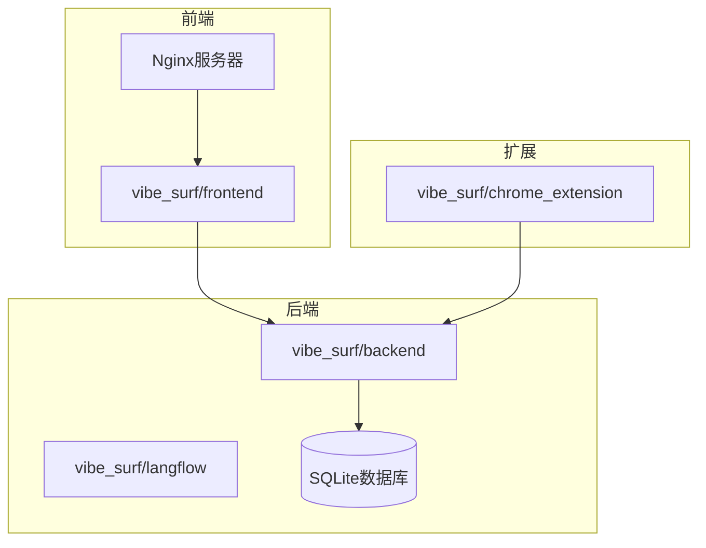
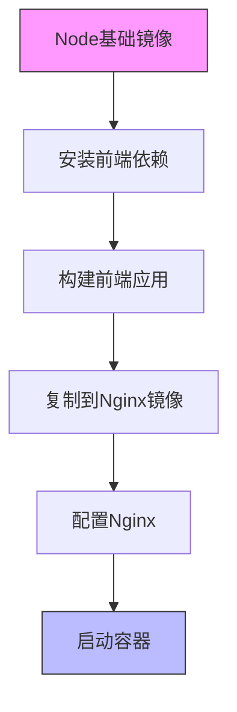
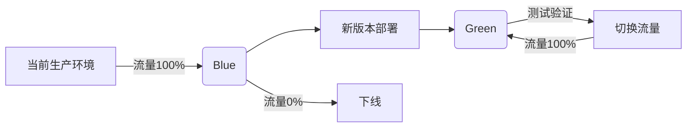
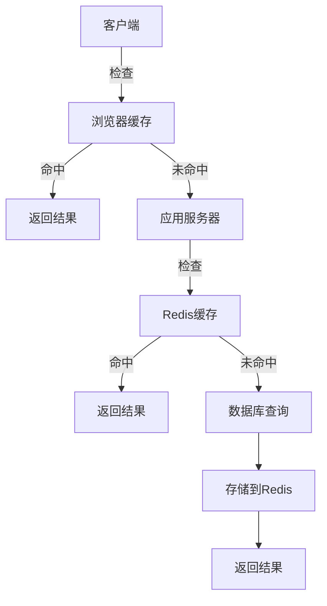
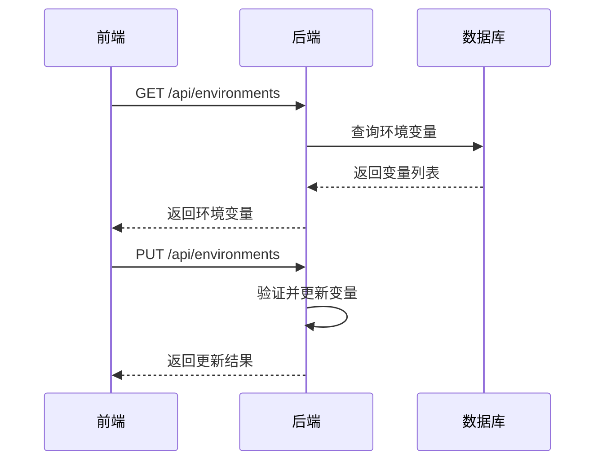

# 生产部署

<cite>
**本文档中引用的文件**   
- [main.py](file://vibe_surf/backend/main.py)
- [Dockerfile](file://vibe_surf/frontend/Dockerfile)
- [dev.Dockerfile](file://vibe_surf/frontend/dev.Dockerfile)
- [cdk.Dockerfile](file://vibe_surf/frontend/cdk.Dockerfile)
- [start-nginx.sh](file://vibe_surf/frontend/start-nginx.sh)
- [nginx.conf](file://vibe_surf/frontend/nginx.conf)
- [package.json](file://vibe_surf/frontend/package.json)
- [pyproject.toml](file://pyproject.toml)
- [config.py](file://vibe_surf/backend/api/config.py)
- [settings-general.js](file://vibe_surf/chrome_extension/scripts/settings-general.js)
</cite>

## 目录
1. [简介](#简介)
2. [项目结构](#项目结构)
3. [Docker容器化部署](#docker容器化部署)
4. [Kubernetes部署](#kubernetes部署)
5. [云服务部署](#云服务部署)
6. [CI/CD流水线与自动化部署](#cicd流水线与自动化部署)
7. [性能调优建议](#性能调优建议)
8. [环境变量与配置管理](#环境变量与配置管理)
9. [结论](#结论)

## 简介

VibeSurf是一个开源的AI代理浏览器，革新了浏览器自动化和研究。本生产部署指南详细介绍了VibeSurf的容器化部署流程、编排策略和最佳实践，涵盖从Docker镜像构建到云服务部署的完整生命周期。

**Section sources**
- [README.md](file://README.md#L1-L186)

## 项目结构

VibeSurf项目采用模块化架构，主要包含以下核心组件：
- **vibe_surf/backend**: 后端API服务，基于FastAPI构建
- **vibe_surf/frontend**: 前端应用，基于React和Vite构建
- **vibe_surf/chrome_extension**: Chrome扩展程序
- **vibe_surf/langflow**: 工作流引擎和AI集成

项目使用uv作为包管理器，通过pyproject.toml管理Python依赖，前端使用npm管理JavaScript依赖。



**Diagram sources **
- [pyproject.toml](file://pyproject.toml#L1-L282)
- [package.json](file://vibe_surf/frontend/package.json#L1-L152)

**Section sources**
- [pyproject.toml](file://pyproject.toml#L1-L282)
- [package.json](file://vibe_surf/frontend/package.json#L1-L152)

## Docker容器化部署

### 镜像构建流程

VibeSurf提供了多阶段Docker构建流程，确保生产环境的高效性和安全性。主要构建文件包括：

- **Dockerfile**: 生产环境构建文件
- **dev.Dockerfile**: 开发环境构建文件
- **cdk.Dockerfile**: 云开发套件构建文件



**Diagram sources **
- [Dockerfile](file://vibe_surf/frontend/Dockerfile#L1-L16)
- [dev.Dockerfile](file://vibe_surf/frontend/dev.Dockerfile#L1-L26)

### 构建和运行生产镜像

```bash
# 构建生产镜像
docker build -f vibe_surf/frontend/Dockerfile \
  --build-arg BACKEND_URL=http://backend:9335 \
  -t vibesurf-prod .

# 运行容器
docker run -d \
  -p 8080:80 \
  -e BACKEND_URL=http://your-backend-url:9335 \
  --name vibesurf \
  vibesurf-prod
```

### 多阶段构建详解

VibeSurf的Docker构建采用多阶段策略：

1. **前端构建阶段**: 使用node:20-alpine镜像安装依赖并构建前端应用
2. **生产阶段**: 使用nginx镜像作为运行时环境，复制构建结果

这种策略的优势包括：
- 减小最终镜像大小
- 提高安全性（不包含构建工具）
- 优化启动时间

**Section sources**
- [Dockerfile](file://vibe_surf/frontend/Dockerfile#L1-L16)
- [start-nginx.sh](file://vibe_surf/frontend/start-nginx.sh#L1-L9)

## Kubernetes部署

### 部署清单

VibeSurf可以轻松部署到Kubernetes集群。以下是一个典型的部署配置：

```yaml
apiVersion: apps/v1
kind: Deployment
metadata:
  name: vibesurf
spec:
  replicas: 3
  selector:
    matchLabels:
      app: vibesurf
  template:
    metadata:
      labels:
        app: vibesurf
    spec:
      containers:
      - name: vibesurf
        image: vibesurf-prod:latest
        ports:
        - containerPort: 80
        env:
        - name: BACKEND_URL
          value: "http://vibesurf-backend:9335"
        resources:
          requests:
            memory: "512Mi"
            cpu: "250m"
          limits:
            memory: "1Gi"
            cpu: "500m"
```

### Helm图表建议

为简化Kubernetes部署，建议创建Helm图表。Helm图表的主要优势包括：

- **版本控制**: 轻松管理不同版本的部署配置
- **参数化**: 通过values.yaml文件配置环境特定参数
- **可重用性**: 在不同环境中复用相同的部署模板

推荐的Helm图表结构：
```
vibesurf-chart/
├── charts/
├── templates/
│   ├── deployment.yaml
│   ├── service.yaml
│   ├── ingress.yaml
│   └── configmap.yaml
├── Chart.yaml
└── values.yaml
```

### 服务发现与网络配置

在Kubernetes环境中，VibeSurf需要正确配置服务发现：

```yaml
apiVersion: v1
kind: Service
metadata:
  name: vibesurf-service
spec:
  selector:
    app: vibesurf
  ports:
    - protocol: TCP
      port: 80
      targetPort: 80
  type: ClusterIP
```

**Section sources**
- [vibe_surf/langflow/services/variable/kubernetes.py](file://vibe_surf/langflow/services/variable/kubernetes.py#L32-L134)

## 云服务部署

### AWS ECS部署

在AWS ECS上部署VibeSurf的步骤：

1. **创建任务定义**:
   - 指定容器镜像
   - 配置环境变量
   - 设置资源限制

2. **配置服务**:
   - 设置自动扩展策略
   - 配置负载均衡器
   - 设置健康检查

3. **网络配置**:
   - 使用Application Load Balancer
   - 配置安全组规则
   - 设置VPC和子网

### GCP Cloud Run部署

GCP Cloud Run提供无服务器部署选项：

```bash
# 构建并推送镜像到Google Container Registry
gcloud builds submit --tag gcr.io/PROJECT-ID/vibesurf

# 部署到Cloud Run
gcloud run deploy vibesurf \
  --image gcr.io/PROJECT-ID/vibesurf \
  --platform managed \
  --region us-central1 \
  --allow-unauthenticated \
  --set-env-vars BACKEND_URL=https://your-backend-url
```

### Azure Container Instances

Azure Container Instances提供快速部署选项：

```bash
az container create \
  --resource-group myResourceGroup \
  --name vibesurf-container \
  --image vibesurf-prod:latest \
  --dns-name-label vibesurf \
  --ports 80 \
  --environment-variables BACKEND_URL="https://your-backend-url"
```

**Section sources**
- [vibe_surf/langflow/services/variable/kubernetes.py](file://vibe_surf/langflow/services/variable/kubernetes.py#L32-L59)

## CI/CD流水线与自动化部署

### 流水线配置

建议的CI/CD流水线包括以下阶段：

1. **代码检查**: 代码格式化和静态分析
2. **测试**: 单元测试和集成测试
3. **构建**: Docker镜像构建
4. **部署**: 到不同环境的自动化部署

### 蓝绿部署策略

VibeSurf支持蓝绿部署，确保零停机更新：



### 滚动更新策略

对于Kubernetes部署，推荐使用滚动更新：

```yaml
spec:
  strategy:
    type: RollingUpdate
    rollingUpdate:
      maxSurge: 1
      maxUnavailable: 0
```

这种策略确保：
- 始终有足够的实例处理请求
- 逐步替换旧实例
- 自动回滚失败的更新

**Section sources**
- [pyproject.toml](file://pyproject.toml#L1-L282)
- [package.json](file://vibe_surf/frontend/package.json#L96-L107)

## 性能调优建议

### 资源限制

合理配置容器资源限制：

```yaml
resources:
  requests:
    memory: "512Mi"
    cpu: "250m"
  limits:
    memory: "1Gi"
    cpu: "500m"
```

### 连接池配置

优化数据库连接池：

```python
# 在配置中设置连接池参数
DATABASE_POOL_SIZE = 20
DATABASE_MAX_OVERFLOW = 10
DATABASE_POOL_TIMEOUT = 30
```

### 缓存策略

实施多层缓存策略：

1. **前端缓存**: 使用浏览器缓存静态资源
2. **应用缓存**: 使用Redis缓存API响应
3. **数据库缓存**: 启用查询缓存



**Diagram sources **
- [vibe_surf/backend/main.py](file://vibe_surf/backend/main.py#L1-L794)

## 环境变量与配置管理

### 环境变量管理

VibeSurf通过API端点管理环境变量：



**Diagram sources **
- [config.py](file://vibe_surf/backend/api/config.py#L690-L762)
- [settings-general.js](file://vibe_surf/chrome_extension/scripts/settings-general.js#L306-L389)

### 配置最佳实践

1. **敏感信息**: 使用环境变量存储API密钥等敏感信息
2. **配置分离**: 不同环境使用不同的配置文件
3. **动态更新**: 支持运行时配置更新

```bash
# 推荐的环境变量设置
VIBESURF_DEBUG=false
VIBESURF_BACKEND_PORT=9335
HTTP_PROXY=""
HTTPS_PROXY=""
no_proxy=""
```

**Section sources**
- [config.py](file://vibe_surf/backend/api/config.py#L690-L762)
- [settings-general.js](file://vibe_surf/chrome_extension/scripts/settings-general.js#L306-L389)

## 结论

VibeSurf提供了完整的生产部署解决方案，支持从本地Docker部署到云原生Kubernetes集群的各种场景。通过合理的容器化策略、自动化部署流程和性能优化，可以确保VibeSurf在生产环境中的稳定性和可扩展性。

关键部署要点总结：
- 使用多阶段Docker构建优化镜像
- 采用蓝绿部署实现零停机更新
- 合理配置资源限制和缓存策略
- 通过环境变量管理配置
- 利用CI/CD流水线实现自动化部署