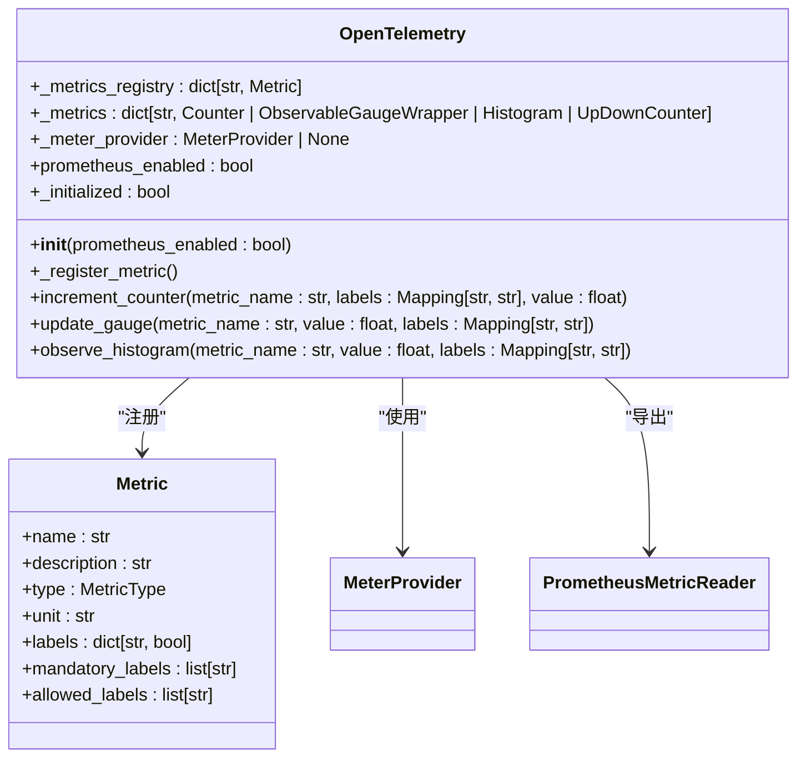
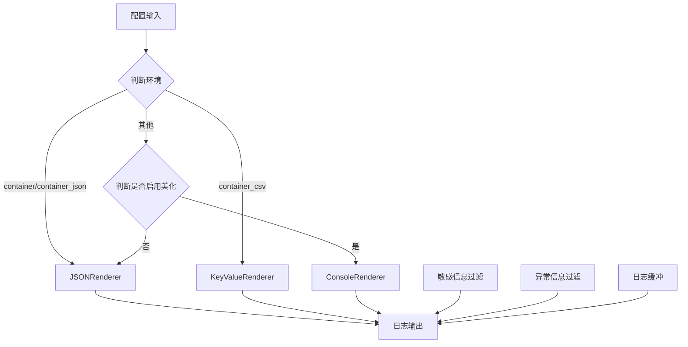
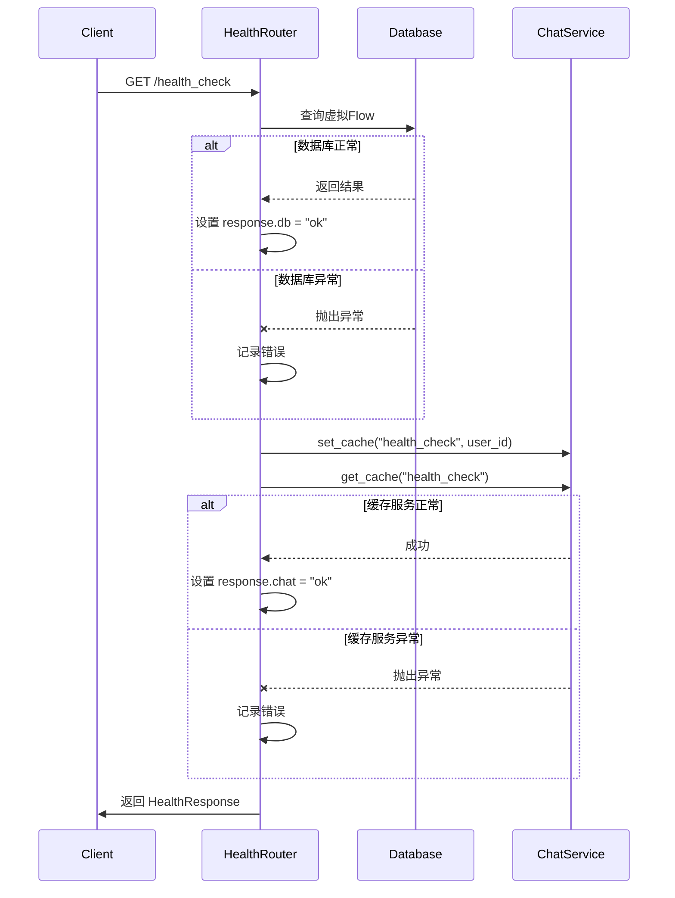
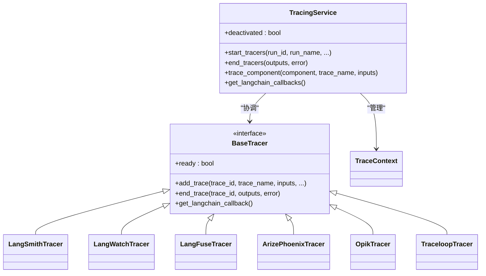

# 监控与日志

<cite>
**本文档引用的文件**   
- [service.py](file://vibe_surf/telemetry/service.py)
- [views.py](file://vibe_surf/telemetry/views.py)
- [opentelemetry.py](file://vibe_surf/langflow/services/telemetry/opentelemetry.py)
- [tracing/service.py](file://vibe_surf/langflow/services/tracing/service.py)
- [tracing/opik.py](file://vibe_surf/langflow/services/tracing/opik.py)
- [tracing/arize_phoenix.py](file://vibe_surf/langflow/services/tracing/arize_phoenix.py)
- [tracing/traceloop.py](file://vibe_surf/langflow/services/tracing/traceloop.py)
- [logging/logger.py](file://vibe_surf/langflow/logging/logger.py)
- [logging/setup.py](file://vibe_surf/langflow/logging/setup.py)
- [api/log_router.py](file://vibe_surf/langflow/api/log_router.py)
- [api/health_check_router.py](file://vibe_surf/langflow/api/health_check_router.py)
- [backend/main.py](file://vibe_surf/backend/main.py)
- [shared_state.py](file://vibe_surf/backend/shared_state.py)
</cite>

## 目录
1. [引言](#引言)
2. [Prometheus指标收集与Grafana可视化](#prometheus指标收集与grafana可视化)
3. [ELK堆栈日志收集与分析](#elk堆栈日志收集与分析)
4. [系统健康检查与自定义监控探针](#系统健康检查与自定义监控探针)
5. [分布式追踪与OpenTelemetry集成](#分布式追踪与opentelemetry集成)
6. [警报规则与日志轮转策略](#警报规则与日志轮转策略)
7. [性能监控最佳实践](#性能监控最佳实践)
8. [结论](#结论)

## 引言

VibeSurf项目提供了一套全面的监控和日志解决方案，旨在确保系统的可观测性、可靠性和可维护性。本文档详细阐述了如何集成Prometheus进行指标收集，配置Grafana仪表板进行可视化，设置ELK堆栈进行日志管理，实现系统健康检查端点，集成分布式追踪，以及最佳的性能监控实践。

系统通过OpenTelemetry框架收集和导出指标，利用structlog进行结构化日志记录，并通过HTTP端点提供实时日志流和健康检查功能。此外，系统还集成了PostHog进行产品级遥测，以收集匿名的使用数据。

**Section sources**
- [backend/main.py](file://vibe_surf/backend/main.py#L1-L794)

## Prometheus指标收集与Grafana可视化

VibeSurf通过OpenTelemetry框架与Prometheus集成，实现对关键系统指标的收集。系统在启动时会自动配置PrometheusMetricReader，将指标暴露给Prometheus服务器。

### 指标配置

指标的收集由`OpenTelemetry`单例类管理，该类在初始化时会根据配置决定是否启用Prometheus。核心配置位于`vibe_surf/langflow/services/telemetry/opentelemetry.py`。



**Diagram sources **
- [opentelemetry.py](file://vibe_surf/langflow/services/telemetry/opentelemetry.py#L108-L254)

**Section sources**
- [opentelemetry.py](file://vibe_surf/langflow/services/telemetry/opentelemetry.py#L1-L254)

### 内置指标

系统预定义了以下核心指标：

| 指标名称 | 类型 | 描述 | 标签 |
| :--- | :--- | :--- | :--- |
| `file_uploads` | ObservableGauge | 上传文件的大小（字节） | `flow_id` (必需) |
| `num_files_uploaded` | Counter | 上传文件的数量 | `flow_id` (必需) |

这些指标在`_register_metric`方法中定义，为后续的性能分析和容量规划提供了基础数据。

### Prometheus端点启用

Prometheus端点的启用是通过环境变量`LANGFLOW_PROMETHEUS_PORT`控制的。当此变量被设置时，系统会在指定端口启动Prometheus HTTP服务器。

```python
# 在 vibe_surf/langflow/main.py 中
if prome_port_str := os.environ.get("LANGFLOW_PROMETHEUS_PORT"):
    prome_port = int(prome_port_str)
    if prome_port > 0 or prome_port < MAX_PORT:
        logger.debug(f"Starting Prometheus server on port {prome_port}...")
        settings.prometheus_enabled = True
        settings.prometheus_port = prome_port
    else:
        msg = f"Invalid port number {prome_port_str}"
        raise ValueError(msg)

if settings.prometheus_enabled:
    from prometheus_client import start_http_server
    start_http_server(settings.prometheus_port)
```

### Grafana仪表板配置

为了在Grafana中可视化这些指标，需要创建一个Prometheus数据源，指向VibeSurf应用暴露的Prometheus端口。然后，可以创建自定义仪表板来展示文件上传量、上传频率等关键业务指标。

## ELK堆栈日志收集与分析

VibeSurf使用structlog库进行结构化日志记录，生成的JSON格式日志可以轻松地被Logstash或Filebeat收集，并发送到Elasticsearch进行存储和分析，最后通过Kibana进行可视化。

### 日志配置

日志系统的核心是`configure`函数，它负责设置日志的格式、级别、输出目标和处理器链。



**Diagram sources **
- [logger.py](file://vibe_surf/langflow/logging/logger.py#L203-L363)

**Section sources**
- [logger.py](file://vibe_surf/langflow/logging/logger.py#L1-L408)
- [setup.py](file://vibe_surf/langflow/logging/setup.py#L1-L16)

#### 配置选项

日志行为可以通过以下环境变量进行配置：

- `LANGFLOW_LOG_LEVEL`: 设置日志级别 (DEBUG, INFO, WARNING, ERROR, CRITICAL)。
- `LANGFLOW_LOG_FILE`: 指定日志文件的路径。
- `LANGFLOW_LOG_ENV`: 设置日志环境，影响输出格式。
- `LANGFLOW_LOG_FORMAT`: 自定义日志的键值对顺序。
- `LANGFLOW_PRETTY_LOGS`: 是否在控制台输出美化后的日志。

#### 日志处理器

日志处理器链（processors）定义了日志消息的处理流程：
1.  **上下文合并**: 合并`contextvars`中的上下文信息。
2.  **添加日志级别**: 添加`level`字段。
3.  **时间戳**: 添加ISO格式的时间戳。
4.  **开发信息**: 在开发模式下，添加文件名、函数名和行号。
5.  **序列化**: 为日志缓冲区创建序列化的JSON表示。
6.  **生产环境异常过滤**: 在生产环境中移除异常堆栈信息。
7.  **缓冲写入**: 将日志写入内存缓冲区，供API检索。
8.  **最终渲染**: 根据环境选择JSON、CSV或美化控制台输出。

### 日志轮转

系统通过`RotatingFileHandler`实现了日志轮转。轮转策略由`LANGFLOW_LOG_ROTATION`环境变量控制，例如设置为`100 MB`，当日志文件大小超过100MB时，会自动创建新的日志文件，并保留最多5个旧文件。

```python
# 在 vibe_surf/langflow/logging/logger.py 中
if log_rotation:
    max_bytes = 10 * 1024 * 1024  # Default 10MB
    if "MB" in log_rotation.upper():
        try:
            parts = log_rotation.split()
            if len(parts) >= 2 and parts[1].upper() == "MB":
                mb = int(parts[0])
                if mb > 0:
                    max_bytes = mb * 1024 * 1024
        except (ValueError, IndexError):
            pass
else:
    max_bytes = 10 * 1024 * 1024  # Default 10MB

file_handler = logging.handlers.RotatingFileHandler(
    log_file,
    maxBytes=max_bytes,
    backupCount=5,
    encoding='utf-8'
)
```

## 系统健康检查与自定义监控探针

VibeSurf提供了多个端点用于系统健康检查和状态监控。

### 健康检查端点

系统提供了两个健康检查端点：

1.  **`/health`**: 一个简单的存活探针，仅返回`{"status": "ok"}`。此端点由Uvicorn和应用本身都支持，用于快速检查服务是否启动。
2.  **`/health_check`**: 一个就绪探针，它会主动检查关键服务的健康状况。



**Diagram sources **
- [health_check_router.py](file://vibe_surf/langflow/api/health_check_router.py#L32-L66)

**Section sources**
- [health_check_router.py](file://vibe_surf/langflow/api/health_check_router.py#L1-L66)

`HealthResponse`模型包含`status`, `chat`, 和 `db`三个字段。只有当所有子系统都返回`"ok"`时，整体状态才为`"ok"`，否则返回500错误。

### 自定义监控探针

除了标准的健康检查，系统还提供了`/api/status`端点来获取更详细的系统状态，这对于自定义监控探针非常有用。

```python
# 在 vibe_surf/backend/main.py 中
@app.get("/api/status")
async def get_system_status():
    task_info = shared_state.get_active_task_info()
    langflow_status = "not_started"
    if langflow_init_task:
        if langflow_init_task.done():
            if langflow_init_task.exception():
                langflow_status = "failed"
            else:
                langflow_status = "completed"
        else:
            langflow_status = "initializing"
    
    return {
        "system_status": "operational",
        "active_task": task_info,
        "langflow_status": langflow_status,
        "timestamp": datetime.now().isoformat()
    }
```

该端点返回的信息包括：
- **`system_status`**: 系统整体运行状态。
- **`active_task`**: 当前正在执行的任务详情（如果存在）。
- **`langflow_status`**: Langflow核心服务的初始化状态（未开始、初始化中、完成、失败）。
- **`timestamp`**: 状态获取的时间戳。

## 分布式追踪与OpenTelemetry集成

VibeSurf集成了强大的分布式追踪功能，支持多种后端，包括Arize Phoenix、LangSmith、Langfuse、OpenLLMetry、Traceloop和Opik。

### 追踪服务架构

`TracingService`是整个追踪系统的核心，它负责协调多个具体的追踪器（Tracer）。



**Diagram sources **
- [tracing/service.py](file://vibe_surf/langflow/services/tracing/service.py#L109-L461)

**Section sources**
- [tracing/service.py](file://vibe_surf/langflow/services/tracing/service.py#L1-L461)

### 追踪上下文传播

系统使用`ContextVar`来管理追踪上下文，确保在异步任务和函数调用中追踪信息能够正确传播。

- `trace_context_var`: 存储`TraceContext`对象，代表一次完整的图（graph）运行。
- `component_context_var`: 存储`ComponentTraceContext`对象，代表图中一个组件的构建过程。

当一个图开始运行时，`start_tracers`方法会创建`TraceContext`并启动一个后台工作协程来处理追踪事件。当图运行结束时，`end_tracers`方法会停止工作协程并结束所有追踪。

### 集成外部追踪后端

系统通过环境变量来配置不同的追踪后端。例如，对于Arize Phoenix和Phoenix，配置如下：

```python
# 在 vibe_surf/langflow/services/tracing/arize_phoenix.py 中
arize_api_key = os.getenv("ARIZE_API_KEY", None)
arize_space_id = os.getenv("ARIZE_SPACE_ID", None)
arize_collector_endpoint = os.getenv("ARIZE_COLLECTOR_ENDPOINT", "https://otlp.arize.com")
enable_arize_tracing = bool(arize_api_key and arize_space_id)

phoenix_api_key = os.getenv("PHOENIX_API_KEY", None)
phoenix_collector_endpoint = os.getenv("PHOENIX_COLLECTOR_ENDPOINT", "https://app.phoenix.arize.com")
phoenix_auth_disabled = "localhost" in phoenix_collector_endpoint or "127.0.0.1" in phoenix_collector_endpoint
enable_phoenix_tracing = bool(phoenix_api_key) or phoenix_auth_disabled
```

只要设置了相应的API密钥和端点，对应的追踪器就会被激活。

## 警报规则与日志轮转策略

### 警报规则建议

基于VibeSurf的监控数据，建议在Prometheus或Grafana中设置以下警报规则：

1.  **服务宕机**: 当`/health`或`/health_check`端点连续5分钟无响应时触发。
2.  **数据库连接失败**: 当`health_check`返回的`db`状态为`error`时触发。
3.  **高错误率**: 当`HTTP_SERVER_DURATION`直方图中5xx状态码的比例在过去5分钟内超过5%时触发。
4.  **资源耗尽**: 当`process_cpu_usage`或`process_memory_usage`持续超过80%阈值时触发。
5.  **任务执行超时**: 当`active_task`的`start_time`距今超过预设的超时时间（如30分钟）时触发。

### 日志轮转策略

如前所述，日志轮转策略由`LANGFLOW_LOG_ROTATION`环境变量控制。最佳实践是：
- **大小轮转**: 建议设置为`100 MB`，以平衡单个文件大小和文件数量。
- **保留策略**: 保留5个备份文件，提供足够的历史日志用于故障排查。
- **文件名**: 日志文件名包含日期（如`langflow_2023-10-27.log`），便于按日期归档和管理。

## 性能监控最佳实践

为了确保VibeSurf系统的高性能和稳定性，建议遵循以下最佳实践：

1.  **启用指标收集**: 始终在生产环境中启用Prometheus指标收集，这是性能分析的基础。
2.  **结构化日志**: 坚持使用结构化日志（JSON格式），便于ELK堆栈进行高效的搜索、过滤和分析。
3.  **合理设置日志级别**: 在生产环境中，将日志级别设置为`INFO`或`WARNING`，避免`DEBUG`级别的海量日志影响性能和存储。
4.  **监控关键指标**: 重点关注文件上传量、API响应延迟、数据库查询时间和内存使用情况。
5.  **利用分布式追踪**: 对于复杂的、涉及多个组件的用户任务，使用分布式追踪来诊断性能瓶颈。
6.  **定期审查警报**: 定期审查和优化警报规则，避免产生过多的误报，确保警报的有效性。
7.  **容量规划**: 根据`file_uploads`等指标的历史数据，进行存储和带宽的容量规划。

## 结论

VibeSurf提供了一套功能完备、可扩展的监控和日志解决方案。通过集成Prometheus、OpenTelemetry和结构化日志，系统具备了强大的可观测性。开发者和运维人员可以利用这些工具来确保系统的稳定性，快速诊断问题，并持续优化性能。通过合理配置Grafana仪表板和警报规则，可以将被动的故障响应转变为主动的性能管理。