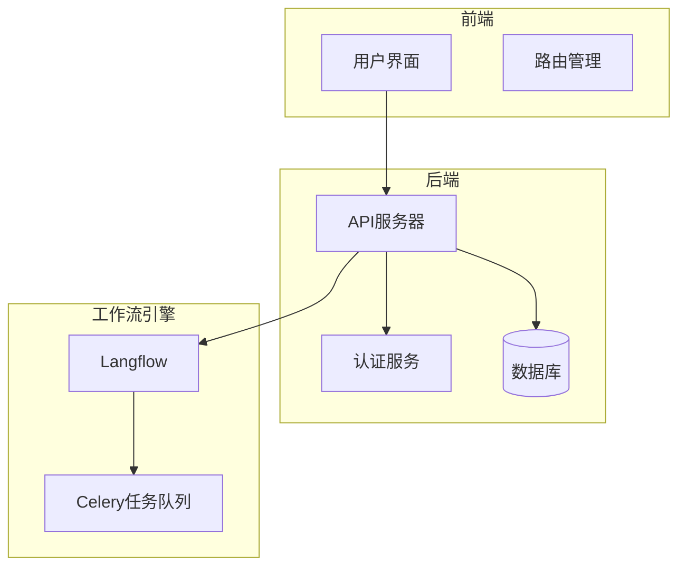

# 项目概述

<cite>
**本文档中引用的文件**   
- [README.md](file://README.md)
- [main.py](file://vibe_surf/backend/main.py)
- [App.tsx](file://vibe_surf/frontend/src/App.tsx)
- [background.js](file://vibe_surf/chrome_extension/background.js)
- [vibe_surf_agent.py](file://vibe_surf/agents/vibe_surf_agent.py)
- [shared_state.py](file://vibe_surf/backend/shared_state.py)
- [vibesurf_tools.py](file://vibe_surf/tools/vibesurf_tools.py)
- [pyproject.toml](file://pyproject.toml)
</cite>

## 目录
1. [引言](#引言)
2. [核心功能](#核心功能)
3. [技术架构](#技术架构)
4. [主要用例与优势](#主要用例与优势)
5. [目标用户群体](#目标用户群体)
6. [发展愿景与路线图](#发展愿景与路线图)

## 引言
VibeSurf 是一个开源的AI代理浏览器，旨在革新浏览器自动化和研究领域。它结合了先进的AI自动化、多代理并行处理、拖放式工作流创建以及无缝的Chrome扩展UI集成，为开发者和研究人员提供了一个强大的工具，用于深度研究、智能爬取和内容摘要等高级AI自动化功能。

**Section sources**
- [README.md](file://README.md#L6-L8)

## 核心功能
VibeSurf 提供了一系列核心功能，使其在AI代理浏览器领域中脱颖而出。这些功能包括但不限于：

- **高级AI自动化**：VibeSurf 不仅限于基本的浏览器自动化，还能执行深度研究、智能爬取、内容摘要等任务，极大地扩展了其应用范围。
- **多代理并行处理**：支持在不同的浏览器标签页中同时运行多个AI代理，实现深度研究和广泛研究的高效结合。
- **代理浏览器工作流**：用户可以通过拖放和对话式的方式创建自定义工作流，将确定性自动化与AI智能相结合，适用于自动登录、数据收集和社交媒体发布等重复性任务。
- **无缝的Chrome扩展UI**：通过原生浏览器集成，无需切换应用程序，提供直观的界面，使用户感觉像是浏览器的一部分。
- **隐私优先的LLM支持**：支持本地LLM（如Ollama）和自定义LLM API，确保浏览数据在“冲浪”过程中保持私密和安全。

**Section sources**
- [README.md](file://README.md#L14-L22)

## 技术架构
VibeSurf 的技术架构由前端（React）、后端（FastAPI）和工作流引擎（Langflow）三部分组成，各部分协同工作，实现了高效、灵活的AI代理浏览器功能。

### 前端
前端使用React框架构建，提供了用户友好的界面，支持拖放式工作流创建和实时反馈。前端代码位于 `vibe_surf/frontend` 目录下，通过 `App.tsx` 文件作为入口点，利用 `react-router-dom` 进行路由管理，并通过 `Suspense` 组件处理异步加载。

### 后端
后端采用FastAPI框架，提供了RESTful API接口，支持任务管理、文件操作、活动记录、配置管理、浏览器控制、语音处理、代理管理、Composio集成、计划管理和VibeSurf特定功能。后端代码位于 `vibe_surf/backend` 目录下，通过 `main.py` 文件启动应用，利用 `uvicorn` 服务器运行。

### 工作流引擎
工作流引擎基于Langflow，负责处理复杂的任务流程和多代理协调。Langflow通过 `langflow/main.py` 文件启动，利用 `FastAPI` 和 `Celery` 实现任务调度和异步处理。工作流引擎支持从数据库加载和保存工作流，确保任务的持久性和可恢复性。

**Diagram sources **
- [App.tsx](file://vibe_surf/frontend/src/App.tsx#L1-L23)
- [main.py](file://vibe_surf/backend/main.py#L1-L794)
- [main.py](file://vibe_surf/langflow/main.py#L1-L551)

**Section sources**
- [App.tsx](file://vibe_surf/frontend/src/App.tsx#L1-L23)
- [main.py](file://vibe_surf/backend/main.py#L1-L794)
- [main.py](file://vibe_surf/langflow/main.py#L1-L551)

## 主要用例与优势
VibeSurf 的主要用例包括但不限于：

- **深度研究**：通过多代理并行处理，VibeSurf 可以同时在多个标签页中进行深度研究，快速获取和分析大量信息。
- **智能爬取**：利用AI智能，VibeSurf 能够自动识别和提取网页中的关键信息，生成结构化的数据。
- **内容摘要**：VibeSurf 可以自动总结网页内容，生成简洁明了的摘要，帮助用户快速了解信息要点。
- **自动化任务**：通过拖放式工作流创建，用户可以轻松定义和执行复杂的自动化任务，如自动登录、数据收集和社交媒体发布。

VibeSurf 的优势在于其高度的灵活性和可扩展性，支持多种LLM和工具集成，能够适应不同用户的需求。此外，VibeSurf 的隐私优先设计确保了用户数据的安全。

**Section sources**
- [README.md](file://README.md#L14-L22)

## 目标用户群体
VibeSurf 的目标用户群体主要包括需要浏览器自动化、研究辅助和数据收集的开发者和研究人员。这些用户可以通过VibeSurf 实现以下目标：

- **开发者**：利用VibeSurf 的API和工作流引擎，开发复杂的自动化脚本，提高开发效率。
- **研究人员**：通过VibeSurf 的深度研究和智能爬取功能，快速获取和分析大量信息，支持学术研究。
- **数据分析师**：利用VibeSurf 的内容摘要和数据提取功能，自动化数据处理流程，提高数据分析的准确性和效率。

**Section sources**
- [README.md](file://README.md#L14-L22)

## 发展愿景与路线图
VibeSurf 的发展愿景是成为用户的终极AI浏览器伴侣。未来的发展路线图包括：

- **智能技能系统**：已实现，增加了 `/search`、`/crawl` 和 `/code` 等智能技能，支持快速信息搜索、自动网站数据提取和网页JS代码执行。
- **第三方集成**：已实现，通过Composio集成，连接了Gmail、Notion、Google Calendar、Slack、Trello、GitHub等数百种流行工具，结合浏览与强大的自动化能力。
- **代理浏览器工作流**：已实现，支持创建自定义的拖放式和对话式工作流，用于自动登录、数据收集和复杂的浏览器自动化任务。
- **强大的编码代理**：正在进行中，旨在构建一个全面的编码助手，支持数据处理和分析。
- **智能记忆与个性化**：计划中，将VibeSurf 转变为真正的人类化伴侣，具备持久记忆，能够学习用户的偏好、习惯和浏览模式。

**Section sources**
- [README.md](file://README.md#L138-L153)