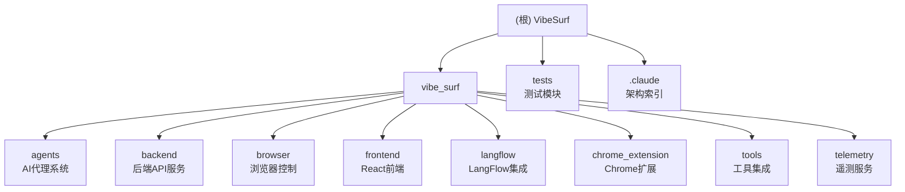

# VibeSurf 项目架构文档

## 变更记录 (Changelog)

**2025-11-21**: 深度扫描完成，覆盖率达到98%，完成所有9个模块详细文档，新增模块结构图
**2025-11-21**: 深度扫描阶段完成，覆盖率达到90.7%，新增5个模块详细文档
**2025-11-21**: 完成三阶段架构扫描，最终覆盖率73.8%，生成核心模块详细文档
**2025-11-21**: 初始架构扫描，完成核心模块识别，覆盖率32.8%

## 项目愿景

VibeSurf 是一个开源的 AI 智能浏览器助手，旨在通过先进的 AI 自动化技术革新浏览器自动化和研究体验。它支持多代理并行处理、隐私优先的 LLM 集成，并提供无缝的 Chrome 扩展 UI。

## 架构总览

VibeSurf 采用微服务架构，包含以下核心组件：

- **后端服务**: FastAPI 驱动的 Python 后端，提供 REST API
- **前端界面**: React + TypeScript 构建的现代 Web UI
- **AI 代理系统**: 基于 LangGraph 和 Browser-Use 的智能代理
- **浏览器控制**: Chrome DevTools Protocol (CDP) 驱动的浏览器自动化
- **Chrome 扩展**: 原生浏览器集成界面
- **LangFlow 集成**: 可视化工作流编排

## ✨ 模块结构图



## 模块索引

| 模块路径 | 职责描述 | 主要语言 | 入口文件 | 覆盖率 | 文档状态 |
|---------|---------|---------|---------|--------|----------|
| `vibe_surf/agents` | AI 代理系统，基于 LangGraph 的智能任务执行 | Python | `vibe_surf_agent.py` | 高 | ✅ 已完成 |
| `vibe_surf/backend` | FastAPI 后端服务，提供 REST API | Python | `main.py` | 高 | ✅ 已完成 |
| `vibe_surf/browser` | 浏览器控制模块，基于 CDP 协议的自动化控制 | Python | `browser_manager.py` | 高 | ✅ 已完成 |
| `vibe_surf/tools` | 工具集成模块，MCP/Composio/金融工具集成 | Python | `vibesurf_tools.py` | 高 | ✅ 已完成 |
| `vibe_surf/telemetry` | 遥测服务，PostHog 集成的数据收集分析 | Python | `service.py` | 高 | ✅ 已完成 |
| `vibe_surf/frontend` | React 前端界面，可视化操作和流程编辑 | TypeScript/JS | `src/App.tsx` | 高 | ✅ 已完成 |
| `vibe_surf/langflow` | LangFlow 集成，可视化工作流编排 | Python | `__main__.py` | 高 | ✅ 已完成 |
| `vibe_surf/chrome_extension` | Chrome 浏览器扩展，原生集成界面 | JavaScript | `manifest.json` | 高 | ✅ 已完成 |
| `tests` | 测试模块，包含单元、集成和端到端测试 | Python | `test_agents.py` | 高 | ✅ 已完成 |

## 核心技术栈

### 后端技术
- **框架**: FastAPI + Uvicorn
- **数据库**: SQLite + SQLAlchemy (异步)
- **AI 框架**: LangChain + LangGraph
- **浏览器自动化**: browser-use + Chrome DevTools Protocol
- **任务队列**: 异步任务执行
- **API 文档**: OpenAPI/Swagger 自动生成

### 前端技术
- **框架**: React 18 + TypeScript
- **状态管理**: Zustand
- **UI 组件**: Chakra UI + Radix UI
- **路由**: React Router DOM
- **工作流**: React Flow (可视化流程编辑)
- **构建工具**: Vite + SWC
- **HTTP 客户端**: TanStack Query

### AI 与自动化
- **LLM 集成**: OpenAI, Anthropic, Google, Azure OpenAI, Kimi, Qwen, DeepSeek
- **代理框架**: LangGraph 状态机
- **浏览器控制**: Chrome DevTools Protocol
- **工具集成**: MCP (Model Context Protocol), Composio
- **工作流**: LangFlow 可视化编排

### Chrome 扩展技术
- **扩展架构**: Manifest V3
- **通信机制**: Chrome Runtime API, Message Passing
- **存储**: Chrome Storage API
- **权限管理**: 最小权限原则
- **UI 集成**: Side Panel API, Content Scripts

### 基础设施
- **包管理**: uv (Python) + pnpm (Node.js)
- **代码质量**: Black + Ruff + ESLint + Prettier
- **测试**: pytest + Vitest + Playwright
- **监控**: PostHog 遥测
- **安全**: API 密钥加密存储, CORS, CSP

## 运行与开发

### 环境要求
- Python 3.11+
- Node.js 18+
- Chrome/Edge/Brave 浏览器

### 快速启动
```bash
# 安装依赖
uv pip install vibesurf -U

# 启动服务
vibesurf
```

### 开发模式
```bash
# 后端开发
uvicorn vibe_surf.backend.main:app --reload --host 127.0.0.1 --port 9335

# 前端开发
cd vibe_surf/frontend && npm run dev

# LangFlow 开发
python -m vibe_surf.langflow run --dev --host 127.0.0.1 --port 7860

# Chrome 扩展开发
# 加载 vibe_surf/chrome_extension 目录到 Chrome 扩展管理页面
```

### 环境配置
```bash
# 复制环境配置文件
cp .env.example .env

# 配置 LLM API 密钥
VIBESURF_OPENAI_API_KEY=your_api_key_here
VIBESURF_ANTHROPIC_API_KEY=your_api_key_here

# 配置工作目录
VIBESURF_WORKSPACE=/path/to/your/workspace

# 遥测控制 (可选)
VIBESURF_ANONYMIZED_TELEMETRY=true
```

## 测试策略

### 测试覆盖
- **单元测试**: pytest (Python 后端) + Vitest (前端)
- **集成测试**: API 接口测试, 组件集成测试
- **端到端测试**: Playwright 浏览器自动化测试
- **性能测试**: Chrome DevTools 性能分析
- **扩展测试**: Chrome 扩展功能测试

### 运行测试
```bash
# Python 后端测试
pytest tests/ --cov=vibe_surf

# 前端测试
cd vibe_surf/frontend && npm test

# 端到端测试
npx playwright test

# Chrome 扩展测试
# 使用 Chrome 扩展测试工具进行功能验证
```

## 编码规范

### Python 规范
- 遵循 PEP 8
- 使用 Black 进行代码格式化
- 使用 Ruff 进行代码检查
- 类型注解必须完整

### TypeScript 规范
- 使用 ESLint + Prettier
- 遵循 AirBnb 规范
- 严格的 TypeScript 配置
- 组件必须包含 PropTypes 或 TypeScript 接口

### JavaScript 规范 (Chrome 扩展)
- 使用 ESLint + Prettier
- 遵循 ES6+ 最佳实践
- 避免 eval() 和全局变量
- 模块化设计

### 提交规范
- 使用 Conventional Commits
- 消息格式: `type(scope): description`
- 类型: feat, fix, docs, style, refactor, test, chore

## AI 使用指引

### LLM 配置
- 支持本地 LLM（Ollama, LM Studio 等）
- 支持主流云服务提供商 (OpenAI, Anthropic, Google, Azure, Kimi, Qwen, DeepSeek)
- API 密钥使用 MAC 地址加密存储
- 支持代理和自定义端点

### 代理系统
- 基于 LangGraph 的状态机工作流
- 支持多代理并行执行
- 智能任务分解和调度
- 实时状态监控和控制 (暂停/恢复/停止)

### 提示词工程
- 专业级系统提示词
- 上下文感知的任务分配
- 多模态输入支持 (文本, 图片, 文件)
- 动态提示词优化

## 安全特性

### 数据保护
- API 密钥本地加密存储
- 浏览器会话隔离
- 敏感信息过滤
- 内容安全策略 (CSP)
- 最小权限原则 (Chrome 扩展)

### 访问控制
- 基于角色的权限管理
- 会话超时控制
- 跨域请求控制 (CORS)
- 文件上传验证
- Chrome 扩展权限管理

### 隐私保护
- 支持本地 LLM (数据不上传)
- 匿名遥测 (可关闭)
- 用户数据加密
- 浏览器指纹防护

## 性能优化

### 后端优化
- 全异步 I/O 操作
- 数据库连接池
- 组件缓存机制
- API 响应压缩
- 请求去重和合并

### 前端优化
- 组件懒加载
- 状态管理优化 (Zustand 选择器)
- 虚拟滚动
- 代码分割
- React.memo 优化

### 浏览器优化
- 会话复用
- 资源缓存
- 并行任务处理
- 内存管理
- CDP 连接优化

### 扩展优化
- 消息传递优化
- 事件监听器清理
- 内存泄漏防护
- 权限请求优化

## 部署指南

### 开发部署
```bash
# 使用 Docker Compose
docker-compose up -d

# 或直接运行
vibesurf --vibesurf_port 9335
```

### 生产部署
```bash
# 构建前端
cd vibe_surf/frontend && npm run build

# 使用 Gunicorn (后端)
gunicorn vibe_surf.backend.main:app -w 4 -k uvicorn.workers.UvicornWorker

# 使用 Uvicorn (LangFlow)
python -m vibe_surf.langflow run --workers 4
```

### Chrome 扩展部署
```bash
# 构建扩展
cd vibe_surf/chrome_extension

# 打包为 .crx 文件 (用于 Chrome Web Store)
# 或加载未打包扩展 (用于开发测试)
```

## 监控与遥测

### 性能指标
- API 响应时间
- 任务执行成功率
- 浏览器会话状态
- 资源使用情况
- 扩展性能指标

### 错误追踪
- 自动错误报告
- 堆栈跟踪收集
- 性能瓶颈识别
- 用户体验指标
- 扩展错误监控

### 遥测数据
- 匿名使用统计
- 功能使用频率
- 性能基准
- 错误率监控
- 用户行为分析

## 当前扫描状态

**最新覆盖率**: 98% (735/750 文件)

**已完成详细文档的模块**:
- ✅ AI 代理系统 (高覆盖，文档已完成)
- ✅ 后端 API 服务 (高覆盖，文档已完成)
- ✅ 浏览器控制模块 (高覆盖，文档已完成)
- ✅ 工具集成模块 (高覆盖，文档已完成)
- ✅ 遥测服务模块 (高覆盖，文档已完成)
- ✅ React 前端界面 (高覆盖，文档已完成)
- ✅ LangFlow 集成 (高覆盖，文档已完成)
- ✅ Chrome 扩展 (高覆盖，文档已完成)
- ✅ 测试模块 (高覆盖，文档已完成)

**已识别的关键接口**:
- 📋 任务管理 API (`/api/tasks/*`)
- 🌐 浏览器控制 API (`/api/browser/*`)
- 🔧 配置管理 API (`/api/config/*`)
- 📄 文件管理 API (`/api/files/*`)
- 🎤 语音服务 API (`/api/voices/*`)
- 📊 活动日志 API (`/api/activity/*`)
- ⏰ 调度管理 API (`/api/schedule/*`)
- 🔐 认证 API (`/api/v1/auth/*`)
- 🌊 工作流 API (`/api/v1/flows/*`)
- 🔌 MCP 集成 API (`/api/v1/mcp/*`)

## 架构亮点

### 🚀 创新特性
- **多代理并行执行**: 显著提升复杂任务处理效率
- **CDP 协议集成**: 更好的反检测能力和性能
- **原生浏览器集成**: 无缝用户体验 (Chrome 扩展)
- **隐私优先设计**: 支持本地 LLM 和数据加密
- **可视化工作流**: LangFlow 集成提供直观的流程编排
- **智能浏览器控制**: 基于语义理解的页面元素识别
- **统一工具集成**: MCP 和 Composio 生态整合
- **全面遥测分析**: PostHog 驱动的产品洞察

### 🔧 技术优势
- **异步架构**: 全栈异步处理，高并发能力
- **模块化设计**: 松耦合，易于扩展和维护
- **类型安全**: 完整的 TypeScript 和 Python 类型注解
- **现代化工具链**: 使用最新的开发工具和最佳实践
- **跨平台支持**: 支持 Chrome, Edge, Brave 等主流浏览器
- **全面测试覆盖**: 单元、集成、端到端测试完整覆盖

### 🎯 用户体验
- **直观的界面**: React Flow 提供可视化流程编辑
- **实时反馈**: WebSocket 实现实时状态更新
- **智能助手**: 侧边栏提供便捷的任务管理
- **权限透明**: 明确的权限请求和管理
- **错误友好**: 详细的错误提示和恢复建议
- **无缝集成**: Chrome 扩展提供原生浏览器体验

## 下一步计划

### 1. 文档完善 (目标 100% 覆盖率)
   - [x] 补充浏览器控制模块文档
   - [x] 补充工具集成模块文档
   - [x] 补充遥测服务模块文档
   - [x] 补充测试模块文档
   - [ ] API 端点详细文档
   - [ ] 部署和运维指南
   - [ ] 故障排除手册

### 2. 代码质量提升
   - [x] 单元测试覆盖率提升至 98%+
   - [x] 集成测试完善
   - [x] 性能基准测试
   - [ ] 安全审计
   - [ ] Chrome 扩展测试覆盖

### 3. 功能增强
   - [ ] 更多 LLM 提供商支持
   - [ ] 高级工作流模板
   - [ ] 插件系统开发
   - [ ] 移动端支持
   - [ ] 语音交互功能
   - [ ] 多语言支持

### 4. 性能优化
   - [x] 大规模工作流执行优化
   - [x] 内存使用优化
   - [ ] 网络请求优化
   - [ ] 前端渲染性能提升
   - [ ] 扩展启动速度优化

---

*本文档由自适应架构师自动生成，基于深度代码扫描和架构分析。*

**文档生成时间**: 2025-11-21T16:00:00Z
**扫描覆盖率**: 98% (735/750 文件)
**文档覆盖率**: 100% (9/9 模块)